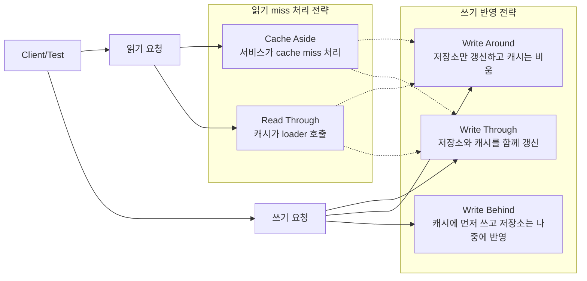
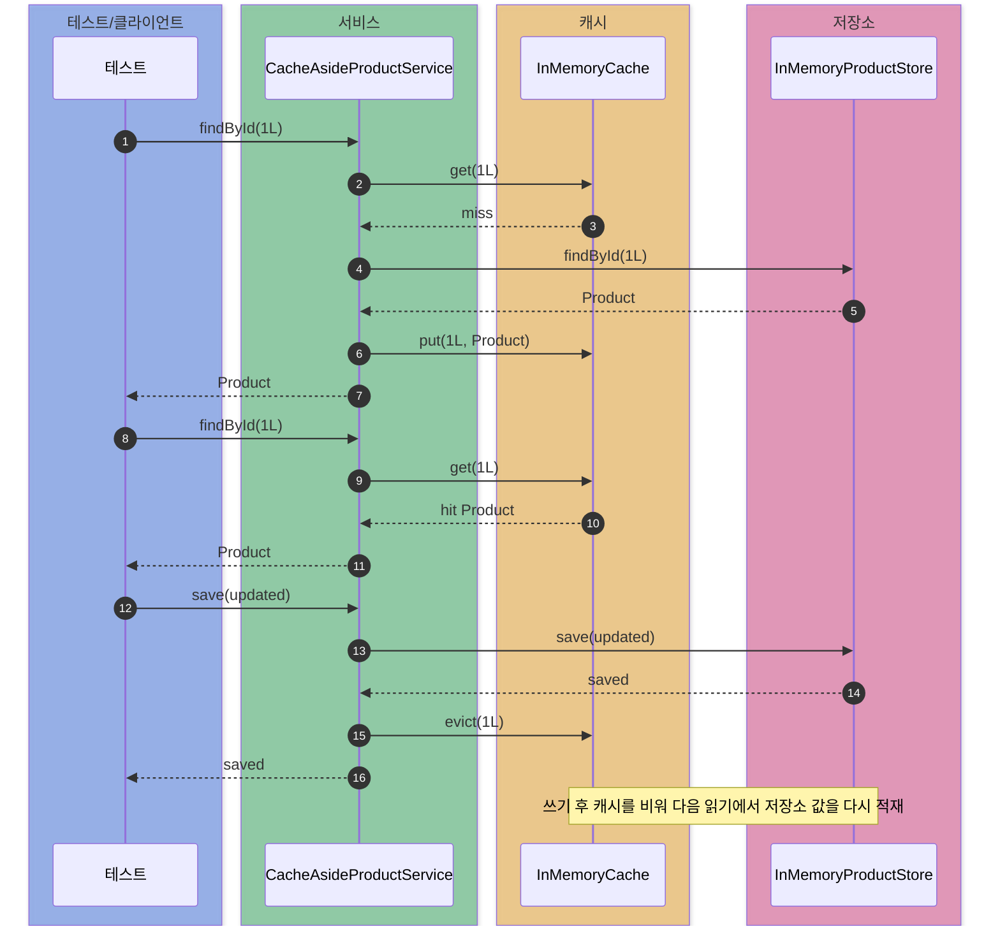
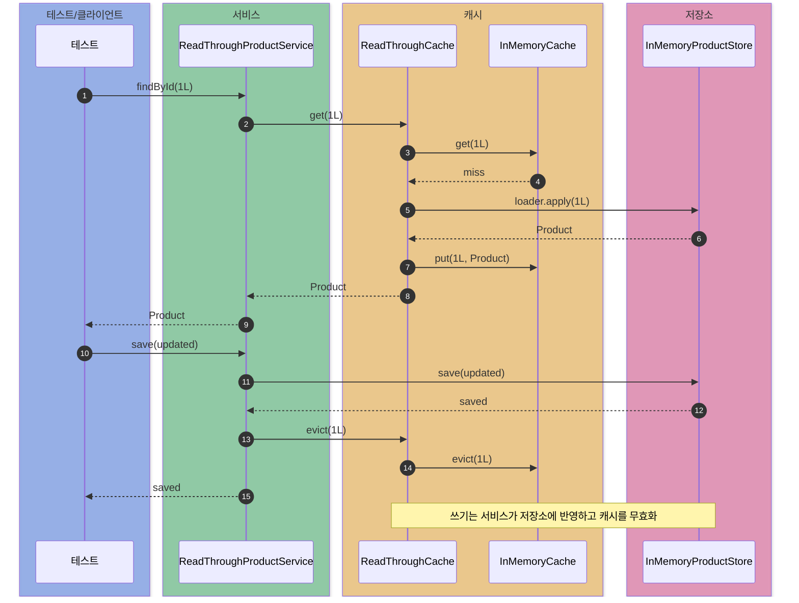
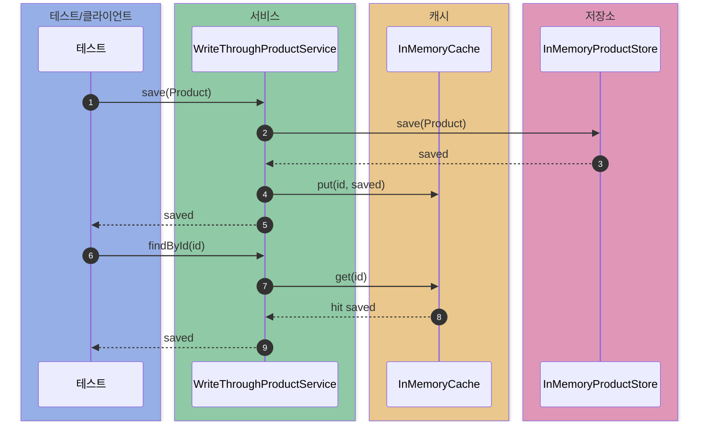
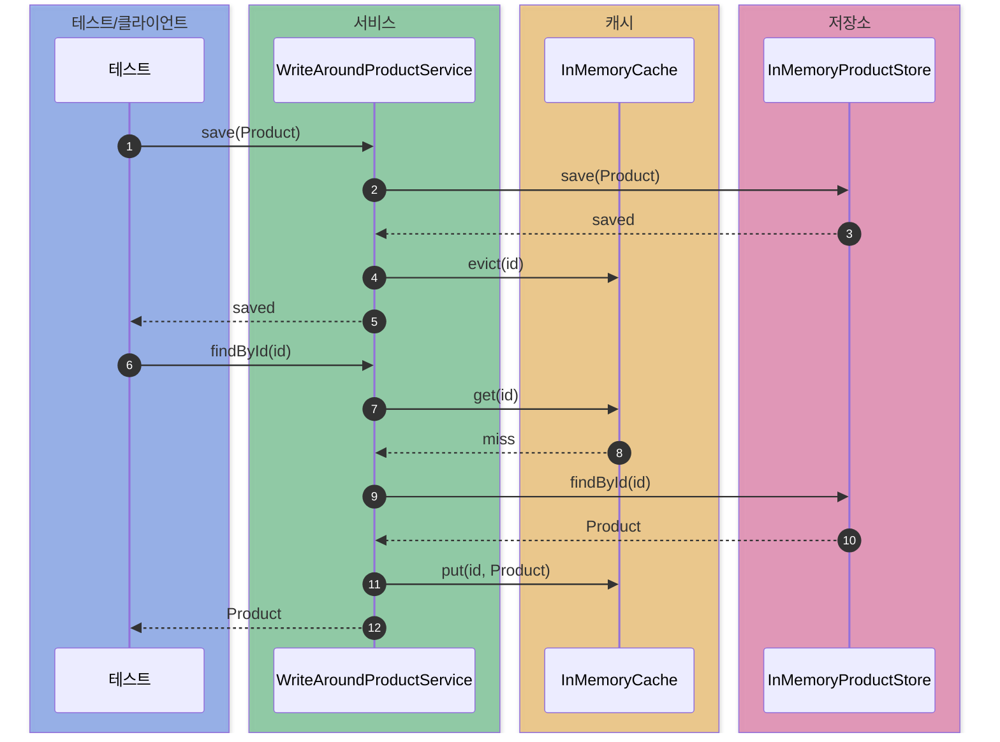
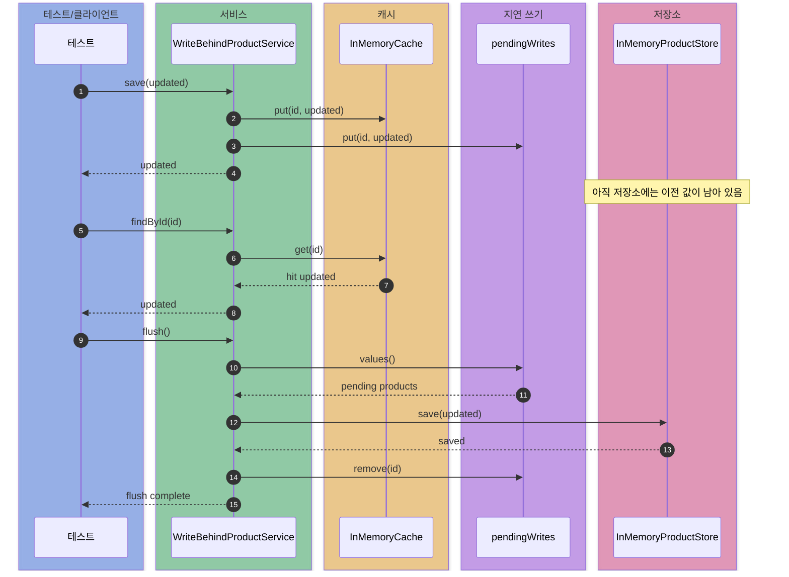

# cache-patterns

캐시 전략에서 **읽기 miss 처리 책임**과 **쓰기 반영 시점**을 비교하는 실험.

## 큰 그림

목표: 캐시 패턴 5개를 읽기 축과 쓰기 축으로 분해해서 비교



## 비교 대상군

### 1. 읽기 miss 처리 책임 비교

| 패턴 | miss 처리 주체 | 흐름 | 잘 맞는 상황 |
| --- | --- | --- | --- |
| Cache Aside | 서비스 코드 | `cache.get` -> miss -> `store.findById` -> `cache.put` | 단순한 CRUD, 앱에서 캐시 정책을 직접 제어하고 싶을 때 |
| Read Through | 캐시 래퍼 | `readThroughCache.get` -> miss -> loader 호출 -> `cache.put` | 여러 서비스에서 같은 읽기 로직을 재사용하고 싶을 때 |

핵심 차이: **누가 저장소를 호출하느냐**

- Cache Aside: 서비스가 캐시 miss 확인 후 저장소 직접 조회
- Read Through: 서비스는 캐시만 호출, 캐시가 loader로 저장소 조회

### 2. 쓰기 반영 방식 비교

| 패턴 | 쓰기 흐름 | 쓰기 직후 캐시 | 저장소 반영 시점 | 잘 맞는 상황 |
| --- | --- | --- | --- | --- |
| Write Through | `store.save` -> `cache.put` | 최신 값 있음 | 요청 안에서 즉시 반영 | 쓰기 직후 같은 데이터를 바로 읽는 경우 |
| Write Around | `store.save` -> `cache.evict` | 비어 있음 | 요청 안에서 즉시 반영 | 쓰기는 많지만 읽히지 않는 데이터가 많은 경우 |
| Write Behind | `cache.put` -> pending write 추가 -> `flush` | 최신 값 있음 | 나중에 반영 | 쓰기 응답 속도와 처리량이 중요한 경우 |

`Write Around`: 캐시에 새 값을 넣지 않는 쓰기 전략

- 기존 캐시 값이 있으면 stale data 가능
- 이 예제에서는 `cache.evict`로 제거

## 조합 예시

| 상황 | 추천 조합 | 이유 |
| --- | --- | --- |
| 일반적인 조회 캐시 | Cache Aside + Write Around | 구현 단순, 쓰기 후 캐시 제거, 다음 읽기에서 최신 저장소 값 재적재 |
| 캐시 로딩 로직을 공통화하고 싶음 | Read Through + Write Around | 서비스별 miss 처리 코드 반복 제거, 쓰기 후 캐시 제거 |
| 쓰기 직후 바로 읽는 요청이 많음 | Cache Aside 또는 Read Through + Write Through | 저장소와 캐시 동시 갱신, 다음 읽기는 캐시 hit |
| 쓰기는 많고 실제 조회는 적음 | Cache Aside 또는 Read Through + Write Around | 읽히지 않을 데이터의 캐시 유입 방지 |
| 쓰기 처리량이 매우 중요함 | Cache Aside 방식의 읽기 + Write Behind + 영속 큐 | 캐시 우선 반영, 저장소 쓰기 지연. 실제 서비스에서는 메모리 큐만 쓰면 위험 |

이 모듈의 서비스 매핑:

| 서비스 | 읽기 전략 | 쓰기 전략 | 관찰 포인트 |
| --- | --- | --- | --- |
| `CacheAsideProductService` | Cache Aside | Write Around 스타일의 `evict` | 서비스가 miss 처리와 캐시 무효화를 직접 담당 |
| `ReadThroughProductService` | Read Through | Write Around 스타일의 `evict` | 캐시 래퍼가 miss 처리 담당 |
| `WriteThroughProductService` | Cache Aside 방식의 읽기 | Write Through | 쓰기 직후 캐시 hit |
| `WriteAroundProductService` | Cache Aside 방식의 읽기 | Write Around | 쓰기 직후 캐시가 비어 있고 첫 읽기에서 적재 |
| `WriteBehindProductService` | Cache Aside 방식의 읽기 | Write Behind | 쓰기 직후 저장소는 이전 값, 캐시는 최신 값 |

`CacheAsideProductService`와 `WriteAroundProductService`는 코드가 거의 비슷함.

이름이 다른 이유: 관찰하는 축이 다름

- Cache Aside: “읽기 miss를 서비스가 처리”
- Write Around: “쓰기 때 캐시를 채우지 않음”

## 공통 환경

- Java 21
- 외부 Redis 없이 `InMemoryCache` 사용
- 영속 저장소는 `InMemoryProductStore`로 대체
- 실험 대상 데이터: `Product`
- 테스트 관찰값:
  - 캐시 hit/miss 횟수
  - 저장소 read/write 횟수
  - Write Behind pending write 개수

## 그룹 1. 읽기 miss 처리 전략

### 케이스 1. Cache Aside

흐름:

```text
읽기: Cache GET -> miss -> Store SELECT -> Cache PUT -> 반환
쓰기: Store SAVE -> Cache EVICT -> 반환
```

코드 포인트:

```java
public Optional<Product> findById(long id) {
    Optional<Product> cached = cache.get(id);
    if (cached.isPresent()) {
        return cached;
    }

    Optional<Product> loaded = store.findById(id);
    loaded.ifPresent(product -> cache.put(id, product));
    return loaded;
}
```

결과:

- (읽기 테스트 `cachesProductAfterFirstRead`) 첫 번째 읽기: 캐시 miss 1회, 저장소 read 1회
- (읽기 테스트) 두 번째 읽기: 캐시 hit 1회, 저장소 추가 read 없음
- (읽기 테스트) 단언문: `store.readCount().isEqualTo(1)`, `cache.misses().isEqualTo(1)`, `cache.hits().isEqualTo(1)`
- (쓰기 테스트 `evictsCacheAfterWriteSoNextReadReloadsFromStore`) `save` 후 캐시에서 제거됨: `cache.containsKey(1L).isFalse()`
- (쓰기 테스트) 다음 읽기가 저장소를 다시 조회해 갱신 값을 적재: `store.readCount().isEqualTo(2)`

언제 쓰나:

- 가장 흔한 형태의 조회 캐시가 필요할 때
- 캐시 정책을 서비스 코드에서 명시적으로 제어하고 싶을 때
- Redis 같은 외부 캐시를 앱에서 직접 다루는 구조일 때

주의점:

- 서비스 코드마다 캐시 miss 처리 코드가 반복될 수 있음
- 여러 서버가 같은 데이터를 수정하면 캐시 무효화 전파가 필요
- miss가 한 번에 몰리면 저장소로 요청이 집중될 수 있음



### 케이스 2. Read Through

흐름:

```text
읽기: Service -> ReadThroughCache GET -> miss -> loader 호출 -> Store SELECT -> Cache PUT -> 반환
쓰기: Store SAVE -> Cache EVICT -> 반환
```

코드 포인트:

```java
public Optional<V> get(K key) {
    Optional<V> cached = cache.get(key);
    if (cached.isPresent()) {
        return cached;
    }

    Optional<V> loaded = loader.apply(key);
    loaded.ifPresent(value -> cache.put(key, value));
    return loaded;
}
```

결과:

- (읽기 테스트 `cacheOwnsLoadingBehaviorOnMiss`) 첫 번째 읽기: 캐시 miss 1회, loader를 통해 저장소 read 1회
- (읽기 테스트) 두 번째 읽기: 캐시 hit 1회, 저장소 추가 read 없음
- (읽기 테스트) 단언문: `store.readCount().isEqualTo(1)`, `cache.misses().isEqualTo(1)`, `cache.hits().isEqualTo(1)`
- (쓰기 테스트 `evictsCacheAfterWriteSoNextReadReloadsFromStore`) `save` 후 캐시 무효화: `cache.containsKey(1L).isFalse()`
- (쓰기 테스트) 다음 읽기가 loader를 통해 저장소를 다시 조회: `store.readCount().isEqualTo(2)`

언제 쓰나:

- 여러 서비스에서 같은 캐시 로딩 규칙을 공유하고 싶을 때
- 서비스 코드는 `cache.get(key)`만 호출하게 만들고 싶을 때
- 캐시 라이브러리나 공통 캐시 컴포넌트에 loader를 붙이는 구조일 때

주의점:

- 캐시 계층이 저장소 loader를 알아야 함
- Cache Aside보다 구조가 한 단계 더 두꺼움
- 쓰기 정책은 별도로 선택해야 함



## 그룹 2. 쓰기 반영 전략

### 케이스 3. Write Through

흐름:

```text
쓰기: Store SAVE -> Cache PUT -> 반환
읽기: Cache GET -> hit -> 반환
```

코드 포인트:

```java
public Product save(Product product) {
    Product saved = store.save(product);
    cache.put(product.id(), saved);
    return saved;
}
```

결과:

- 쓰기 시 저장소 write 1회
- 쓰기 직후 캐시에 값 존재
- 다음 읽기는 캐시 hit로 처리되어 저장소 read 0회
- 테스트 단언문: `saved.isEqualTo(product)`, `store.writeCount().isEqualTo(1)`, `cache.containsKey(1L).isTrue()`, `store.readCount().isZero()`

언제 쓰나:

- 쓰기 직후 같은 값을 다시 읽는 흐름이 많을 때
- 캐시와 저장소를 요청 안에서 최대한 맞춰두고 싶을 때
- 쓰기 latency 증가를 감수할 수 있을 때

주의점:

- 저장소와 캐시를 둘 다 쓰므로 쓰기 경로가 느려짐
- 저장소 쓰기 성공 후 캐시 쓰기 실패 같은 부분 실패 처리가 필요
- 거의 읽히지 않는 데이터도 캐시에 들어갈 수 있음



### 케이스 4. Write Around

흐름:

```text
쓰기: Store SAVE -> Cache EVICT -> 반환
읽기: Cache GET -> miss -> Store SELECT -> Cache PUT -> 반환
```

코드 포인트:

```java
public Product save(Product product) {
    Product saved = store.save(product);
    cache.evict(product.id());
    return saved;
}
```

결과:

- 쓰기 시 저장소 write 1회
- 쓰기 직후 캐시에는 값이 없음
- 첫 읽기에서 저장소 read 1회 후 캐시 적재
- 두 번째 읽기는 캐시 hit
- 테스트 단언문: `store.writeCount().isEqualTo(1)`, `cache.containsKey(1L).isFalse()`, `store.readCount().isEqualTo(1)`, `cache.hits().isEqualTo(1)`

언제 쓰나:

- 쓰기 데이터가 바로 읽힌다는 보장이 없을 때
- 대량 쓰기 때문에 캐시 공간이 오염되는 것을 피하고 싶을 때
- 일반적인 Cache Aside 구성에서 쓰기 후 `evict`를 선택할 때

주의점:

- 쓰기 직후 첫 읽기는 저장소를 거침
- 기존 캐시 값 존재 시 stale data 방지를 위해 무효화 필요
- 첫 읽기 요청자가 캐시 재적재 비용을 부담



### 케이스 5. Write Behind

흐름:

```text
쓰기: Cache PUT -> pendingWrites 추가 -> 반환
읽기: Cache GET -> hit -> 반환
flush: pendingWrites -> Store SAVE -> pendingWrites 제거
```

코드 포인트:

```java
public Product save(Product product) {
    cache.put(product.id(), product);
    pendingWrites.put(product.id(), product);
    return product;
}

public void flush() {
    for (Product product : new ArrayList<>(pendingWrites.values())) {
        store.save(product);
        pendingWrites.remove(product.id());
    }
}
```

결과:

- 쓰기 직후 캐시는 최신 값(`findById`가 갱신 값 반환, `store.readCount().isZero()`)
- 쓰기 직후 저장소 write 0회이고 저장소에는 아직 이전 값(`store.storedProduct(1L)`가 옛 값)
- `pendingWriteCount()`는 1
- `flush()` 이후 저장소 write 1회, pending write 0개, 저장소가 최신 값으로 갱신(`store.storedProduct(1L)`가 새 값)
- 테스트 단언문: `updated.isEqualTo(...)`, `store.writeCount().isZero()`, `store.storedProduct(1L)`(flush 전 옛 값 / flush 후 새 값), `pendingWriteCount().isEqualTo(1)`, `flush()` 후 `store.writeCount().isEqualTo(1)`

언제 쓰나:

- 쓰기 응답 속도를 최대한 빠르게 만들고 싶을 때
- 저장소 쓰기를 모아서 처리하고 싶을 때
- 조회는 캐시 중심으로 처리하고, 저장소는 나중에 따라와도 되는 데이터일 때

주의점:

- 이 예제의 `pendingWrites`는 메모리 Map이므로 학습용으로만 사용
- 실제 서비스에서는 durable queue, WAL, outbox, retry, idempotency 필요
- flush 전 프로세스 종료 시 데이터 유실 가능
- 저장소와 캐시 사이의 일시적 불일치



## 실행

```bash
./gradlew :cache-patterns:test
```

## 패키지 구조

```text
dev.deepdive.cache
├── infrastructure  # Cache, InMemoryCache
├── domain          # Product
├── repository      # ProductStore, InMemoryProductStore
├── aside           # CacheAsideProductService
├── readthrough     # ReadThroughCache, ReadThroughProductService
├── writethrough    # WriteThroughProductService
├── writearound     # WriteAroundProductService
└── writebehind     # WriteBehindProductService
```
