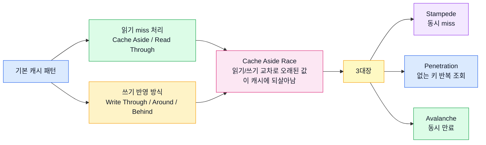
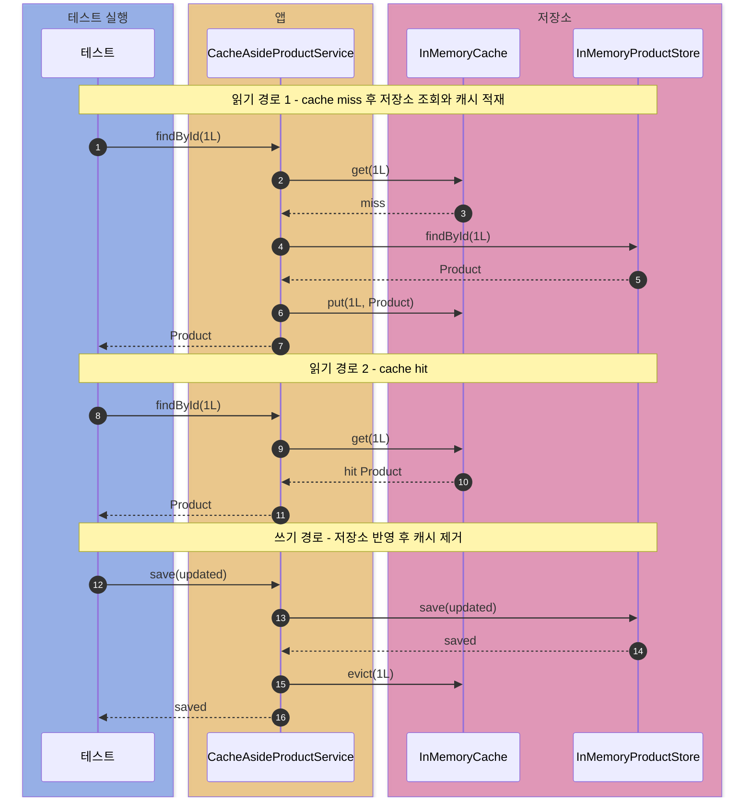
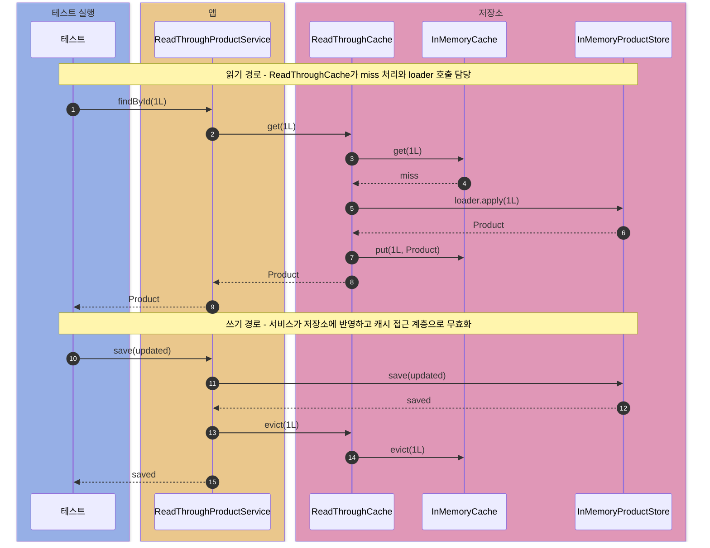
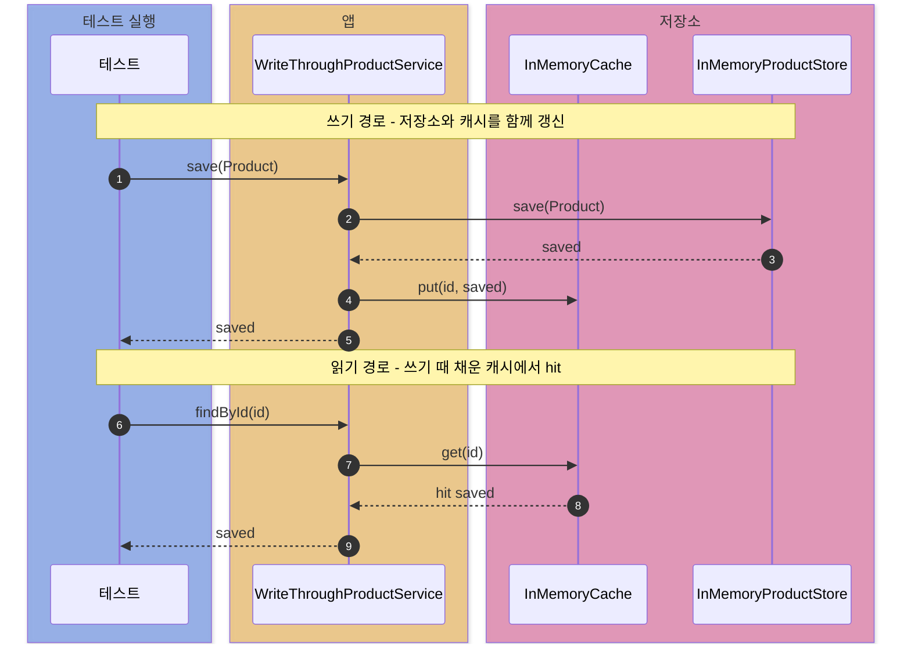
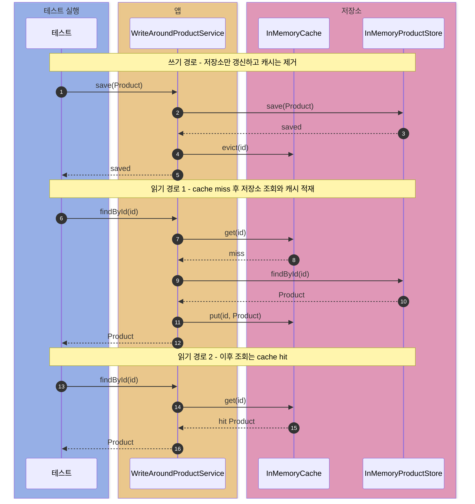
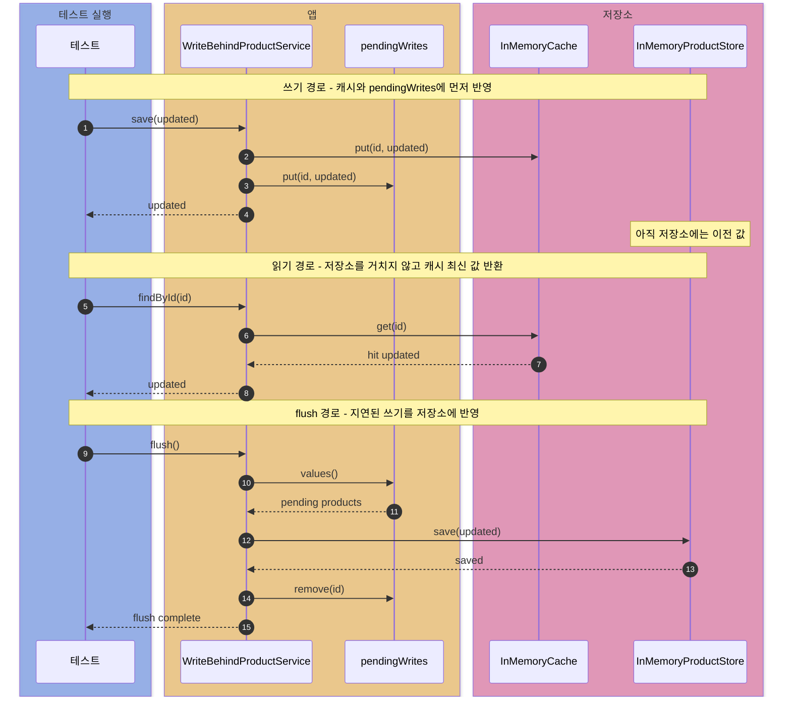
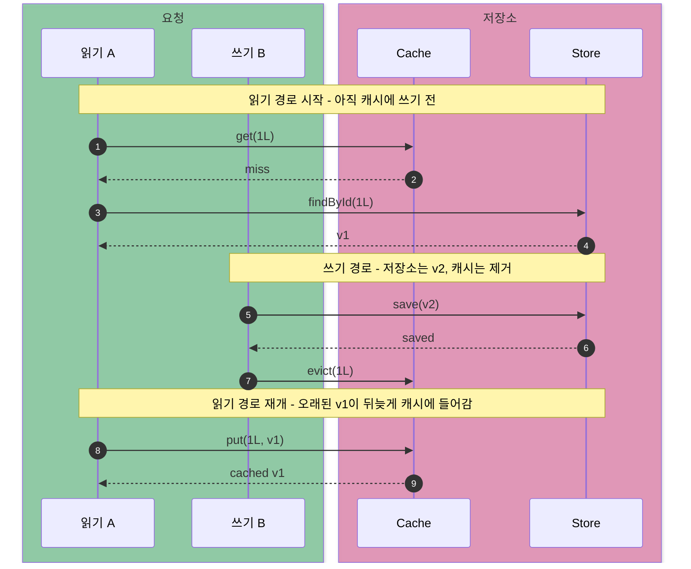
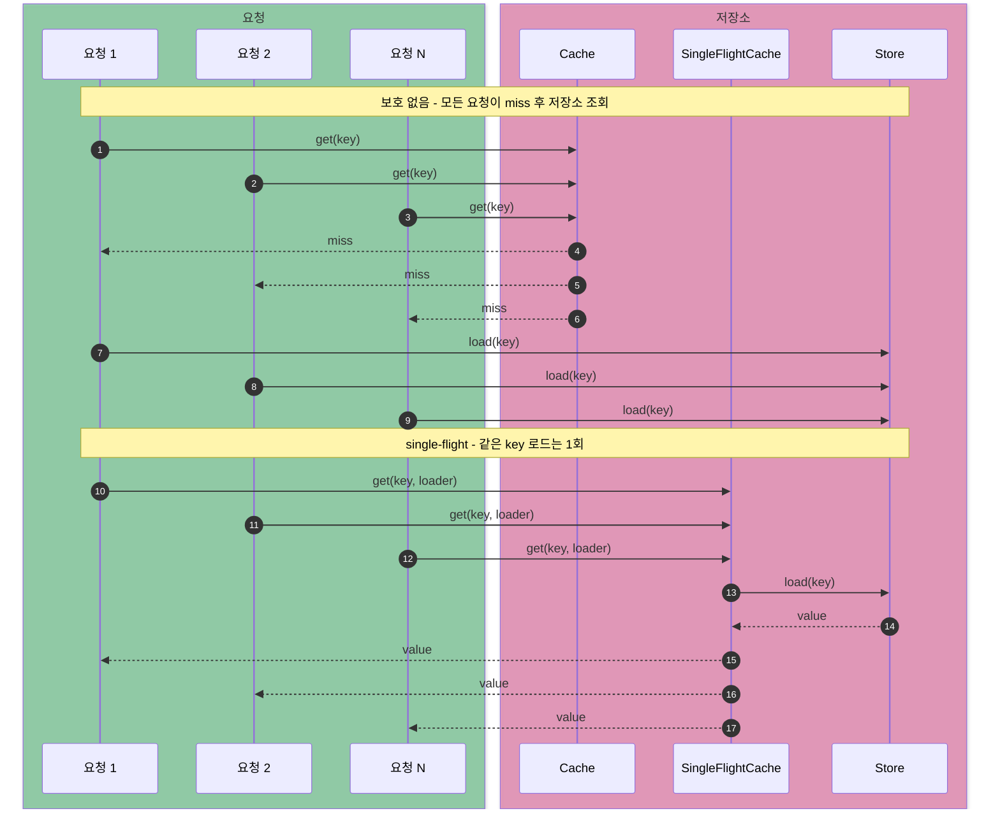
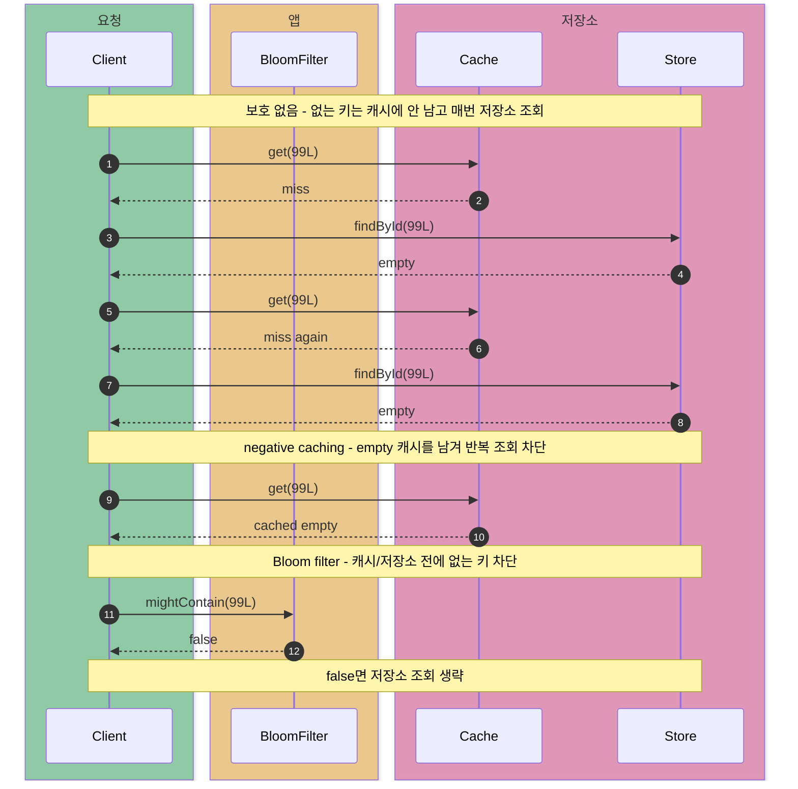
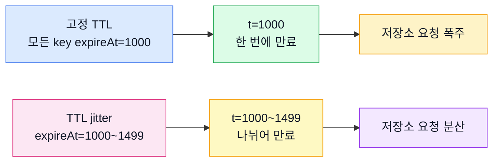

# cache-patterns

캐시 전략을 작은 Java 코드와 단위 테스트로 쪼개서 보는 실험.

학습 순서:

1. 기본 패턴 5개
2. Cache Aside에서 터질 수 있는 Race Condition
3. Cache Stampede / Penetration / Avalanche



## 비교 대상군

### 1. 읽기 miss 처리

| 패턴 | miss 처리 주체 | 흐름 | 잘 맞는 상황 |
| --- | --- | --- | --- |
| Cache Aside | 서비스 코드 | `cache.get` -> miss -> `store.findById` -> `cache.put` | 단순한 CRUD, 앱에서 캐시 정책을 직접 제어 |
| Read Through | 캐시 접근 계층 | `readThroughCache.get` -> miss -> loader 호출 -> `cache.put` | 여러 서비스에서 같은 읽기 로직 재사용 |

핵심 차이: **누가 저장소를 호출하느냐**

- Cache Aside: 서비스가 cache miss 확인 후 저장소 직접 조회
- Read Through 읽기: 서비스는 캐시 접근 계층만 호출, 캐시 접근 계층이 loader로 저장소 조회

이 예제의 `ReadThroughCache` 위치:

- 비즈니스 서비스 안쪽 로직이 아니라, 서비스 바깥의 캐시 접근 계층 역할
- 실제 저장 공간은 `InMemoryCache`
- `ReadThroughCache`는 miss 처리와 loader 호출 담당
- 외부 Redis 자체가 DB loader를 아는 구조는 아님
- 실무에서는 Caffeine/Ehcache 같은 loading cache, 또는 Redis 앞에 둔 앱 공통 캐시 래퍼로 자주 표현

### 2. 쓰기 반영 방식

| 패턴 | 쓰기 흐름 | 쓰기 직후 캐시 | 저장소 반영 시점 | 잘 맞는 상황 |
| --- | --- | --- | --- | --- |
| Write Through | `store.save` -> `cache.put` | 최신 값 있음 | 요청 안에서 즉시 반영 | 쓰기 직후 같은 데이터를 바로 읽는 경우 |
| Write Around | `store.save` -> `cache.evict` | 해당 key 없음 | 요청 안에서 즉시 반영 | 쓰기는 많지만 읽히지 않는 데이터가 많은 경우 |
| Write Behind | `cache.put` -> pending write 추가 -> `flush` | 최신 값 있음 | 나중에 반영 | 쓰기 응답 속도와 처리량이 중요한 경우 |

`Write Around`: 캐시에 새 값을 넣지 않는 쓰기 전략

- 기존 캐시 값이 있으면 저장소보다 오래된 값을 반환할 수 있음
- 그래서 이 예제에서는 `cache.evict`로 제거

### 3. 장애/부하 패턴

| 문제 | 언제 터지나 | 예제 방어 방식 |
| --- | --- | --- |
| Race Condition | 읽기와 쓰기가 교차하면서 오래된 값이 뒤늦게 캐시에 들어갈 때 | `VersionedCache` |
| Cache Stampede | 인기 키가 동시에 miss되거나 동시에 만료될 때 | `SingleFlightCache`, `RefreshAheadCache` |
| Cache Penetration | 존재하지 않는 키가 반복 조회될 때 | `NegativeCachingCache`, `BloomFilter` |
| Cache Avalanche | 많은 키가 같은 시각에 만료될 때 | `ExpiringCache` + TTL jitter |

## 조합 예시

| 상황 | 추천 조합 | 이유 |
| --- | --- | --- |
| 일반적인 조회 캐시 | Cache Aside + Write Around | 구현 단순, 쓰기 후 캐시 제거, 다음 읽기에서 최신 저장소 값 재적재 |
| 캐시 로딩 로직 공통화 | Read Through + Write Around | 서비스별 miss 처리 코드 반복 제거, 쓰기 후 캐시 제거 |
| 쓰기 직후 바로 읽는 요청 많음 | Cache Aside 또는 Read Through + Write Through | 저장소와 캐시 동시 갱신, 다음 읽기는 캐시 hit |
| 쓰기는 많고 실제 조회는 적음 | Cache Aside 또는 Read Through + Write Around | 읽히지 않을 데이터의 캐시 유입 방지 |
| 쓰기 처리량이 매우 중요 | Cache Aside 방식의 읽기 + Write Behind + 영속 큐 | 캐시 우선 반영, 저장소 쓰기 지연. 메모리 큐만 쓰면 유실 위험 |

이 모듈의 서비스 매핑:

| 서비스 | 읽기 전략 | 쓰기 전략 | 관찰 포인트 |
| --- | --- | --- | --- |
| `CacheAsideProductService` | Cache Aside | Write Around 스타일의 `evict` | 서비스가 miss 처리와 캐시 무효화를 직접 담당 |
| `ReadThroughProductService` | Read Through | Write Around 스타일의 `evict` | 캐시 접근 계층이 miss 처리 담당 |
| `WriteThroughProductService` | Cache Aside 방식의 읽기 | Write Through | 쓰기 직후 캐시 hit |
| `WriteAroundProductService` | Cache Aside 방식의 읽기 | Write Around | 쓰기 직후 캐시가 비어 있고 첫 읽기에서 적재 |
| `WriteBehindProductService` | Cache Aside 방식의 읽기 | Write Behind | 쓰기 직후 저장소는 이전 값, 캐시는 최신 값 |

`CacheAsideProductService`와 `WriteAroundProductService`는 코드가 거의 비슷함.

이름이 다른 이유:

- Cache Aside: 읽기 miss를 누가 처리하는지 관찰
- Write Around: 쓰기 때 캐시를 채우는지 관찰

## 공통 환경

- Java 21
- 외부 Redis 없이 `InMemoryCache` 사용
- 영속 저장소는 `InMemoryProductStore`로 대체
- 실험 대상 데이터: `Product`
- 테스트 관찰값:
  - 캐시 hit/miss 횟수
  - 저장소 read/write 횟수
  - Write Behind pending write 개수
  - 동시 miss 시 저장소 load 횟수
  - TTL 만료 시점의 active key 개수

## 1. 읽기 miss 처리 전략

### 케이스 1. Cache Aside

흐름:

```text
읽기: Cache GET -> miss -> Store SELECT -> Cache PUT -> 반환
쓰기: Store SAVE -> Cache EVICT -> 반환
```

코드 포인트:

```java
public Optional<Product> findById(long id) {
    Optional<Product> cached = cache.get(id);
    if (cached.isPresent()) {
        return cached;
    }

    Optional<Product> loaded = store.findById(id);
    loaded.ifPresent(product -> cache.put(id, product));
    return loaded;
}
```

테스트: `ReadPatternTest`

- 첫 번째 읽기: 캐시 miss 1회, 저장소 read 1회
- 두 번째 읽기: 캐시 hit 1회, 저장소 추가 read 없음
- 쓰기 후 캐시 제거: `cache.containsKey(1L).isFalse()`
- 다음 읽기에서 저장소 재조회 후 갱신 값 적재: `store.readCount().isEqualTo(2)`

언제 쓰나:

- 가장 흔한 형태의 조회 캐시
- 캐시 정책을 서비스 코드에서 명시적으로 제어
- Redis 같은 외부 캐시를 앱에서 직접 다루는 구조

주의점:

- 서비스 코드마다 cache miss 처리 코드 반복 가능
- 여러 서버가 같은 데이터를 수정하면 캐시 무효화 전파 필요
- miss가 한 번에 몰리면 저장소로 요청 집중



### 케이스 2. Read Through

흐름:

```text
읽기: Service -> ReadThroughCache GET -> miss -> loader 호출 -> Store SELECT -> Cache PUT -> 반환
쓰기: Store SAVE -> ReadThroughCache EVICT -> Cache EVICT -> 반환
```

코드 포인트:

```java
public Optional<V> get(K key) {
    Optional<V> cached = cache.get(key);
    if (cached.isPresent()) {
        return cached;
    }

    Optional<V> loaded = loader.apply(key);
    loaded.ifPresent(value -> cache.put(key, value));
    return loaded;
}
```

테스트: `ReadPatternTest`

- 첫 번째 읽기: 캐시 miss 1회, loader를 통해 저장소 read 1회
- 두 번째 읽기: 캐시 hit 1회, 저장소 추가 read 없음
- 쓰기 후 캐시 접근 계층으로 무효화: `readThroughCache.evict(1L)`
- 다음 읽기에서 loader를 통해 저장소 재조회

언제 쓰나:

- 여러 서비스에서 같은 캐시 로딩 규칙 공유
- 서비스 코드는 `cache.get(key)`만 호출
- 캐시 라이브러리나 공통 캐시 컴포넌트에 loader 연결

주의점:

- 캐시 접근 계층이 저장소 loader를 알아야 함
- Cache Aside보다 계층이 하나 더 생김
- 쓰기 정책은 별도 선택
- Redis만 단독으로 두면 Read Through가 자동으로 생기지 않음



## 2. 쓰기 반영 전략

### 케이스 3. Write Through

흐름:

```text
쓰기: Store SAVE -> Cache PUT -> 반환
읽기: Cache GET -> hit -> 반환
```

코드 포인트:

```java
public Product save(Product product) {
    Product saved = store.save(product);
    cache.put(product.id(), saved);
    return saved;
}
```

테스트: `WritePatternTest`

- 쓰기 시 저장소 write 1회
- 쓰기 직후 캐시에 값 존재
- 다음 읽기는 캐시 hit
- 저장소 read 0회

언제 쓰나:

- 쓰기 직후 같은 값을 다시 읽는 흐름이 많을 때
- 캐시와 저장소를 요청 안에서 최대한 맞춰두고 싶을 때
- 쓰기 latency 증가를 감수할 수 있을 때

주의점:

- 저장소와 캐시를 둘 다 써서 쓰기 경로가 느려짐
- 저장소 쓰기 성공 후 캐시 쓰기 실패 같은 부분 실패 처리 필요
- 거의 읽히지 않는 데이터도 캐시에 들어갈 수 있음



### 케이스 4. Write Around

흐름:

```text
쓰기: Store SAVE -> Cache EVICT -> 반환
읽기: Cache GET -> miss -> Store SELECT -> Cache PUT -> 반환
```

코드 포인트:

```java
public Product save(Product product) {
    Product saved = store.save(product);
    cache.evict(product.id());
    return saved;
}
```

테스트: `WritePatternTest`

- 쓰기 시 저장소 write 1회
- 쓰기 직후 해당 key는 캐시에 없음
- 첫 읽기에서 저장소 read 1회 후 캐시 적재
- 두 번째 읽기는 캐시 hit

언제 쓰나:

- 쓰기 데이터가 바로 읽힌다는 보장이 없을 때
- 대량 쓰기 때문에 캐시 공간이 오염되는 것을 피하고 싶을 때
- 일반적인 Cache Aside 구성에서 쓰기 후 `evict` 선택

주의점:

- 쓰기 직후 첫 읽기는 저장소를 거침
- 캐시 제거를 빼먹으면 저장소보다 오래된 값 반환 가능
- 첫 읽기 요청자가 캐시 재적재 비용 부담



### 케이스 5. Write Behind

흐름:

```text
쓰기: Cache PUT -> pendingWrites 추가 -> 반환
읽기: Cache GET -> hit -> 반환
flush: pendingWrites -> Store SAVE -> pendingWrites 제거
```

코드 포인트:

```java
public Product save(Product product) {
    cache.put(product.id(), product);
    pendingWrites.put(product.id(), product);
    return product;
}

public void flush() {
    for (Product product : new ArrayList<>(pendingWrites.values())) {
        store.save(product);
        pendingWrites.remove(product.id());
    }
}
```

테스트: `WritePatternTest`

- 쓰기 직후 캐시는 최신 값
- 쓰기 직후 저장소 write 0회
- 쓰기 직후 저장소에는 아직 이전 값
- `pendingWriteCount()`는 1
- `flush()` 이후 저장소 write 1회, pending write 0개

언제 쓰나:

- 쓰기 응답 속도를 최대한 빠르게 만들고 싶을 때
- 저장소 쓰기를 모아서 처리하고 싶을 때
- 조회는 캐시 중심, 저장소는 나중에 따라와도 되는 데이터

주의점:

- 저장소와 캐시 사이의 일시적 불일치
- 이 예제의 `pendingWrites`는 메모리 Map이라 flush 전 프로세스 종료 시 유실
- 실무에서는 영속 큐, retry, idempotency, 실패 보상 흐름 필요



## 3. Race Condition

Cache Aside에서 읽기와 쓰기가 교차하면 저장소보다 오래된 값이 캐시에 다시 들어갈 수 있음.

시나리오:

1. 읽기 A가 cache miss 확인
2. 읽기 A가 저장소에서 v1 조회
3. 쓰기 B가 저장소를 v2로 갱신하고 캐시 제거
4. 읽기 A가 뒤늦게 v1을 캐시에 put
5. 캐시에는 v1, 저장소에는 v2



예제 코드:

- `StaleCachePutRaceTest`
- `VersionedCache`

테스트 포인트:

- 보호 없는 Cache Aside: 캐시에는 v1, 저장소에는 v2
- `VersionedCache`: 더 낮은 버전의 put 거부
- `rejectedPuts()`로 거부 횟수 확인

## 4. 3대장

### 4-1. Cache Stampede

인기 키가 동시에 miss되면 여러 요청이 한꺼번에 저장소를 조회.

예제 코드:

- `CacheStampedeTest`
- `SingleFlightCache`
- `RefreshAheadCache`

방어:

- `SingleFlightCache`: 같은 key의 동시 로드를 1회로 합침
- `RefreshAheadCache`: 만료 직전에 미리 갱신해서 완전 만료로 생기는 miss를 줄임



테스트 포인트:

- 보호 없는 Cache Aside: `THREADS`만큼 load 발생
- `SingleFlightCache`: load 1회
- `RefreshAheadCache`: TTL 80% 경과 시점부터 미리 갱신

### 4-2. Cache Penetration

존재하지 않는 키 조회가 캐시에 남지 않아 매번 저장소까지 관통.

예제 코드:

- `CachePenetrationTest`
- `NegativeCachingCache`
- `BloomFilter`

방어:

- Negative caching: `Optional.empty()`도 캐시에 저장
- Bloom filter: 확실히 없는 키는 저장소 조회 전 차단



테스트 포인트:

- 보호 없는 Cache Aside: 없는 키 조회마다 저장소 read 증가
- `NegativeCachingCache`: 첫 조회만 저장소 read
- `BloomFilter`: 확실히 없는 키는 저장소 read 0회

주의점:

- Negative cache는 짧은 TTL 권장
- 나중에 실제 값이 생성됐는데 empty 캐시가 오래 남으면 새 값을 가릴 수 있음
- Bloom filter의 `true`는 "있을 수도 있음", `false`는 "확실히 없음"

### 4-3. Cache Avalanche

많은 키가 같은 시각에 만료되면 저장소로 요청 폭주.

예제 코드:

- `CacheAvalancheTest`
- `ExpiringCache`
- `Clock`, `MutableClock`

방어:

- TTL jitter: 키마다 TTL을 조금씩 다르게 부여
- 만료 시각 분산



테스트 포인트:

- 고정 TTL: `BASE_TTL` 시점에 active key 0개
- 지터 TTL: `BASE_TTL` 시점에도 살아 있는 key 존재
- 지터 상한을 넘기면 결국 모두 만료
