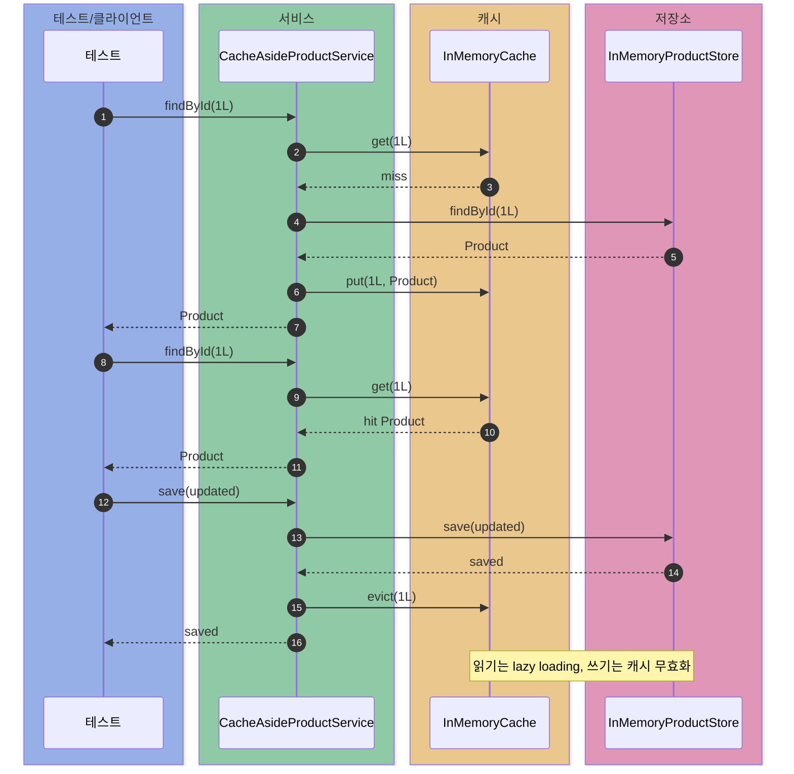
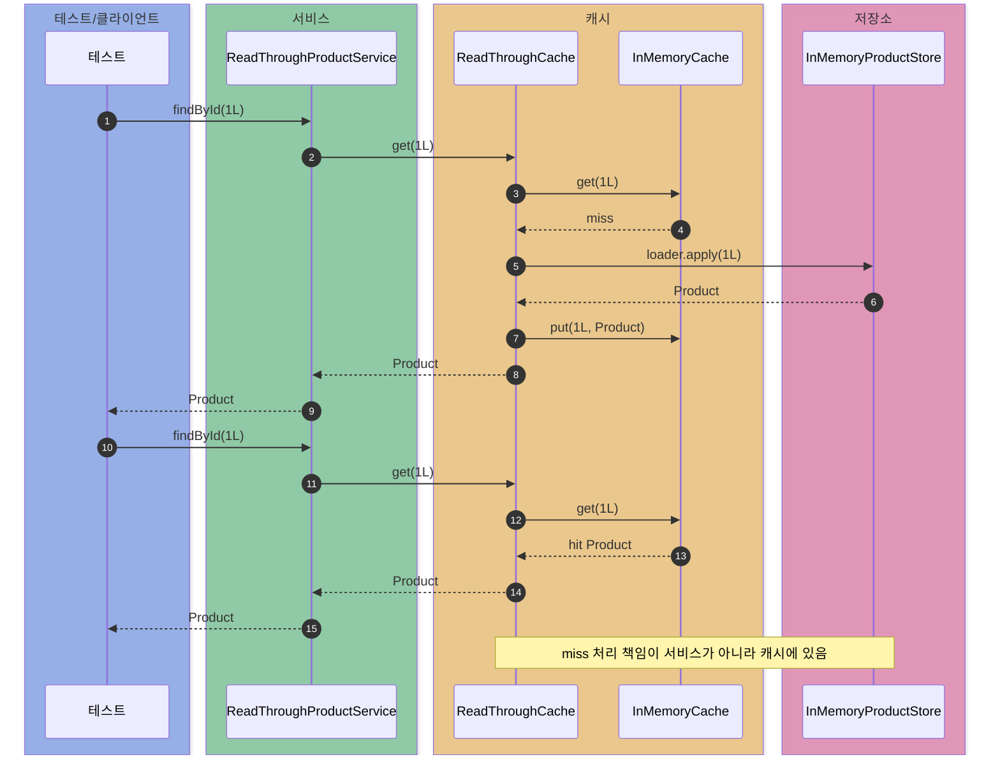
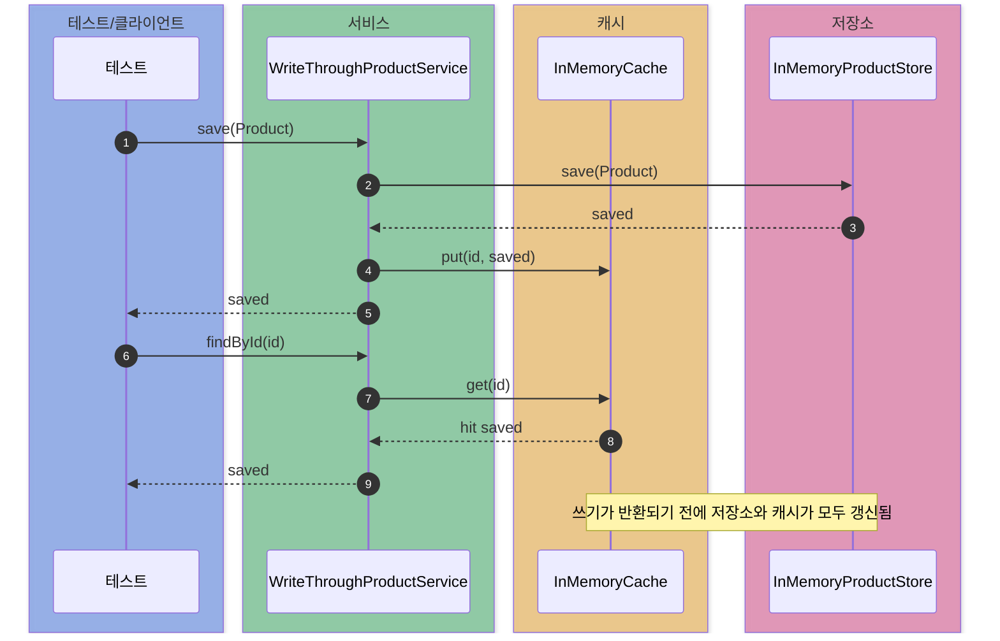
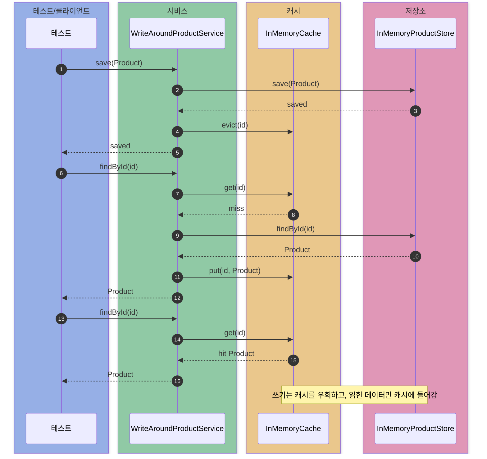
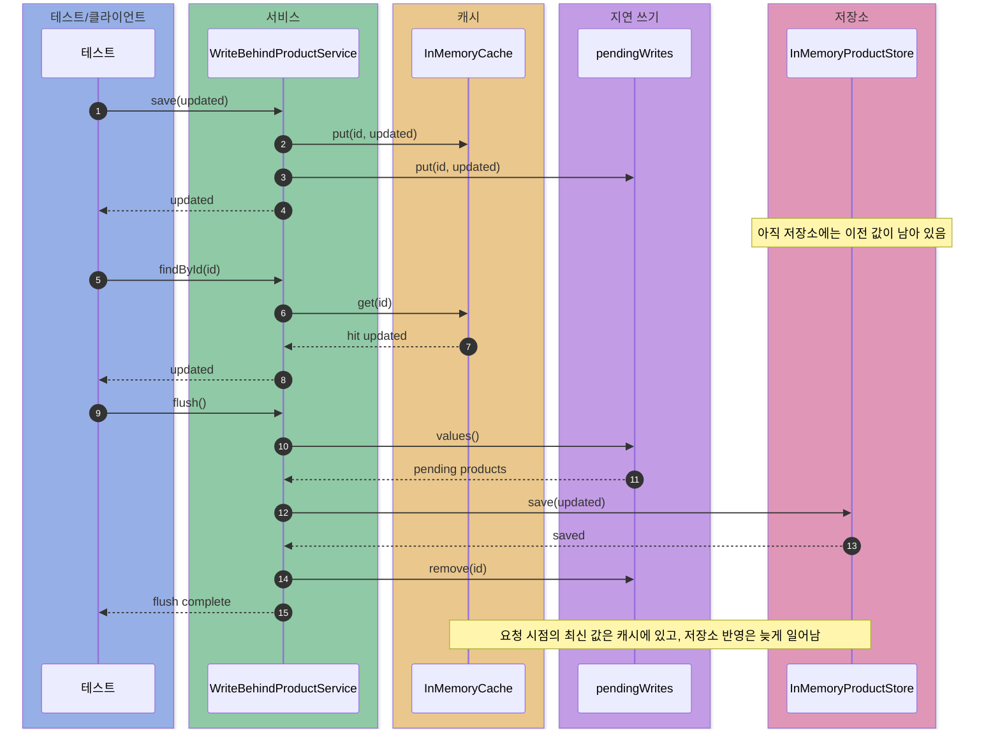

# cache-patterns

캐시 전략에서 읽기/쓰기 책임을 어디에 둘지 비교하는 실험.

비교 대상:

- Cache Aside
- Read Through
- Write Through
- Write Around
- Write Behind

## 공통 환경

- Java 21
- 외부 Redis 없이 `InMemoryCache` 사용
- 영속 저장소는 `InMemoryProductStore`로 대체
- 실험 대상 데이터: `Product`
- 테스트 관찰값:
  - 캐시 hit/miss 횟수
  - 저장소 read/write 횟수
  - Write Behind pending write 개수

Mermaid 색상 기준:

- 파랑: 테스트/클라이언트
- 초록: 서비스 계층
- 주황: 캐시
- 분홍: 영속 저장소
- 보라: 지연 쓰기 큐

테스트 단언문 표기 기준:

- 캐시 동작은 `cache.hits()`, `cache.misses()`, `cache.containsKey(...)`로 검증
- 저장소 접근은 `store.readCount()`, `store.writeCount()`로 검증
- Write Behind는 `pendingWriteCount()`와 `flush()` 전후 저장소 상태를 함께 검증

## 패턴 요약

| 패턴 | 읽기 미스 처리 | 쓰기 처리 | 장점 | 주의점 |
| --- | --- | --- | --- | --- |
| Cache Aside | 애플리케이션이 저장소 조회 후 캐시 채움 | 저장소 반영 후 캐시 무효화 | 단순하고 실무에서 흔함 | 캐시 무효화 정책을 앱이 직접 책임짐 |
| Read Through | 캐시가 로더를 호출해 저장소 조회 | 보통 저장소 반영 후 캐시 무효화 | 읽기 로직이 캐시에 모임 | 캐시 구현이 저장소 로더를 알아야 함 |
| Write Through | 캐시 미스 시 저장소 조회 | 저장소와 캐시를 함께 갱신 | 쓰기 직후 읽기 일관성이 좋음 | 쓰기 지연 시간이 증가 |
| Write Around | 캐시 미스 시 저장소 조회 | 저장소만 갱신하고 캐시는 비움 | 쓰기 많은 데이터가 캐시를 오염시키지 않음 | 쓰기 직후 첫 읽기는 저장소 접근 |
| Write Behind | 캐시 우선 조회 | 캐시와 큐에 먼저 쓰고 나중에 저장소 반영 | 쓰기 응답이 빠름 | 장애 시 유실/순서/재시도 설계 필요 |

## 케이스 1. Cache Aside

흐름:

```text
읽기: Cache GET -> miss -> Store SELECT -> Cache PUT -> 반환
쓰기: Store SAVE -> Cache EVICT -> 반환
```

코드 흐름:

```java
public Optional<Product> findById(long id) {
    Optional<Product> cached = cache.get(id);
    if (cached.isPresent()) {
        return cached;
    }

    Optional<Product> loaded = store.findById(id);
    loaded.ifPresent(product -> cache.put(id, product));
    return loaded;
}

public Product save(Product product) {
    Product saved = store.save(product);
    cache.evict(product.id());
    return saved;
}
```

결과:

- 첫 번째 읽기: 캐시 miss 1회, 저장소 read 1회
- 두 번째 읽기: 캐시 hit 1회, 저장소 추가 read 없음
- 쓰기 후: 캐시를 제거하고 다음 읽기에서 저장소 값을 다시 적재
- 테스트 단언문: `store.readCount().isEqualTo(1)`, `cache.misses().isEqualTo(1)`, `cache.hits().isEqualTo(1)`

이유:

- 애플리케이션이 캐시를 옆에 두고 직접 관리
- 캐시에 없으면 저장소에서 읽고, 읽은 값을 캐시에 넣음
- 쓰기 시 캐시를 업데이트하지 않고 제거하면 오래된 값을 반환할 위험이 줄어듦

한계:

- 캐시 무효화 타이밍을 애플리케이션 코드가 계속 신경 써야 함
- 여러 서비스가 같은 데이터를 수정하면 무효화 이벤트 전파가 필요
- 캐시 miss가 한 번에 몰리면 저장소로 요청이 집중될 수 있음



## 케이스 2. Read Through

흐름:

```text
Service -> ReadThroughCache GET -> miss -> loader 호출 -> Store SELECT -> Cache PUT -> 반환
```

코드 흐름:

```java
public Optional<V> get(K key) {
    Optional<V> cached = cache.get(key);
    if (cached.isPresent()) {
        return cached;
    }

    Optional<V> loaded = loader.apply(key);
    loaded.ifPresent(value -> cache.put(key, value));
    return loaded;
}
```

결과:

- 첫 번째 읽기: 캐시 miss 1회, 로더를 통해 저장소 read 1회
- 두 번째 읽기: 캐시 hit 1회, 저장소 추가 read 없음
- 테스트 단언문: `store.readCount().isEqualTo(1)`, `cache.misses().isEqualTo(1)`, `cache.hits().isEqualTo(1)`

이유:

- 서비스는 캐시 조회만 호출
- 캐시가 miss 처리와 저장소 로딩을 책임짐
- 읽기 로직이 여러 서비스에 흩어지는 것을 줄일 수 있음

한계:

- 캐시 계층이 저장소 로더를 알아야 함
- 단순 캐시보다 구현이 두꺼워짐
- 쓰기 정책은 별도로 정해야 함



## 케이스 3. Write Through

흐름:

```text
쓰기: Store SAVE -> Cache PUT -> 반환
읽기: Cache GET -> hit -> 반환
```

코드 흐름:

```java
public Product save(Product product) {
    Product saved = store.save(product);
    cache.put(product.id(), saved);
    return saved;
}
```

결과:

- 쓰기 시 저장소 write 1회
- 쓰기 직후 캐시에 값 존재
- 다음 읽기는 캐시 hit로 처리되어 저장소 read 0회
- 테스트 단언문: `store.writeCount().isEqualTo(1)`, `cache.containsKey(1L).isTrue()`, `store.readCount().isZero()`

이유:

- 쓰기 요청이 저장소와 캐시를 함께 갱신
- 쓰기 직후 같은 키를 읽으면 최신 값을 캐시에서 바로 반환
- 읽기 비중이 높고 쓰기 직후 재조회가 많은 데이터에 유리

한계:

- 쓰기 경로가 느려짐
- 저장소 쓰기 성공 후 캐시 쓰기 실패 같은 부분 실패 처리가 필요
- 자주 쓰이지만 거의 읽히지 않는 데이터도 캐시에 들어갈 수 있음



## 케이스 4. Write Around

흐름:

```text
쓰기: Store SAVE -> Cache EVICT -> 반환
읽기: Cache GET -> miss -> Store SELECT -> Cache PUT -> 반환
```

코드 흐름:

```java
public Product save(Product product) {
    Product saved = store.save(product);
    cache.evict(product.id());
    return saved;
}
```

결과:

- 쓰기 시 저장소 write 1회
- 쓰기 직후 캐시에는 값이 없음
- 첫 읽기에서 저장소 read 1회 후 캐시 적재
- 두 번째 읽기는 캐시 hit
- 테스트 단언문: `store.writeCount().isEqualTo(1)`, `cache.containsKey(1L).isFalse()`, `store.readCount().isEqualTo(1)`

이유:

- 쓰기 데이터가 바로 읽힌다는 보장이 없으면 캐시에 넣지 않음
- 캐시 공간을 실제로 읽히는 데이터 중심으로 사용
- 대량 쓰기나 이벤트성 쓰기에서 캐시 오염을 줄일 수 있음

한계:

- 쓰기 직후 첫 읽기는 항상 저장소를 거침
- 기존 캐시가 있다면 stale data 방지를 위해 무효화가 필요
- 읽기 지연 시간을 첫 요청자가 부담



## 케이스 5. Write Behind

흐름:

```text
쓰기: Cache PUT -> pendingWrites 추가 -> 반환
읽기: Cache GET -> hit -> 반환
flush: pendingWrites -> Store SAVE -> pendingWrites 제거
```

코드 흐름:

```java
public Product save(Product product) {
    cache.put(product.id(), product);
    pendingWrites.put(product.id(), product);
    return product;
}

public void flush() {
    for (Product product : new ArrayList<>(pendingWrites.values())) {
        store.save(product);
        pendingWrites.remove(product.id());
    }
}
```

결과:

- 쓰기 직후 캐시는 최신 값
- 쓰기 직후 저장소 write 0회
- `pendingWriteCount()`는 1
- `flush()` 이후 저장소 write 1회, pending write 0개
- 테스트 단언문: `store.writeCount().isZero()`, `pendingWriteCount().isEqualTo(1)`, `flush()` 후 `store.writeCount().isEqualTo(1)`

이유:

- 사용자 요청에서는 캐시와 메모리 큐까지만 반영하고 빠르게 반환
- 저장소 반영은 나중에 묶어서 처리 가능
- 쓰기 처리량을 높이고 저장소 부하를 완화할 수 있음

한계:

- flush 전에 프로세스가 죽으면 데이터가 유실될 수 있음
- 저장 순서, 재시도, 중복 반영, 실패 보상 설계가 필요
- 캐시와 저장소 사이에 일시적 불일치가 생김
- 실제 서비스에서는 durable queue, WAL, outbox 같은 장치가 필요



## 실행

```bash
./gradlew :cache-patterns:test
```

## 읽어볼 파일

- `src/main/java/dev/deepdive/cache/CacheAsideProductService.java`
- `src/main/java/dev/deepdive/cache/ReadThroughCache.java`
- `src/main/java/dev/deepdive/cache/ReadThroughProductService.java`
- `src/main/java/dev/deepdive/cache/WriteThroughProductService.java`
- `src/main/java/dev/deepdive/cache/WriteAroundProductService.java`
- `src/main/java/dev/deepdive/cache/WriteBehindProductService.java`
- `src/test/java/dev/deepdive/cache/*Test.java`
