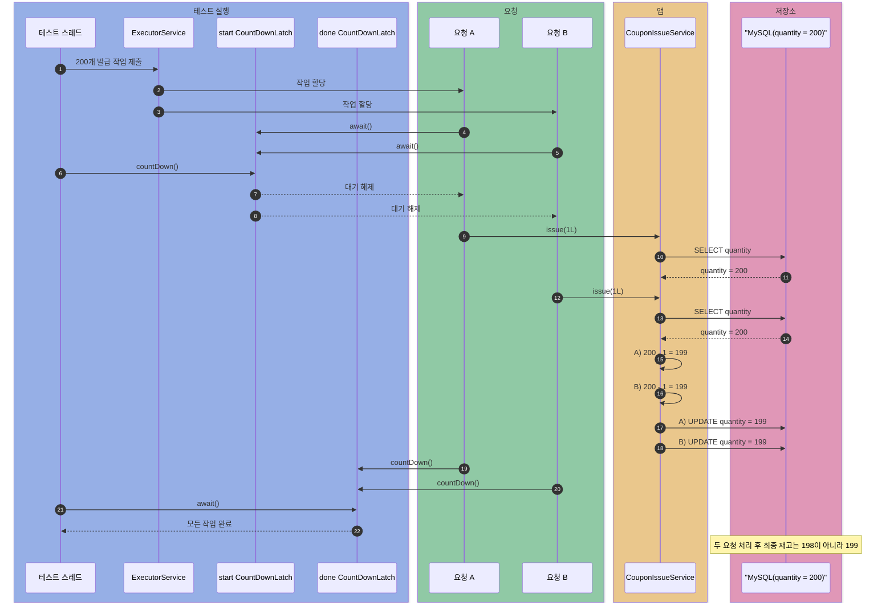
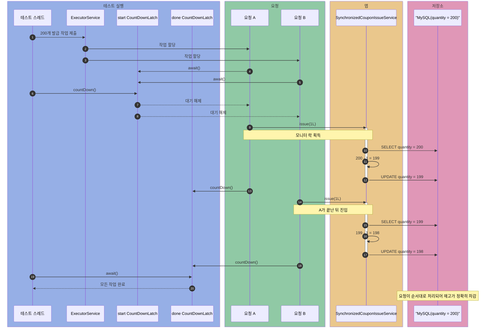
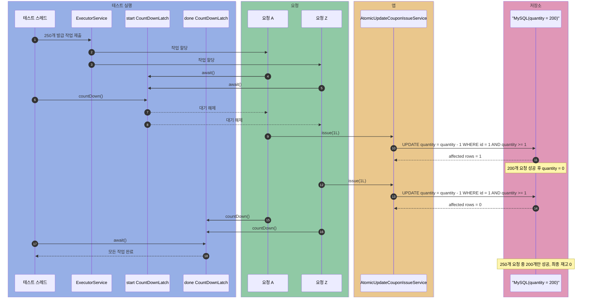
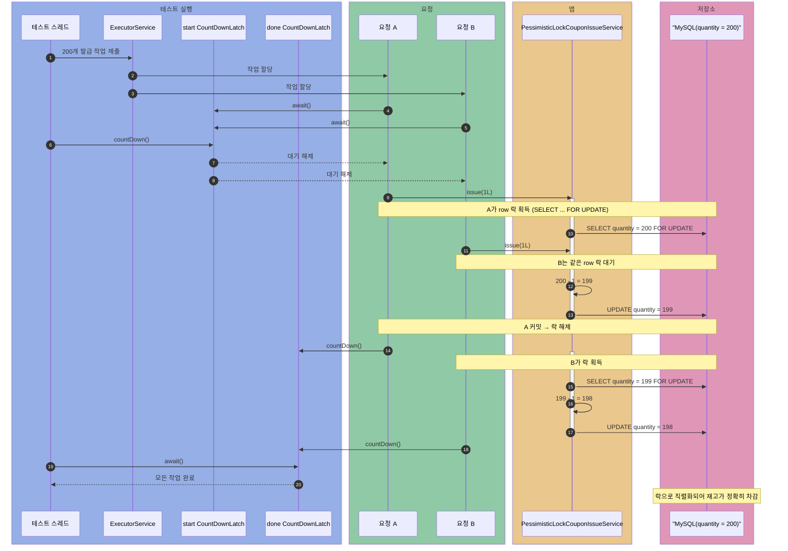
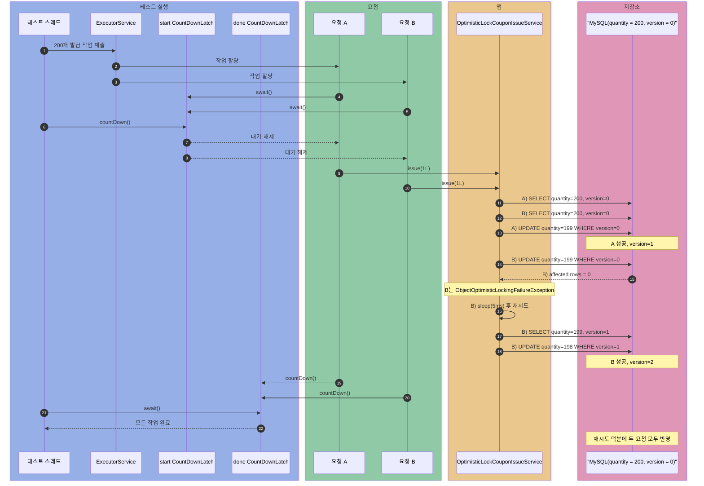
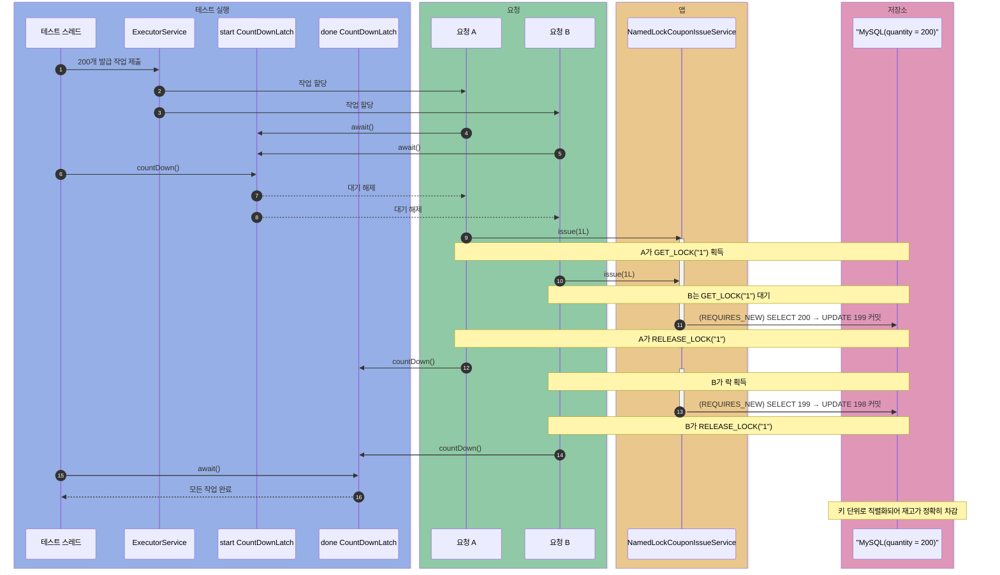
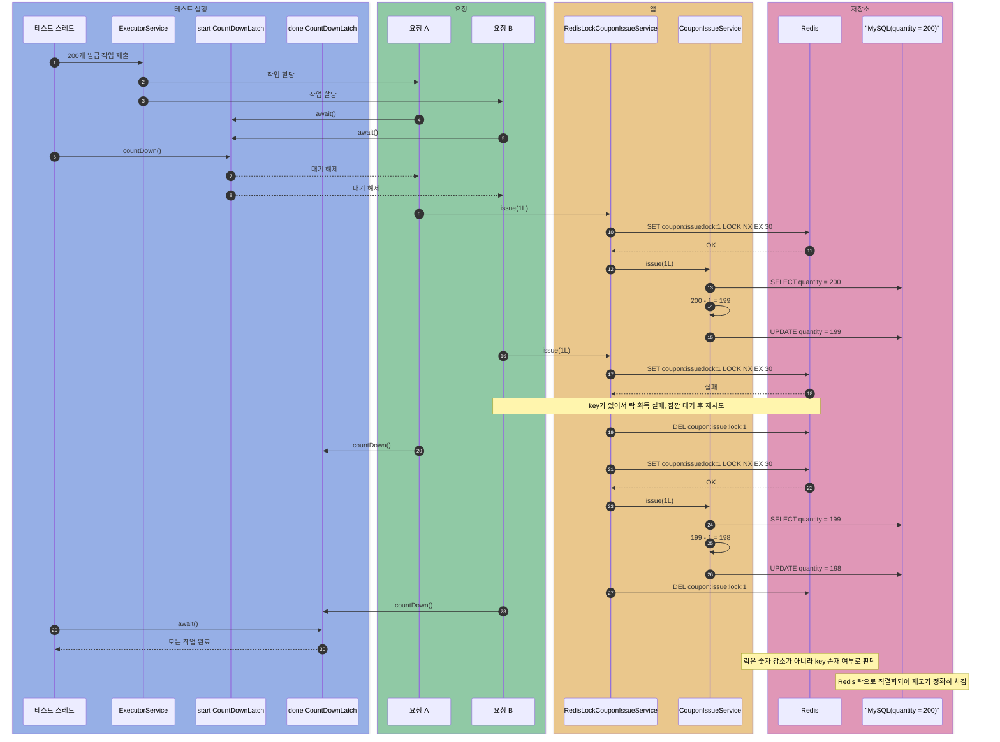
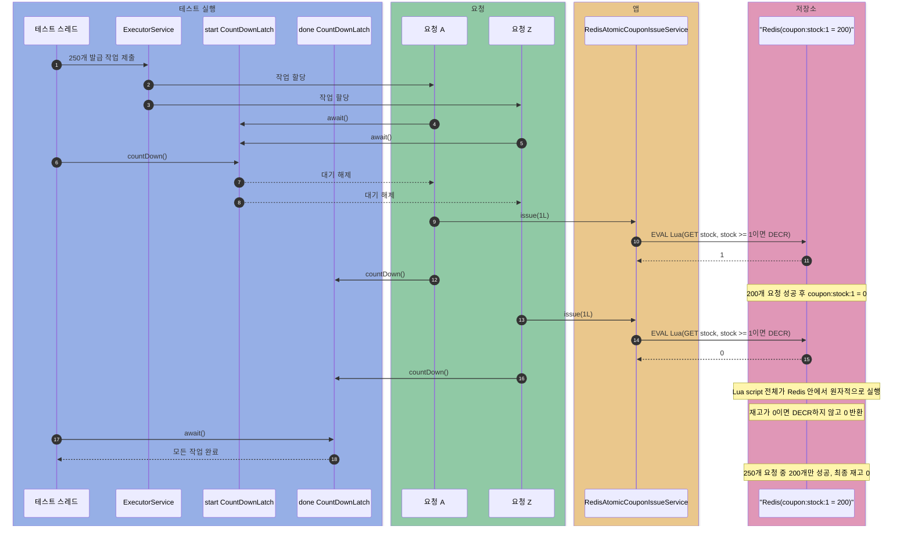
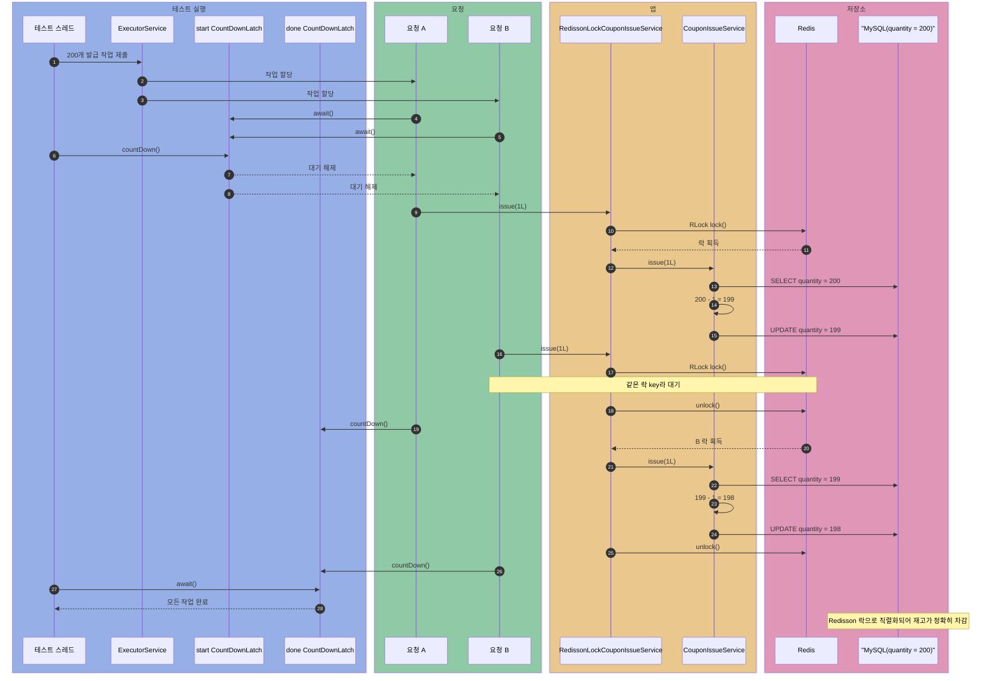

# coupon-issue

선착순 쿠폰 발급에서 같은 재고를 동시에 차감할 때 생기는 동시성 문제 실험.

비교 대상:

- 동시성 제어 없음
- `synchronized`
- 원자적 `UPDATE`
- 비관적 락 (`SELECT ... FOR UPDATE`)
- 낙관적 락 (`@Version`)
- 네임드 락 (MySQL `GET_LOCK`)
- Redis 분산락 (`SET NX`)
- Redis 원자적 재고 차감 (Lua)
- Redisson 분산락 (`RLock`)

## 공통 환경

- Testcontainers MySQL 8.0.36
- Redis 관련 케이스는 Testcontainers Redis 7.2.5 추가 사용
- 실험 대상 쿠폰: ID `1L`, 재고 200개
- 기본 요청 수: 200개
- 초과 요청 수: 250개 (`원자적 UPDATE`, `Redis Lua`처럼 성공/실패를 반환하는 케이스)
- 실행 시간: 테스트 콘솔에 `ms` 출력

Mermaid 색상 기준:

- 파랑: 테스트 실행 도구 (`테스트 스레드`, `ExecutorService`, latch)
- 초록: 요청 스레드
- 주황: 애플리케이션 코드
- 분홍: 외부 저장소 (`MySQL`, `Redis`)

테스트 단언문 표기 기준:

- 최종 재고만 검증하는 케이스는 핵심 메서드만 표기 (`isEqualTo(0)`)
- 성공 수처럼 별도 변수를 함께 검증하는 케이스는 AssertJ 호출을 풀어서 표기

## 케이스 1. 동시성 제어 없음

흐름:

```text
SELECT -> 메모리에서 -1 -> flush/commit 시 UPDATE
```

코드 흐름:

```java
@Transactional
public void issue(Long couponId) {
    CouponStock stock = couponRepository.findById(couponId).orElseThrow();
    stock.decrease();
    couponRepository.save(stock);
}
```

결과:

- 기대값: `200 - 200 = 0`
- 실제 결과: 최종 재고가 `0`이 아닐 수 있음
- 테스트 단언문: `isNotEqualTo(0)`

이유:

- 두 스레드가 둘 다 `quantity = 200` 조회
- 둘 다 메모리에서 `199`로 계산
- 둘 다 DB에 `quantity = 199` 저장
- 요청은 2번 처리됐지만 실제 차감은 1번만 반영
- lost update 발생


## 케이스 2. synchronized

흐름:

```text
synchronized 진입 -> SELECT -> 메모리에서 -1 -> flush/commit 시 UPDATE -> synchronized 종료
```

코드 흐름:

```java
public synchronized void issue(Long couponId) {
    CouponStock stock = couponRepository.findById(couponId).orElseThrow();
    stock.decrease();
    couponRepository.save(stock);
}
```

결과:

- 최종 재고: `0`
- 테스트 단언문: `isEqualTo(0)`

이유:

- 한 스레드만 `issue()` 진입
- 읽기, 계산, 저장이 순서대로 처리
- lost update 없음

한계:

- 같은 서비스 인스턴스/단일 JVM 안에서만 유효
- 서버 여러 대면 각 JVM이 별도 모니터 락 사용
- 전체 구간 직렬화로 처리량 저하



## 케이스 3. 원자적 UPDATE

흐름:

```text
UPDATE 한 방으로 조건 검사 + 차감
```

쿼리:

```java
@Modifying
@Query("""
        UPDATE CouponStock c
        SET c.remainingQuantity = c.remainingQuantity - 1
        WHERE c.couponId = :couponId AND c.remainingQuantity >= 1
        """)
int decreaseQuantity(@Param("couponId") Long couponId);
```

결과:

- 요청 수: 250개
- 이번 테스트의 성공 발급 수: 200개
- 실패 요청 수: 50개
- 최종 재고: `0`
- 테스트 단언문: `assertThat(issuedCount.get()).isEqualTo(200)`, `assertThat(remainingQuantity).isEqualTo(0)`

이유:

- `quantity >= 1` 검사와 `quantity - 1` 차감을 한 SQL에서 처리
- MySQL이 같은 row에 대한 `UPDATE`를 안전하게 처리
- 애플리케이션 레벨 락 불필요
- `affected rows = 1`: 성공
- `affected rows = 0`: 재고 부족
- 재고 200개에 요청 250개를 보내므로 초과 50개는 `affected rows = 0`으로 실패

한계:

- 단순 증감에 적합
- 여러 테이블 검증, 복잡한 정책, 외부 조건이 섞이면 SQL 한 문장으로 끝내기 어려움



## 케이스 4. 비관적 락 (`SELECT ... FOR UPDATE`)

흐름:

```text
SELECT ... FOR UPDATE(row 잠금) -> 메모리에서 -1 -> commit 시 UPDATE -> 락 해제
다른 트랜잭션은 락이 풀릴 때까지 대기
```

쿼리:

```java
@Lock(LockModeType.PESSIMISTIC_WRITE)
@Query("""
        SELECT c
        FROM CouponStock c
        WHERE c.couponId = :couponId
        """)
Optional<CouponStock> findByIdWithPessimisticLock(@Param("couponId") Long couponId);
```

코드 흐름:

```java
@Transactional
public void issue(Long couponId) {
    CouponStock stock = couponRepository.findByIdWithPessimisticLock(couponId).orElseThrow();
    stock.decrease();
    couponRepository.save(stock);
}
```

결과:

- 최종 재고: `0`
- 테스트 단언문: `isEqualTo(0)`

이유:

- `PESSIMISTIC_WRITE`는 조회 시점에 row에 쓰기 락(`SELECT ... FOR UPDATE`)
- 락 잡은 트랜잭션이 커밋/롤백할 때까지 다른 트랜잭션의 같은 row 조회는 대기
- 읽기-계산-쓰기가 트랜잭션 단위로 직렬화 → lost update 없음
- `synchronized`와 달리 앱이 아닌 **DB가 락 관리** → 서버 여러 대여도 동작

한계:

- 전 구간 직렬화 → 동시 요청 많이 몰리면 처리량 저하
- 락 대기 길어지면 커넥션 오래 점유, 최악의 경우 락 타임아웃·데드락
- 락 잡는 동안 커넥션 풀 점유 → 동시 요청 많으면 풀 고갈 위험



## 케이스 5. 낙관적 락 (`@Version`)

흐름:

```text
SELECT(version 포함) -> 메모리에서 -1 -> commit 시 UPDATE ... WHERE version = ?
  -> version 안 맞으면 예외 -> 잠깐 대기 후 처음부터 재시도
```

버전 컬럼은 **전용 엔티티** `VersionedCouponStock`에만 둔다. 다른 발급 방식이 쓰는 `CouponStock`에는 `@Version`이 없다:

```java
@Entity
@Table(name = "versioned_coupon_stock")
public class VersionedCouponStock {
    @Version
    private Long version;
    // ...
}
```

코드 흐름:

```java
// 재시도는 트랜잭션 "바깥"에 있어야 한다.
public void issue(Long couponId) {
    while (true) {
        try {
            self.issueOnce(couponId);   // 프록시를 통해 @Transactional 적용
            return;
        } catch (ObjectOptimisticLockingFailureException conflict) {
            sleep(5);                   // 잠깐 기다렸다 재시도
        }
    }
}

@Transactional
public void issueOnce(Long couponId) {
    VersionedCouponStock stock = versionedCouponRepository.findByIdWithOptimisticLock(couponId).orElseThrow();
    stock.decrease();
    versionedCouponRepository.save(stock);
}
```

> `@Version`을 공용 `CouponStock`에 두면 "락 없음" 케이스까지 커밋 시 버전 검사를 받아 lost update를 재현하지 못한다. 그래서 낙관적 락만 별도 엔티티/리포지토리로 분리했다.

결과:

- 최종 재고: `0`
- 테스트 단언문: `isEqualTo(0)`

이유:

- 읽을 때 `version`도 함께 조회
- 커밋 시 `UPDATE ... WHERE version = 읽은값`으로 갱신
- 그 사이 다른 트랜잭션이 먼저 커밋해 `version`이 바뀌었으면 `affected rows = 0` → `ObjectOptimisticLockingFailureException`
- 충돌한 요청은 **실패** → 재시도 없이는 재고가 `0`까지 안 줄어듦
- 재시도 루프가 충돌 요청을 새 트랜잭션에서 다시 시도 → 결국 모두 성공

한계:

- **충돌이 곧 실패** — 락으로 막는 게 아니라 "충돌을 사후에 감지"하는 방식이라 충돌 시 예외
- **재시도 로직이 사실상 필수** — 그냥 두면 요청 실패 → 재시도(+백오프)를 직접 구현해야 함. 비관적 락·원자적 `UPDATE`엔 없는 추가 코드
- **동시 요청 몰리면 비효율** — 같은 row를 여럿이 다투면 대부분 충돌 → 재시도 폭주. 이 실험도 200개를 한 row에 몰아 다른 방식보다 훨씬 느림(아래 실행 시간). 동시 충돌이 드문 상황에 적합

참고:

- **재시도가 트랜잭션 바깥이어야 함** — 충돌 예외는 커밋 시점에 나고 그 트랜잭션은 롤백 → 같은 `@Transactional` 안에서 재시도 불가 → 경계와 루프를 분리



주의 (재시도 + `self` 호출):

- `@Transactional` 빈은 Spring이 **프록시로 한 겹 감쌈** → 트랜잭션을 열고 커밋/롤백하는 건 알맹이(원본)가 아니라 프록시
- 충돌(=커밋)도 프록시가 메서드를 끝낸 뒤 처리 → 한 번 충돌하면 그 트랜잭션은 끝, 재시도란 곧 **새 트랜잭션 열기**
- 그래서 **시도 1회 = 트랜잭션 1개**가 되도록, 한 번의 시도를 `issueOnce`(`@Transactional`)로 두고 → 반복하는 루프 `issue`는 트랜잭션 밖
- `this.issueOnce()`는 알맹이가 자기 메서드를 직접 호출 → 프록시 우회 → 트랜잭션 안 열림. 프록시 참조 `self`로 호출
- `self`는 자기 자신을 주입받아 확보 (순환 참조 회피용 `@Lazy`)
- 재시도를 별도 클래스(퍼사드)로 빼면 `self`/`@Lazy` 불필요 — 주입받은 서비스는 **이미 프록시**라 그냥 호출해도 거쳐감. 여기선 한 클래스로 보여주려고 `self` 사용

## 케이스 6. 네임드 락 (MySQL `GET_LOCK`)

흐름:

```text
GET_LOCK(키) 획득 -> (별도 트랜잭션에서) SELECT -> -1 -> UPDATE 커밋 -> RELEASE_LOCK(키)
다른 트랜잭션은 같은 키의 GET_LOCK에서 대기
```

쿼리:

```java
@Query(value = "SELECT GET_LOCK(:key, 10)", nativeQuery = true)
Integer getLock(@Param("key") String key);

@Query(value = "SELECT RELEASE_LOCK(:key)", nativeQuery = true)
Integer releaseLock(@Param("key") String key);
```

코드 흐름:

```java
// getLock/releaseLock을 같은 커넥션에 고정(@Transactional)
@Transactional
public void issue(Long couponId) {
    try {
        namedLockRepository.getLock(couponId.toString());
        self.issueOnce(couponId);   // REQUIRES_NEW, 프록시 경유
    } finally {
        namedLockRepository.releaseLock(couponId.toString());
    }
}

// 차감은 별도 트랜잭션, 락 풀기 전에 커밋
@Transactional(propagation = Propagation.REQUIRES_NEW)
public void issueOnce(Long couponId) {
    CouponStock stock = couponRepository.findById(couponId).orElseThrow();
    stock.decrease();
    couponRepository.save(stock);
}
```

결과:

- 최종 재고: `0`
- 테스트 단언문: `isEqualTo(0)`

이유:

- `GET_LOCK`은 row가 아닌 **문자열 키**에 거는 락 → 같은 키를 노리는 다른 세션은 대기
- 비관적 락과 달리 테이블·row와 무관 → 락 대상을 애플리케이션이 자유롭게 지정
- 차감을 `REQUIRES_NEW`로 분리해 **락 풀기 전에 커밋** → 안 그러면 다음 스레드가 안 보이는 재고를 읽어 lost update

한계:

- 비관적 락처럼 전 구간 직렬화 → 처리량 저하
- 락 대기 스레드도 커넥션 점유 → 동시 요청 몰리면 풀 고갈 위험
- `GET_LOCK`은 MySQL 전용 → DB 종속

주의 (커넥션 2개 + `self` 호출):

- 락 잡는 커넥션(`@Transactional`)과 차감 커넥션(`REQUIRES_NEW`)이 **동시에 2개** 필요
- `getLock`/`releaseLock`은 **같은 커넥션**에서 해야 풀림 → `@Transactional`로 한 커넥션에 고정
- `self.issueOnce()`로 프록시를 거쳐야 `REQUIRES_NEW`가 적용 (낙관적 락과 같은 self 주입)



## 케이스 7. Redis 분산락 (`SET NX`)

흐름:

```text
Redis 락 획득 -> SELECT -> 메모리에서 -1 -> flush/commit 시 UPDATE -> Redis 락 해제
다른 요청은 같은 Redis key가 사라질 때까지 재시도
```

코드 흐름:

```java
public void issue(Long couponId) {
    String lockKey = "coupon:issue:lock:" + couponId;

    lock(lockKey);
    try {
        couponIssueService.issue(couponId);
    } finally {
        redisTemplate.delete(lockKey);
    }
}

private void lock(String lockKey) {
    while (true) {
        if (Boolean.TRUE.equals(redisTemplate.opsForValue().setIfAbsent(lockKey, "LOCK", Duration.ofSeconds(30)))) {
            return;
        }
        Thread.sleep(10);
    }
}
```

결과:

- 최종 재고: `0`
- 테스트 단언문: `isEqualTo(0)`

이유:

- Redis에 락 key가 없으면 `SET NX` 성공 → 락 획득
- Redis에 락 key가 있으면 `SET NX` 실패 → 잠깐 대기 후 재시도
- `key 있음`: 잠김
- `key 없음`: 락 없음
- 재고 차감은 기존 `CouponIssueService`가 담당

한계:

- 락 TTL이 너무 짧으면 작업 중 락 만료 위험
- 락 TTL이 너무 길면 장애 시 대기 시간 증가



## 케이스 8. Redis 원자적 재고 차감 (Lua)

흐름:

```text
Redis Lua script 한 번 호출 -> 재고 확인 -> 1 이상이면 DECR -> 성공/실패 반환
```

Lua 스크립트:

```lua
local stock = tonumber(redis.call('GET', KEYS[1]) or '0')
if stock < 1 then
    return 0
end
redis.call('DECR', KEYS[1])
return 1
```

Java 호출 코드:

```java
public boolean issue(Long couponId) {
    Long result = redisTemplate.execute(DECREASE_STOCK_SCRIPT, List.of(stockKey(couponId)));
    return Long.valueOf(1L).equals(result);
}
```

결과:

- Redis key: `coupon:stock:1`
- 초기 재고: 200개
- 요청 수: 250개
- 성공 발급 수: 200개
- 실패 요청 수: 50개
- 최종 Redis 재고: `0`
- 테스트 단언문: `assertThat(issuedCount.get()).isEqualTo(200)`, `assertThat(stock).isEqualTo("0")`

이유:

- `GET`으로 재고 확인하고 `DECR`하는 작업을 Lua script 하나로 묶음
- Redis는 Lua script 실행 중 다른 명령을 끼워 넣지 않음 → 확인과 차감이 원자적으로 처리
- DB 락, 애플리케이션 락 없이 Redis 단일 실행으로 끝
- 재고가 `0`이면 차감하지 않고 실패 반환

한계:

- Redis가 재고의 기준 저장소가 됨
- DB에 발급 이력을 남겨야 한다면 Redis 차감 이후 동기화 전략 필요
- 복잡한 정책이 많아지면 Lua script가 읽기 어려워짐
- Redis 장애, 클러스터, 복제 지연까지 고려하면 운영 설계가 별도로 필요



## 케이스 9. Redisson 분산락 (`RLock`)

흐름:

```text
Redisson RLock 획득 -> SELECT -> 메모리에서 -1 -> flush/commit 시 UPDATE -> RLock 해제
다른 요청은 같은 Redis lock key가 풀릴 때까지 대기
```

코드 흐름:

```java
public void issue(Long couponId) {
    RLock lock = redissonClient.getLock("coupon:issue:redisson-lock:" + couponId);

    lock.lock();
    try {
        couponIssueService.issue(couponId);
    } finally {
        lock.unlock();
    }
}
```

결과:

- 최종 재고: `0`
- 테스트 단언문: `isEqualTo(0)`

이유:

- Redisson `RLock`이 Redis 기반 락 획득/대기/해제를 처리
- 직접 `SET NX`, TTL, 재시도 루프를 작성하지 않아도 됨
- 락 안에서 기존 `CouponIssueService.issue()` 실행 → DB 차감 로직 재사용
- 같은 쿠폰 ID는 하나씩만 차감 → lost update 없음

한계:

- Redis 락으로 임계 구역을 직렬화 → 처리량 저하
- 락을 잡은 뒤 DB 작업을 하므로 Redis와 DB를 모두 의존
- 락 lease time, watchdog, 장애 시 unlock 같은 Redisson 동작 이해 필요



## 실행 시간

예시 출력:

```text
락 없음: 163.157ms
synchronized: 933.327ms
원자적 UPDATE: 369.100ms
비관적 락: 429.167ms
낙관적 락(재시도): 3156.127ms
네임드 락: 1101.326ms
Redis 분산락: 1312.485ms
Redis Lua 원자 차감: 41.137ms
Redisson 분산락: 1312.510ms
```

> 낙관적 락이 가장 느린 이유: 200개 요청이 한 row를 다투면서 충돌 → 재시도가 반복되기 때문이다. 이렇게 동시 요청이 한꺼번에 몰리는 선착순 쿠폰 같은 상황에는 잘 맞지 않는다.
