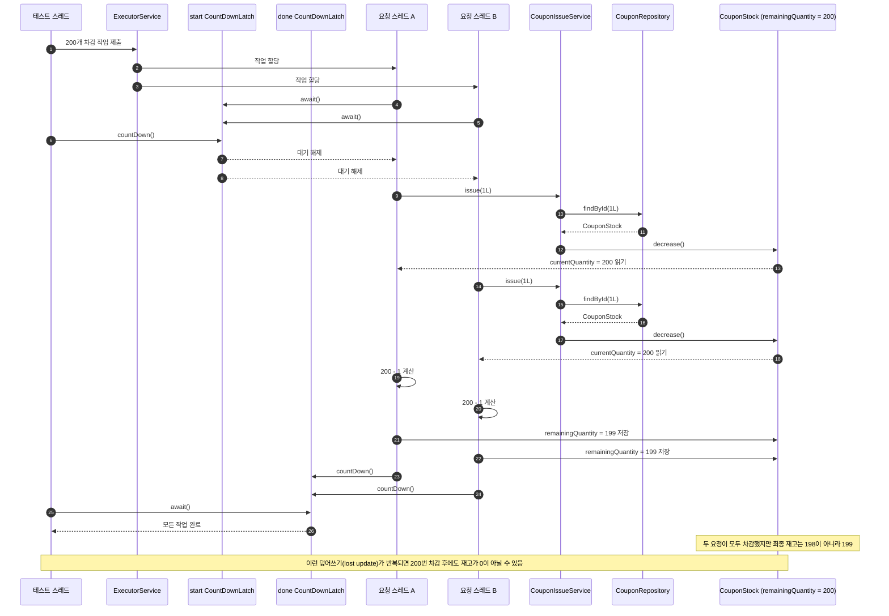

# coupon-issue

쿠폰 발급 과정에서 여러 요청이 동시에 들어올 때 발급 수량과 재고 수량이 어긋나는 문제를 실험합니다.

첫 단계는 락, 트랜잭션 제어, Redis 없이 같은 쿠폰 재고를 동시에 차감하면 왜 결과가 깨지는지 확인하는 것입니다.

동시성 문제는 쿠폰이 제한 수량보다 많이 발급되는 경우뿐 아니라, 발급 성공 수와 재고 차감 수가 서로 다르게 기록되는 경우도 포함합니다.

## 케이스 1. 동시에 재고 차감

시나리오:

- 쿠폰 ID `1L`의 재고가 200개 있습니다.
- 200개의 요청이 동시에 쿠폰 발급 서비스를 호출합니다.

기대 결과:

- `200 - 200 = 0`

실제 결과:

- 여러 스레드가 같은 재고 값을 읽고 각각 차감하면, 일부 차감 결과가 덮어써질 수 있습니다.
- 따라서 최종 재고가 `0`이 아닐 수 있습니다.

