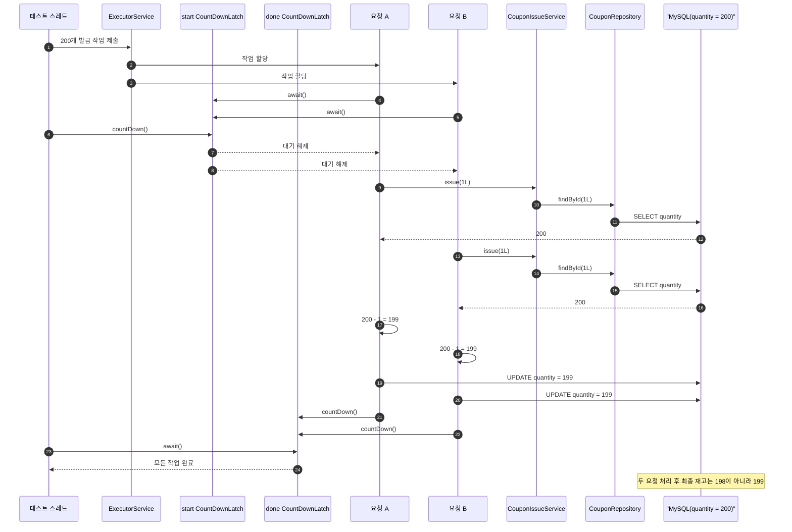
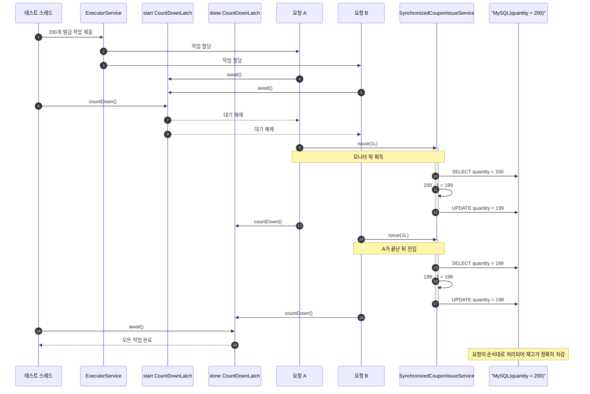
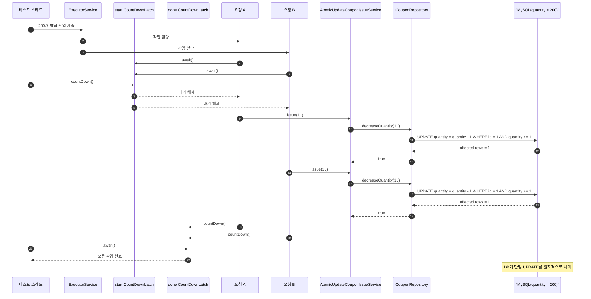

# coupon-issue

선착순 쿠폰 발급에서 같은 재고를 동시에 차감할 때 생기는 동시성 문제 실험.

비교 대상:

- 동시성 제어 없음
- `synchronized`
- 원자적 `UPDATE`

## 공통 환경

- Testcontainers MySQL 8.0.36
- Spring Data JPA `CouponRepository`
- 테스트 시작 전 `coupon_stock` 초기화
- 실험 대상 쿠폰: ID `1L`, 재고 200개
- 요청 수: 200개
- 동시 시작: `start` 래치
- 종료 대기: `done` 래치
- 실행 시간: 테스트 콘솔에 `ms` 출력

## 케이스 1. 동시성 제어 없음

흐름:

```text
SELECT -> 메모리에서 -1 -> flush/commit 시 UPDATE
```

코드 흐름:

```java
@Transactional
public void issue(Long couponId) {
    CouponStock stock = couponRepository.findById(couponId).orElseThrow();
    stock.decrease();
    couponRepository.save(stock);
}
```

결과:

- 기대값: `200 - 200 = 0`
- 실제 결과: 최종 재고가 `0`이 아닐 수 있음
- 테스트 단언: `isNotEqualTo(0)`

이유:

- 두 스레드가 둘 다 `quantity = 200` 조회
- 둘 다 메모리에서 `199`로 계산
- 둘 다 DB에 `quantity = 199` 저장
- 요청은 2번 처리됐지만 실제 차감은 1번만 반영
- lost update 발생



주의:

- `@Transactional`은 Spring 프록시를 거쳐야 동작
- `CouponIssueService`는 테스트에서 직접 `new` 하지 않고 Spring 빈으로 주입

## 케이스 2. synchronized

흐름:

```text
synchronized 진입 -> SELECT -> 메모리에서 -1 -> flush/commit 시 UPDATE -> synchronized 종료
```

코드 흐름:

```java
public synchronized void issue(Long couponId) {
    CouponStock stock = couponRepository.findById(couponId).orElseThrow();
    stock.decrease();
    couponRepository.save(stock);
}
```

결과:

- 최종 재고: `0`
- 테스트 단언: `isEqualTo(0)`

이유:

- 한 스레드만 `issue()` 진입
- 읽기, 계산, 저장이 순서대로 처리
- lost update 없음

한계:

- 같은 서비스 인스턴스/단일 JVM 안에서만 유효
- 서버 여러 대면 각 JVM이 별도 모니터 락 사용
- 전체 구간 직렬화로 처리량 저하



## 케이스 3. 원자적 UPDATE

흐름:

```text
UPDATE 한 방으로 조건 검사 + 차감
```

쿼리:

```java
@Modifying
@Query("""
        UPDATE CouponStock c
        SET c.remainingQuantity = c.remainingQuantity - 1
        WHERE c.couponId = :couponId AND c.remainingQuantity >= 1
        """)
int decreaseQuantity(@Param("couponId") Long couponId);
```

결과:

- 이번 테스트의 성공 발급 수: 200개
- 최종 재고: `0`
- 테스트 단언: `issuedCount == 200`, `remainingQuantity == 0`

이유:

- `quantity >= 1` 검사와 `quantity - 1` 차감을 한 SQL에서 처리
- MySQL이 같은 row에 대한 `UPDATE`를 안전하게 처리
- 애플리케이션 레벨 락 불필요
- `affected rows = 1`: 성공
- `affected rows = 0`: 재고 부족
- 현재 테스트는 요청 수와 재고가 같아서 `0` 케이스까지 직접 검증하지 않음

한계:

- 단순 증감에 적합
- 여러 테이블 검증, 복잡한 정책, 외부 조건이 섞이면 SQL 한 문장으로 끝내기 어려움



## 실행 시간

예시 출력:

```text
락 없음: 168.347ms
synchronized: 1294.471ms
원자적 UPDATE: 443.514ms
```
