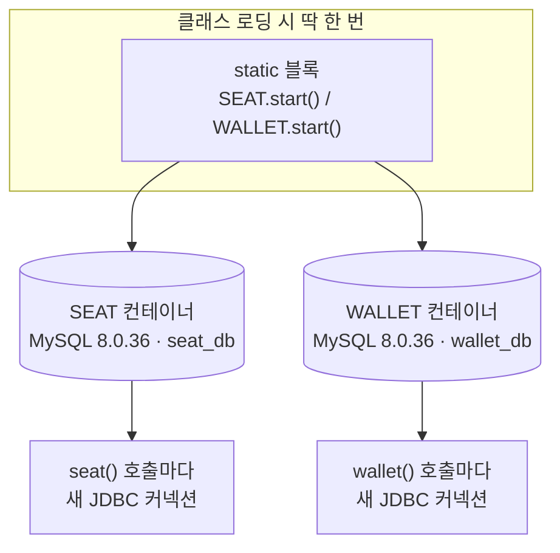
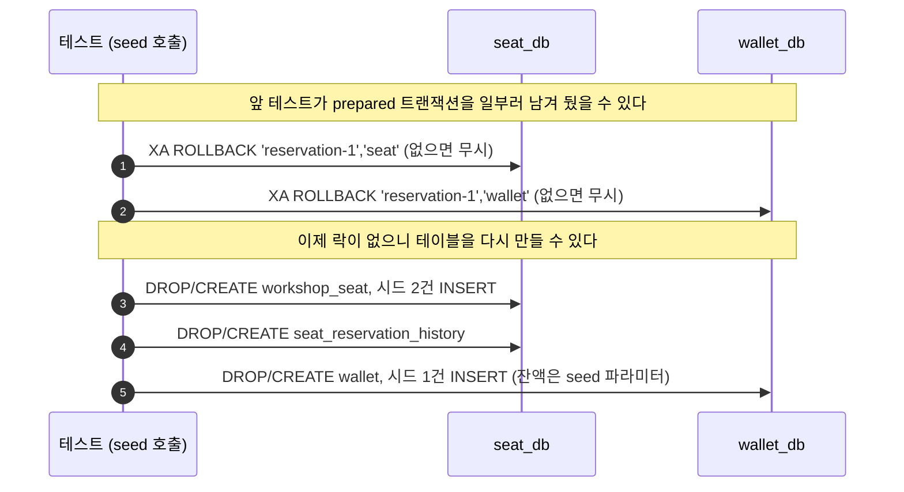
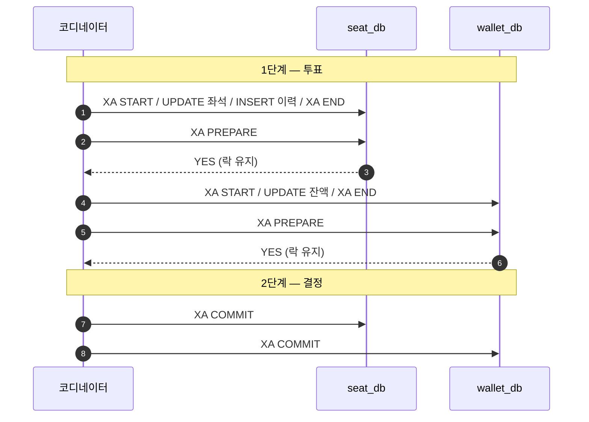
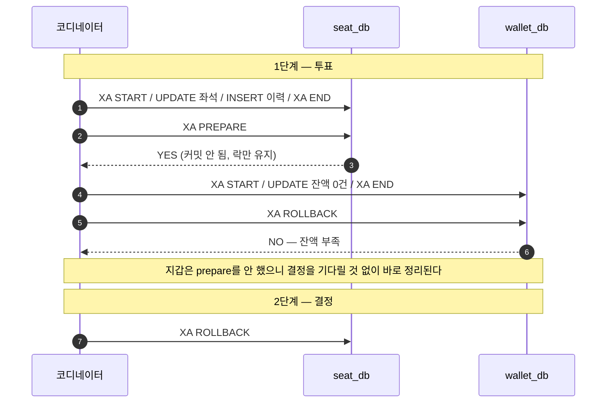
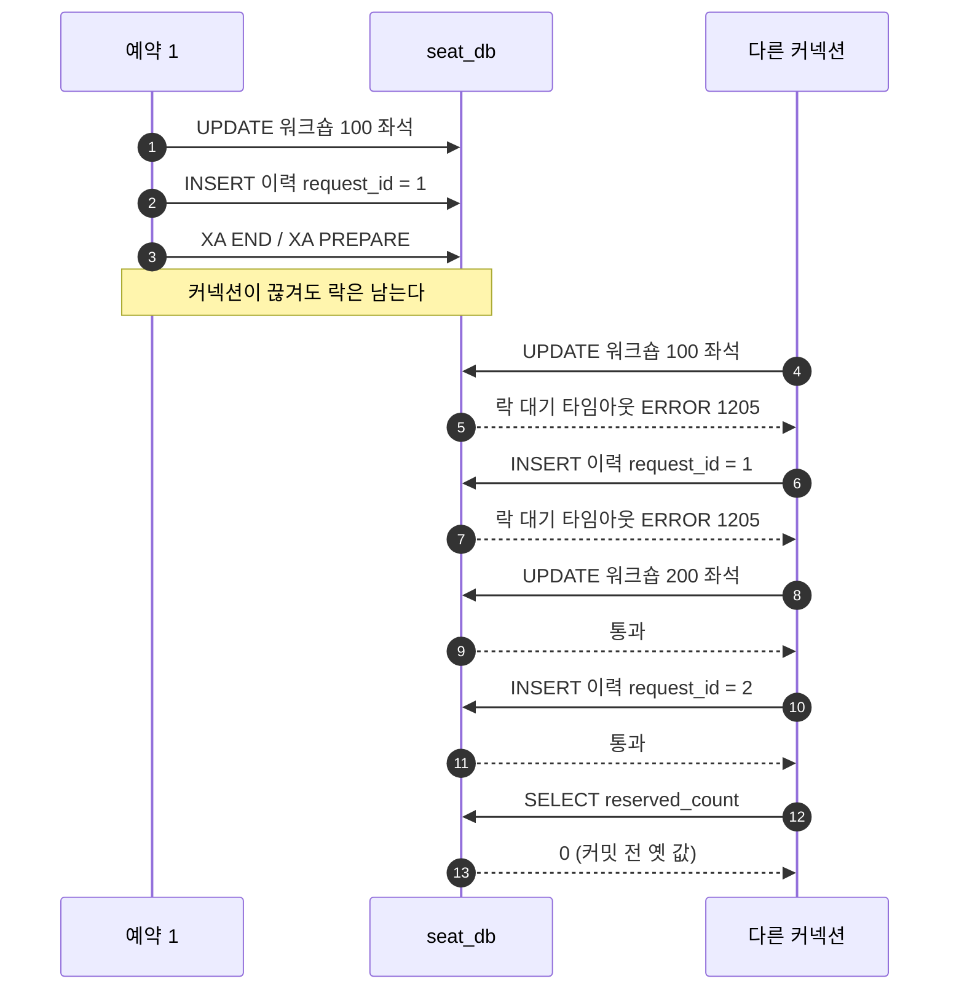

# distributed-transaction-2pc

*결론에는 형광펜을 칠했다. 근거와 주의점까지 3색으로 구분된 판은 `README.html`을 내려받아 브라우저로 열면 볼 수 있다.*

`distributed-transaction-msa`에서 남은 문제는 부분 커밋이었다. 좌석은 이미 커밋됐는데 지갑이 실패하면, 예약도 결제도 없이 좌석만 잡힌 상태가 남는다. 각 서비스의 `@Transactional`이 자기 데이터베이스 하나만 관리하기 때문이다.

2PC는 여기에 단계를 하나 끼워 넣는다. <mark>먼저 전원에게 "커밋할 수 있냐"고 묻고, 답을 다 받은 뒤에 커밋할지 되돌릴지 정한다.</mark>

이 실험실은 **그 두 단계를 MySQL의 `XA` SQL 문으로 직접 실행한다.**<!--tip--> `Xid` 구현체도, 코디네이터 클래스도, JTA 라이브러리도 없다. 코디네이터 역할은 테스트 메서드의 제어 흐름이 한다. 실행하는 SQL은 mysql 클라이언트에 그대로 붙여 넣어도 돌아간다.

도메인은 앞 실험실과 같다. 좌석은 `seat_db`에, 지갑은 `wallet_db`에 있고 서로 다른 MySQL 서버다.

## 두 데이터베이스는 어떻게 준비되나

이 실험실의 픽스처는 `TwoDatabases` 하나다. 헷갈리기 쉬운 지점은 "DB 둘"이 스키마 둘인지 서버 둘인지다. **스키마가 아니라 진짜 MySQL 컨테이너 두 대다.**<!--tip--> 한 서버 안에서 스키마만 나눴다면 커밋도 원래 하나로 묶이니 2PC가 풀 문제 자체가 없다.



**컨테이너는 한 번 뜨면 멈추지 않는다.**<!--note--> `stop()`을 안 부르는 싱글톤 컨테이너 패턴이라, 이 클래스의 테스트 전부가 컨테이너 두 대를 그대로 공유한다. 정리는 JVM이 끝날 때 Testcontainers의 Ryuk이 한다. 대신 커넥션은 풀링하지 않고 `seat()`/`wallet()`을 부를 때마다 새로 연다.

컨테이너는 계속 떠 있어도 안의 테이블은 테스트마다 새로 만들어야 한다. `seed()`가 이 일을 하는데, 여기서는 순서가 중요하다.



**이 순서를 바꾸면 `DROP TABLE`부터 막힌다.**<!--note--> `TwoPhaseCommitTest`의 코디네이터 죽음 시나리오와 `PreparedLockTest`는 일부러 커밋도 롤백도 안 한 채 prepared 트랜잭션을 남기고 끝난다. 다음 테스트의 `seed()`가 롤백을 먼저 하지 않으면, 그 행에 걸린 락 때문에 `DROP TABLE`이 타임아웃까지 기다리게 된다.

`seed()`가 만드는 최종 상태:

| 테이블 | 위치 | 시드 데이터 |
| --- | --- | --- |
| `workshop_seat` | seat_db | id=100(잔여 0), id=200(잔여 0) |
| `seat_reservation_history` | seat_db | 없음 |
| `wallet` | wallet_db | user_id=1, balance=`seed()` 인자 |

## 물어보고 나서 정한다

```sql
-- 1단계: 각 참여자가 자기 작업을 하고 prepare까지 간다 (투표)
XA START 'reservation-1','seat';
UPDATE workshop_seat SET reserved_count = reserved_count + 2 WHERE id = 100;
XA END 'reservation-1','seat';
XA PREPARE 'reservation-1','seat';

-- 2단계: 코디네이터가 답을 모아 결정한다
XA COMMIT 'reservation-1','seat';     -- 전원 YES
XA ROLLBACK 'reservation-1','seat';   -- 한 명이라도 NO
```

**`'reservation-1','seat'`에서 앞이 글로벌 트랜잭션 ID(`gtrid`), 뒤가 참여자별 브랜치(`bqual`)다.**<!--tip--> 여기서는 예약 하나가 글로벌 트랜잭션 하나고, 좌석과 지갑이 브랜치 둘이다.

| 단계 | SQL | 뜻 |
| --- | --- | --- |
| 1 | `XA START` | 이 브랜치의 작업 시작 |
| 1 | `XA END` | 작업 끝. 락은 아직 안 풀린다 |
| 1 | `XA PREPARE` | "무슨 일이 있어도 커밋할 수 있다"는 약속 = YES 투표 |
| 2 | `XA COMMIT` / `XA ROLLBACK` | 코디네이터의 결정 적용 |

## 모두 성공하면



| 데이터 | 실행 전 | 실행 후 |
| --- | ---: | ---: |
| `workshop_seat.reserved_count` | 0 | 2 |
| `seat_reservation_history` | 0건 | 1건 |
| `wallet.balance` | 100,000 | 40,000 |

## 지갑이 못 내면

잔액 50,000인데 60,000을 차감해야 하는 경우. 앞 실험실과 같은 시나리오다.



**핵심은 좌석이 커밋되지 않은 채로 기다렸다는 것이다.**<!--tip--> 좌석은 YES를 던졌을 뿐 아직 커밋하지 않았기 때문에 되돌릴 수 있다.

두 참여자의 롤백 시점이 다른 것도 눈여겨볼 만하다. 지갑은 prepare까지 가지 않았으므로 못 내겠다고 판단한 그 자리에서 스스로 정리하고 NO만 돌려준다. **코디네이터의 결정을 기다려야 하는 쪽은 YES를 던져 놓고 락을 쥔 좌석뿐이다.**<!--note-->

| 데이터 | 실행 전 | MSA 기준선 | 2PC |
| --- | ---: | ---: | ---: |
| `workshop_seat.reserved_count` | 0 | **2** | **0** |
| `seat_reservation_history` | 0건 | **1건** | **0건** |
| `wallet.balance` | 50,000 | 50,000 | 50,000 |

<mark>MSA에서 좌석 2가 남던 자리가 0이 된다. 부분 커밋이 사라졌다.</mark>

## prepare가 보장하는 것

`XA END` 다음에도 락은 풀리지 않는다. `XA PREPARE`가 성공했다는 건 참여자가 이렇게 말한 것이다.

> 변경 내용을 디스크에 안전하게 적어 뒀다. 지금 서버가 죽었다 살아나도 커밋할 수 있다. 그러니 언제든 커밋하라고만 해라.

그 약속을 지키려면 다른 트랜잭션이 같은 행을 건드리지 못하게 막아야 한다. **그래서 락을 계속 쥔다. 이게 2PC가 정합성을 얻는 방법이자, 동시에 대가를 치르는 지점이다.**<!--note-->

## 2PC의 대가

<mark>투표를 받고도 결정을 못 들으면 참여자는 혼자서 커밋도 롤백도 판단할 수 없다.</mark> 커밋하자니 다른 참여자가 NO였을 수 있고, 롤백하자니 이미 YES를 약속했다.

`TwoPhaseCommitTest`의 `prepare_직후_코디네이터가_죽으면_결정이_올_때까지_락이_남는다`가 이 상태를 만든다. 좌석이 prepare한 직후 코디네이터가 죽고 커넥션까지 끊긴다.

prepared 트랜잭션은 커넥션이 끊겨도 사라지지 않는다. 문제는 원래 커넥션이 끊겼으니, 이 트랜잭션이 지금 매달려 있다는 사실 자체를 아무도 모른다는 것이다.

**`XA RECOVER`는 "이 서버에 지금 prepare된 채로 결정을 기다리는 트랜잭션이 뭐가 있는지" 서버에 직접 묻는 명령이다.**<!--tip--> 어느 커넥션이 만들었는지와 무관하게 서버 안에 남아 있는 걸 전부 찾아준다. 그래서 원래 커넥션 없이 새로 접속한 커넥션에서도 이 목록을 받아 `XA COMMIT`이나 `XA ROLLBACK`으로 마무리 지을 수 있다. 이름이 RECOVER인 이유도 이거다 — 죽었던 코디네이터(또는 관리자)가 재기동 후 미결 트랜잭션을 다시 찾아내 복구하는 용도다.

```sql
XA RECOVER;
```

```text
formatID=1  gtrid_length=13  bqual_length=4  data=reservation-1seat
```

`data`는 `gtrid`와 `bqual`을 이어 붙인 값이고, 앞의 두 길이로 잘라 읽는다. 여기서는 `reservation-1` + `seat`이다.

그동안 같은 좌석을 건드리려는 다른 트랜잭션은 그냥 막힌다.

```sql
SET SESSION innodb_lock_wait_timeout = 3;
UPDATE workshop_seat SET reserved_count = reserved_count + 1 WHERE id = 100;
-- ERROR 1205: Lock wait timeout exceeded
```

**결정을 아는 쪽이 나타나 `XA COMMIT`이나 `XA ROLLBACK`을 해 줘야 풀린다.**<!--note--> 실제 트랜잭션 매니저는 자기 로그에 결정을 적어 두고, 재기동하면 로그를 읽어 이 정리 작업을 한다.

## 그동안 다른 요청은 어떻게 되나

`PreparedLockTest`가 prepare한 트랜잭션을 남겨 둔 채로 다른 커넥션이 뭘 할 수 있고 뭘 못 하는지 확인한다. 남겨 둔 트랜잭션은 좌석 행을 UPDATE하고 이력 한 건을 INSERT한 상태다.



다섯 가지는 각각 별개의 테스트다. 매번 같은 prepared 상태를 다시 만들어 놓고 하나씩 시도한다.

| 다른 커넥션이 하려는 것 | 결과 |
| --- | --- |
| 같은 좌석 행 UPDATE | **막힘** |
| 같은 `request_id`로 이력 INSERT | **막힘** |
| 다른 워크숍 좌석 행 UPDATE | 통과 |
| 다른 `request_id`로 이력 INSERT | 통과 |
| SELECT | 통과. 단 옛 값이 보인다 |

세 가지를 읽을 수 있다.

**락은 테이블이 아니라 행에 걸린다.**<!--note--> 다른 워크숍 예약도, 다른 `request_id`로 넣는 이력도 멀쩡히 통과한다. 2PC가 데이터베이스를 통째로 세우는 건 아니다.

INSERT도 막힌다. `request_id`가 기본 키인데 같은 값을 넣으려 하면, 앞 트랜잭션이 커밋될지 롤백될지 모르니 중복인지 아닌지도 확정할 수 없다. 그래서 에러를 내는 대신 기다린다. **실패한 요청이 재시도로 다시 들어오는 상황이 정확히 이 모양이다.**<!--note-->

```sql
SET SESSION innodb_lock_wait_timeout = 3;
INSERT INTO seat_reservation_history VALUES (1, 100, 2, 60000);
-- ERROR 1205: Lock wait timeout exceeded
```

중복 키 에러가 아니라 락 대기 에러다. 데이터베이스는 아직 중복인지조차 판단하지 못한다.

**읽기는 안 막히지만 옛 값을 본다.**<!--note--> MVCC 스냅샷을 읽으므로 `reserved_count`는 여전히 0이고 이력도 0건이다. 남은 좌석을 세어 예약을 받는 화면이라면, 이미 잡혀 있는 좌석을 남아 있다고 보여 주게 된다.

여기까지가 테스트로 확인한 것이다.

- 코디네이터가 죽으면 참여자는 락을 쥔 채 멈춘다
- 그동안 그 행을 쓰려는 다른 요청도 같이 멈춘다. 재시도도 막힌다
- 읽기는 통과하지만 확정되지 않은 값은 안 보인다

이 실험실에서 재지 않은 것도 하나 적어 둔다. 참여자 하나가 느리면 전원이 그만큼 기다린다. 1단계가 전원의 응답을 모아야 끝나기 때문인데, 이건 프로토콜상 그런 것이고 여기서 지연을 측정하지는 않았다.

## 왜 이렇게 만들었나

같은 걸 만드는 방법이 여럿이었다. **고른 이유보다 버린 이유가 나중에 더 필요하다.**<!--tip-->

| 갈림길 | 고른 것 | 버리고 그 이유 |
| --- | --- | --- |
| 2PC 실행 방식 | `XA` SQL 문 직접 실행 | **JTA 라이브러리(Narayana·Atomikos)** — `@Transactional` 한 줄로 끝나지만 prepare·commit 단계가 라이브러리 안에 숨는다. 프로토콜을 보는 게 목적이라 정반대다. Spring Boot 3.0에서 두 스타터가 모두 빠져 서드파티 버전을 물어야 하는 점도 걸렸다 |
| 코디네이터 | 테스트 메서드의 제어 흐름 | **`XAResource`를 감싼 자바 코디네이터 클래스** — `Xid` 구현체와 참여자 래퍼까지 만들면 파일이 예닐곱 개가 된다. SQL 네 줄로 보이는 걸 자바로 옮겨 적을 값이 없었다 |
| 코디네이터 로그 | 남기지 않음 | **파일 기반 결정 로그** — 실제 트랜잭션 매니저를 흉내 낼 수 있지만, 이 실험실은 "결정을 아는 쪽이 없으면 못 푼다"까지만 보이면 된다 |
| 데이터베이스 | MySQL 8 (Testcontainers) | **H2** — `XA PREPARE`로 멈춘 트랜잭션이 커넥션이 끊긴 뒤에도 살아 있어야 하고 `XA RECOVER`로 찾을 수 있어야 하는데, H2는 그걸 지원하지 않는다 |
| 서비스 분리 | 안 함. 한 프로세스가 두 DB에 직접 붙는다 | **앞 실험실처럼 HTTP로 나눈 세 서비스** — 그러면 prepare한 트랜잭션을 요청과 요청 사이에 열어 둬야 한다. 그게 어려운 이유 자체가 아래 "왜 MSA에서는 안 쓰나"의 내용이라, 실험실에서까지 그 고생을 할 필요가 없었다 |

## 실무에서는 JTA가 이 제어 흐름을 대신한다

이 실험실이 손으로 한 제어 흐름은 원래 트랜잭션 매니저의 일이다.

| 실험실 | 실무 |
| --- | --- |
| 테스트 메서드의 제어 흐름 | JTA 트랜잭션 매니저 (Narayana, Atomikos) |
| `XA START` … `XA PREPARE` SQL | `XAResource.start()` … `prepare()` |
| 결정을 어디에도 안 적음 | 트랜잭션 로그 (Narayana ObjectStore, Atomikos `tmlog`) |
| 손으로 `XA RECOVER` | 매니저가 재기동 시 자동 복구 |

애플리케이션 코드는 `@Transactional` 하나로 끝난다. 두 XA 데이터소스에 걸친 작업을 `JtaTransactionManager`가 위 절차로 커밋한다. **편해지는 건 코드지 성질이 아니다. 블로킹은 그대로 남는다.**<!--note-->

## 왜 MSA에서는 안 쓰나

여기서는 코디네이터가 두 데이터베이스에 직접 커넥션을 쥐고 있었다. 서비스를 쪼개면 그게 안 된다.

- 참여자가 HTTP 뒤에 있으면 prepare한 트랜잭션을 요청과 요청 사이에 열어 둬야 한다. 커넥션 풀 하나가 통째로 묶인다
- 참여자가 늘수록 전원이 YES를 낼 확률이 떨어지고, 하나만 느려도 전체가 느려진다
- 코디네이터 장애가 전체 서비스 가용성을 끌어내린다
- 애초에 XA를 지원하지 않는 참여자가 흔하다 (외부 결제 API, 메시지 큐 일부, NoSQL)

**그래서 MSA에서는 락을 쥐고 기다리는 대신, 일단 커밋하고 잘못되면 되돌리는 쪽을 택한다.**<!--tip--> 그 방식은 `distributed-transaction-tcc`에서 이어진다. 같은 실패 시나리오를 락 없이 처리하는 대신, 참여자가 멱등성과 뒤늦은 요청을 직접 감당하게 된다.

## 실행

```bash
./gradlew :distributed-transaction-2pc:test
```

Testcontainers로 MySQL 두 대를 띄우므로 Docker가 실행 중이어야 한다. 첫 실행은 `mysql:8.0.36` 이미지를 받느라 느리다.

건드리면 깨지는 곳 둘.

- **`XA RECOVER`는 MySQL 8에서 `XA_RECOVER_ADMIN` 권한을 요구한다.**<!--note--> 그래서 테스트가 `root`로 접속한다. Testcontainers가 만드는 일반 사용자로 바꾸면 복구 관련 테스트가 깨진다
- **테스트가 일부러 prepared 트랜잭션을 남기므로, `TwoDatabases.seed()`가 남은 것을 먼저 `XA ROLLBACK`한다.**<!--note--> 이 정리를 빼면 락이 남아 `DROP TABLE`부터 막힌다
