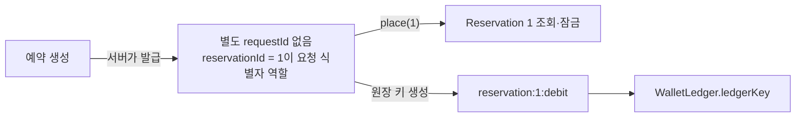
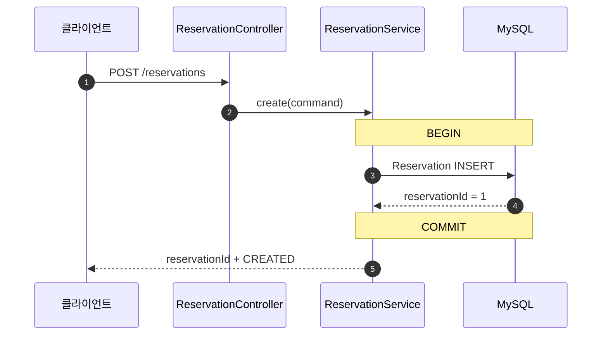
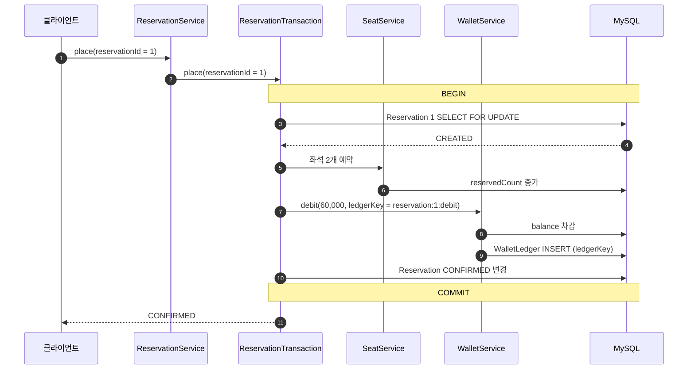
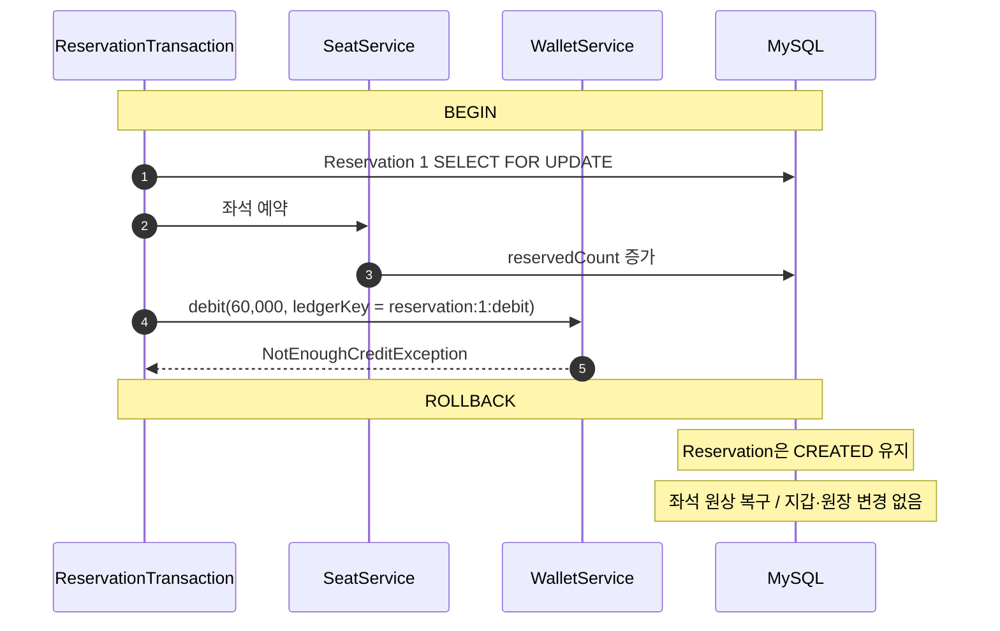
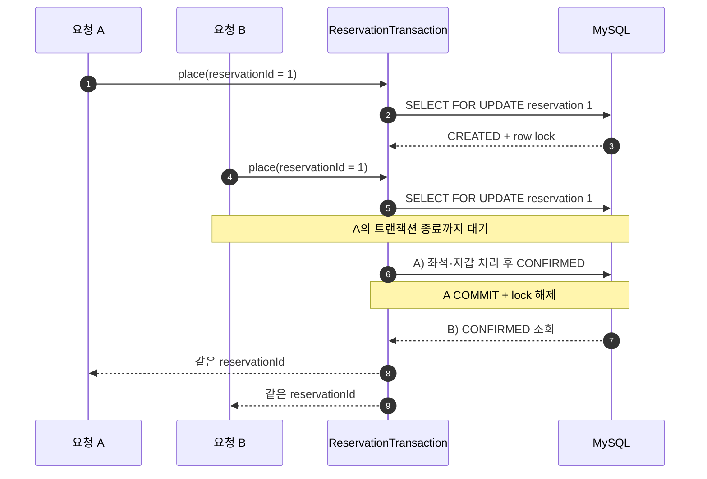

# distributed-transaction-monolith

워크숍 좌석 예약을 하나의 애플리케이션과 하나의 데이터베이스에서 처리하는 기준선.

예약 실행이 바꾸는 데이터:

- `Reservation`: 예약 생성과 상태 변경
- `WorkshopSeat`: 예약 좌석 수 증가
- `Wallet`: 사용자 크레딧 차감
- `WalletLedger`: 크레딧 차감 이력 기록

일부만 반영되면 좌석은 잡혔는데 결제가 안 됐거나, 결제됐는데 예약이 없는 상태가 생긴다. Monolithic 단계에서는 좌석·지갑·원장·예약 확정을 하나의 로컬 트랜잭션으로 묶는다.

## 예약 생성과 실행을 나눈 이유

클라이언트가 임의의 멱등성 키를 만드는 대신 서버가 예약을 먼저 생성하고 `reservationId`를 발급한다.

```text
1. 예약 생성  → reservationId 발급
2. 예약 실행  → reservationId로 좌석과 크레딧 처리
```

같은 예약을 다시 실행하는지 `reservationId`만으로 판단할 수 있다. 모놀리스에는 별도의 `requestId` 필드가 없고, `reservationId`가 요청 식별자 역할까지 맡는다.

- 예약 실행 대상을 찾고 잠그는 ID
- 같은 예약의 재실행 여부를 판단하는 ID
- 지갑 원장 키를 만드는 ID



이후 MSA로 분리하면 같은 값을 Seat·Wallet Service에 전달하는 명시적인 `requestId`로 사용한다.

두 API 호출을 사용하지만 2PC는 아니다. 예약 생성과 예약 실행이 각각 독립적인 로컬 트랜잭션이고, 실행 트랜잭션 안에서 사용하는 데이터베이스는 하나다.

## 1. 예약 생성

```http
POST /reservations
Content-Type: application/json

{
  "userId": 1,
  "workshopId": 100,
  "seatCount": 2
}
```

```json
{
  "reservationId": 1,
  "amount": 0,
  "status": "CREATED"
}
```

이 단계에서는 좌석과 크레딧을 건드리지 않는다. 어떤 사용자가 어떤 워크숍을 몇 자리 예약할지만 저장한다.



## 2. 예약 실행

```http
POST /reservations/1/place
```

`reservationId`로 예약을 조회한 뒤 좌석 예약, 크레딧 차감, 원장 기록, 예약 확정을 함께 처리한다.



핵심은 좌석 예약, 크레딧 차감, 예약 확정이 하나의 `@Transactional` 메서드 안에서 실행된다는 점이다.

```java
@Transactional
public ReservationResult place(long reservationId) {
    Reservation reservation = repository.findByIdForUpdate(reservationId)
            .orElseThrow(() -> new ReservationNotFoundException(reservationId));
    if (reservation.getStatus() == ReservationStatus.CONFIRMED) {
        return ReservationResult.from(reservation);
    }

    long amount = seatService.reserve(
            reservation.getWorkshopId(), reservation.getSeatCount());

    String ledgerKey = "reservation:" + reservationId + ":debit";
    walletService.debit(reservation.getUserId(), amount, ledgerKey);

    reservation.confirm(amount);
    return ReservationResult.from(reservation);
}
```

`reservationId`는 예약 조회와 중복 실행 판단에 사용되고, `reservation:{reservationId}:debit` 형태의 원장 키로도 이어진다. 이 메서드 중간에서 예외가 발생하면 네 데이터의 변경이 함께 롤백된다.

좌석 10개, 좌석당 30,000 크레딧인 워크숍에서 2개를 예약하면:

| 데이터 | 실행 전 | 실행 후 |
| --- | ---: | ---: |
| `WorkshopSeat.reservedCount` | 0 | 2 |
| `Wallet.balance` | 100,000 | 40,000 |
| `Reservation.status` | `CREATED` | `CONFIRMED` |
| `WalletLedger` | 0건 | 1건 |

## 실행 중 실패하면

예약 생성은 이미 커밋된 상태다. 실행 중 지갑 잔액 부족이 발생하면 실행 트랜잭션만 롤백한다.



예약 자체는 삭제되지 않고 `CREATED`로 남는다. 잔액 충전이나 장애 해소 후 같은 `reservationId`로 다시 실행할 수 있다.

## 같은 예약을 다시 실행하면

`ReservationTransaction`은 예약 row를 `SELECT FOR UPDATE`로 조회한다.

```java
@Lock(LockModeType.PESSIMISTIC_WRITE)
@Query("select reservation from Reservation reservation where reservation.id = :reservationId")
Optional<Reservation> findByIdForUpdate(@Param("reservationId") long reservationId);
```

- 상태가 `CREATED`면 좌석과 크레딧 처리
- 상태가 `CONFIRMED`면 기존 결과 반환

순차 재시도뿐 아니라 같은 ID의 동시 실행도 한 번만 처리한다.



현재 검증한 경우:

- 예약 생성만으로 좌석과 지갑이 변경되지 않음
- 예약 실행 성공 시 네 데이터가 함께 반영
- 좌석 부족 시 예약은 `CREATED`, 나머지는 변경 없음
- 크레딧 부족 시 좌석 증가도 롤백되고 예약은 `CREATED`
- 확정된 예약을 다시 실행해도 한 번만 처리
- 같은 예약 실행 20건이 동시에 들어와도 한 번만 처리
- 존재하지 않는 `reservationId`는 실행 불가

## HTTP 응답

| 상황 | 상태 | 코드 |
| --- | ---: | --- |
| 예약 생성·실행 성공 또는 기존 결과 반환 | `200` | - |
| 요청 값 검증 실패 | `400` | `INVALID_REQUEST` |
| 예약·워크숍·지갑 없음 | `404` | `RESOURCE_NOT_FOUND` |
| 좌석 또는 크레딧 부족 | `409` | `RESERVATION_UNAVAILABLE` |

## 다음 문제

예약·좌석·지갑을 서로 다른 서비스와 데이터베이스로 분리하면 이 로컬 트랜잭션을 그대로 사용할 수 없다.

```text
Reservation Service → reservation_db
Seat Service        → seat_db
Wallet Service      → wallet_db
```

좌석 예약이 커밋된 뒤 크레딧 차감이 실패해도 Reservation Service의 롤백으로 `seat_db`를 되돌릴 수 없다. 다음 단계인 `distributed-transaction-msa`에서 세 서비스를 실제 HTTP로 연결하고 이 부분 커밋을 재현한다.
