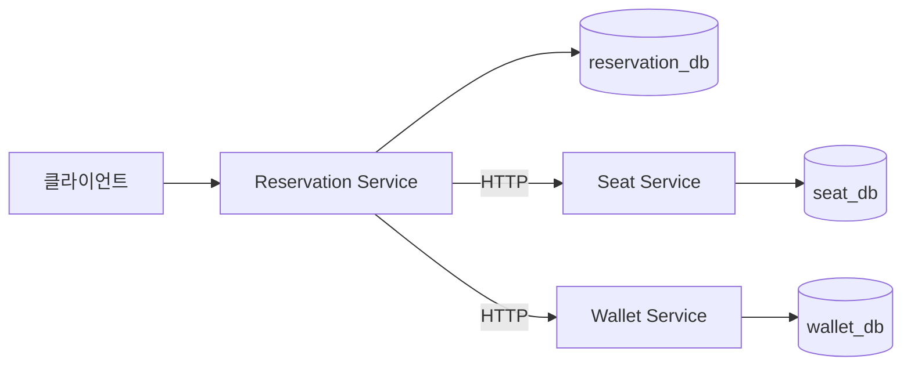
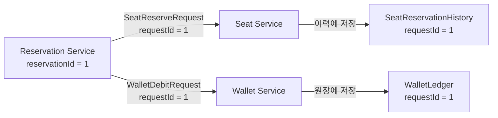
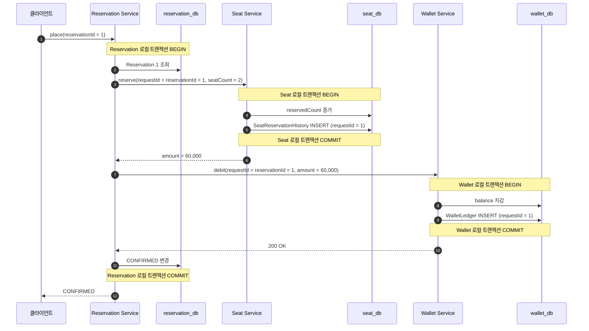
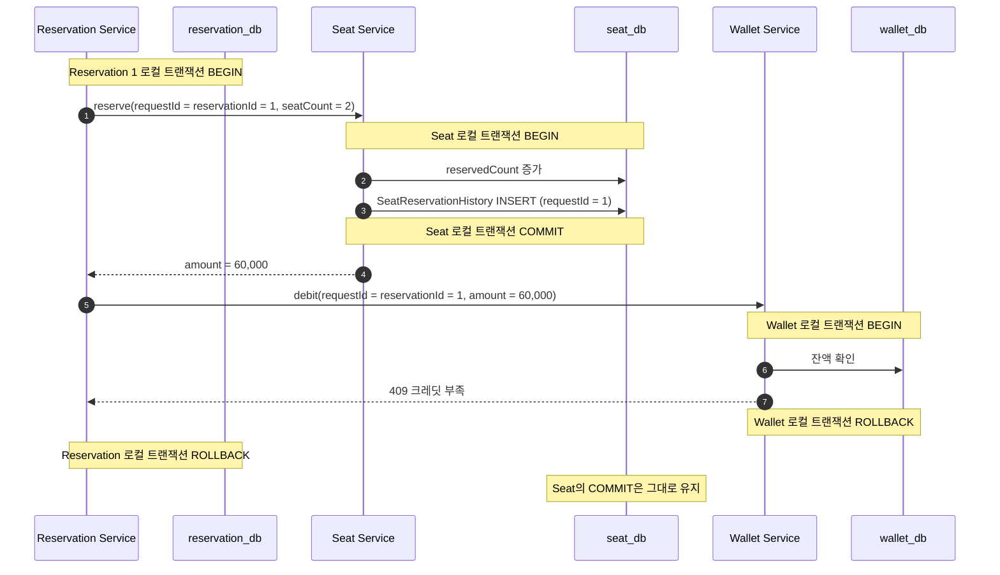

# distributed-transaction-msa

Monolithic 주문 시스템의 예약·좌석·지갑을 세 서비스와 세 데이터베이스로 분리한 기준선.

기능 순서는 그대로다.

```text
좌석 예약 → 크레딧 차감 → 예약 확정
```

달라진 점은 각 작업이 서로 다른 애플리케이션과 데이터베이스에서 실행된다는 것. 하나의 로컬 트랜잭션으로 전체 작업을 묶을 수 없어서 중간 실패 시 데이터 불일치가 생긴다.

## Monolithic과 MSA의 차이

| 구분 | Monolithic | MSA |
| --- | --- | --- |
| 애플리케이션 | 하나 | Reservation / Seat / Wallet |
| 데이터베이스 | 하나 | 서비스마다 하나 |
| 트랜잭션 | 전체 작업을 하나로 묶음 | 서비스별 로컬 트랜잭션 |
| 중간 실패 | 전체 롤백 | 이미 커밋한 서비스는 롤백 불가 |



| 서비스 | 책임 | 소유 데이터 |
| --- | --- | --- |
| Reservation | 예약 생성, 실행 순서 조정, 최종 확정 | `Reservation` |
| Seat | 좌석 수 확인과 예약 | `WorkshopSeat`, `SeatReservationHistory` |
| Wallet | 크레딧 차감과 원장 기록 | `Wallet`, `WalletLedger` |

서비스는 다른 서비스의 테이블을 직접 조회하거나 수정하지 않는다. Reservation Service가 Seat Service와 Wallet Service의 내부 HTTP API를 순서대로 호출한다.

## 예약 ID를 요청 ID로 사용

예약 생성과 실행 API는 Monolithic 단계와 같다.

```text
POST /reservations
POST /reservations/{reservationId}/place
```

Reservation Service가 발급한 `reservationId`를 하위 서비스에는 `requestId`로 전달한다.



별도의 `userId + requestKey` 조합을 만들지 않아도 하나의 예약에서 파생된 좌석 처리와 지갑 처리를 연결할 수 있다.

| 위치 | 사용하는 값 | 역할 |
| --- | --- | --- |
| Reservation Service | `reservationId = 1` | 예약 조회와 실행 식별 |
| Seat Service 요청 | `requestId = 1` | 어느 예약에서 발생한 좌석 처리인지 전달 |
| `SeatReservationHistory` | `requestId = 1` | 좌석 이력과 예약 연결 |
| Wallet Service 요청 | `requestId = 1` | 어느 예약에서 발생한 차감인지 전달 |
| `WalletLedger` | `requestId = 1` | 지갑 원장과 예약 연결 |

Reservation Service는 별도의 ID를 만들지 않고 `reservationId`를 두 HTTP 클라이언트의 첫 번째 인자로 넘긴다. 클라이언트와 하위 서비스에서는 이 인자 이름이 `requestId`다.

```java
@Transactional
public ReservationResult place(long reservationId) {
    Reservation reservation = reservationRepository.findById(reservationId)
            .orElseThrow(() -> new ReservationNotFoundException(reservationId));
    if (reservation.getStatus() == ReservationStatus.CONFIRMED) {
        return ReservationResult.from(reservation);
    }

    long amount = seatClient.reserve(
            reservationId,
            reservation.getWorkshopId(),
            reservation.getSeatCount()
    );
    walletClient.debit(reservationId, reservation.getUserId(), amount);

    reservation.confirm(amount);
    return ReservationResult.from(reservation);
}
```

`SeatClient`와 `WalletClient`는 받은 값을 HTTP 요청 DTO의 `requestId`에 그대로 넣는다.

```java
public long reserve(long requestId, long workshopId, int seatCount) {
    SeatReserveResponse response = restClient.post()
            .uri("/internal/seats/reserve")
            .body(new SeatReserveRequest(requestId, workshopId, seatCount))
            .retrieve()
            .body(SeatReserveResponse.class);

    if (response == null) throw new IllegalStateException("seat service returned an empty response");
    return response.amount();
}

public void debit(long requestId, long userId, long amount) {
    restClient.post()
            .uri("/internal/wallets/debit")
            .body(new WalletDebitRequest(requestId, userId, amount))
            .retrieve()
            .toBodilessEntity();
}
```

단, 현재 Seat·Wallet Service는 `requestId`를 이력에 저장만 한다. 중복 요청을 차단하는 제약이나 멱등 처리까지 구현한 상태는 아니다.

## 모두 성공하면

좌석 두 개를 예약하고 60,000 크레딧을 차감하는 흐름.



세 서비스가 모두 성공해야 최종 상태가 맞는다.

| 데이터 | 실행 전 | 실행 후 |
| --- | ---: | ---: |
| `Reservation.status` | `CREATED` | `CONFIRMED` |
| `WorkshopSeat.reservedCount` | 0 | 2 |
| `SeatReservationHistory` | 0건 | 1건 |
| `Wallet.balance` | 100,000 | 40,000 |
| `WalletLedger` | 0건 | 1건 |

## 좌석 커밋 후 지갑이 실패하면

지갑에 50,000 크레딧만 있는데 60,000 차감을 요청하는 경우.



실패 후 실제로 남는 상태:

| 데이터 | 실행 전 | 실패 후 |
| --- | ---: | ---: |
| `Reservation.status` | `CREATED` | `CREATED` |
| `WorkshopSeat.reservedCount` | 0 | 2 |
| `SeatReservationHistory` | 0건 | 1건 |
| `Wallet.balance` | 50,000 | 50,000 |
| `WalletLedger` | 0건 | 0건 |

예약은 확정되지 않았고 결제도 없지만 좌석만 차지한 상태. Reservation Service의 롤백은 `reservation_db`에만 적용되므로 이미 커밋된 `seat_db`를 되돌릴 수 없다.

## `@Transactional`이 전체를 묶지 못하는 이유

각 서비스의 `@Transactional`은 해당 서비스가 연결한 데이터베이스 하나만 관리한다.

```text
Reservation @Transactional → reservation_db
Seat        @Transactional → seat_db
Wallet      @Transactional → wallet_db
```

Seat Service는 좌석과 좌석 이력만 자신의 로컬 트랜잭션으로 커밋한다.

```java
@Transactional
public long reserve(long requestId, long workshopId, int seatCount) {
    WorkshopSeat workshop = workshopRepository.findById(workshopId)
            .orElseThrow(() -> new WorkshopNotFoundException(workshopId));

    long amount = workshop.reserve(seatCount);
    historyRepository.save(
            new SeatReservationHistory(requestId, workshopId, seatCount, amount));
    return amount;
}
```

Wallet Service도 크레딧과 원장만 자신의 로컬 트랜잭션으로 커밋한다.

```java
@Transactional
public void debit(long requestId, long userId, long amount) {
    Wallet wallet = walletRepository.findById(userId)
            .orElseThrow(() -> new WalletNotFoundException(userId));

    wallet.debit(amount);
    ledgerRepository.save(new WalletLedger(requestId, userId, amount));
}
```

HTTP 호출은 같은 트랜잭션에 참여하지 않는다. Reservation Service가 트랜잭션 안에서 Seat Service를 호출하더라도 Seat Service는 자신의 트랜잭션을 시작하고 응답 전에 커밋한다.

따라서 마지막 호출이 실패했을 때 앞선 서비스의 변경까지 자동으로 롤백되는 구조가 아니다.

## 통합 검증에서 확인한 것

테스트에서는 세 Spring 애플리케이션을 서로 다른 포트로 띄우고, 각각 독립된 데이터베이스를 사용한다. 서비스 간 호출도 메서드 직접 호출이 아니라 실제 HTTP로 연결한다.

- 전체 성공 시 세 데이터베이스가 모두 변경됨
- Wallet Service 실패 시 Reservation Service의 확정은 롤백됨
- Wallet Service 실패 전 커밋한 Seat Service의 변경은 그대로 남음
- Wallet Service의 잔액과 원장은 변경되지 않음

부분 커밋을 고정하는 핵심 검증 코드:

```java
assertThatThrownBy(() -> reservationService.place(reservationId))
        .isInstanceOf(HttpClientErrorException.class)
        .hasMessageContaining("409");

assertThat(reservationRepository.findById(reservationId).orElseThrow().getStatus())
        .isEqualTo(ReservationStatus.CREATED);
assertThat(workshopRepository.findById(WORKSHOP_ID).orElseThrow().getReservedCount())
        .isEqualTo(2);
assertThat(seatHistoryRepository.count()).isEqualTo(1);
assertThat(walletRepository.findById(USER_ID).orElseThrow().getBalance())
        .isEqualTo(50_000);
assertThat(walletLedgerRepository.count()).isZero();
```

## 아직 남아 있는 문제

- 중간 실패로 인한 부분 커밋
- 실패 후 같은 예약을 재시도하면 좌석이 다시 증가할 수 있음
- HTTP 타임아웃이 발생하면 상대 서비스의 커밋 여부를 바로 알 수 없음
- 이미 반영된 좌석을 취소하는 보상 작업 없음
- 세 서비스가 최종 상태에 도달했는지 추적하는 상태 모델 없음

이 기준선 다음에 2PC와 TCC를 적용하면, 각 방식이 부분 커밋과 재시도를 어떻게 다루는지 같은 실패 시나리오로 비교할 수 있다.
