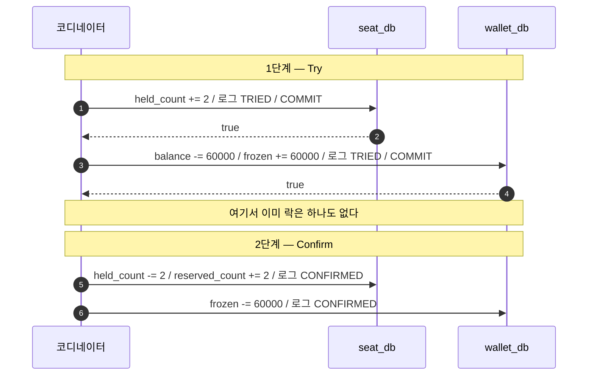
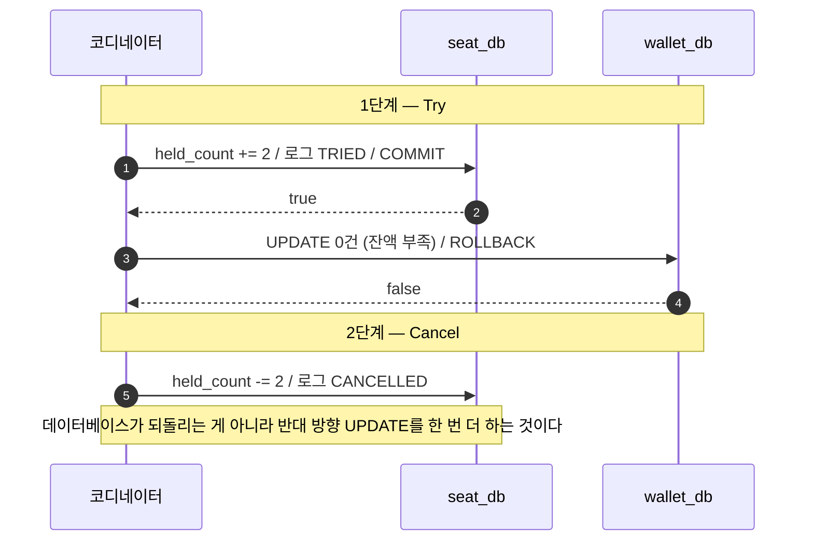
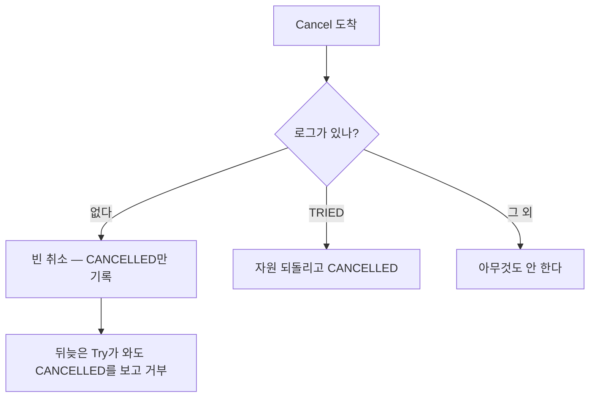

# distributed-transaction-tcc

*결론에는 형광펜을 칠했다. 근거와 주의점까지 3색으로 구분된 판은 `README.html`을 내려받아 브라우저로 열면 볼 수 있다.*

<mark>기다리지 않고 일단 커밋한 다음, 잘못되면 반대 방향 업무 작업으로 되돌린다.</mark>

세 단계의 이름이 그대로 규약이다.

| 단계 | 하는 일 |
| --- | --- |
| **Try** | 자원을 잡아 두고 **바로 커밋한다**. 확정은 아니다 |
| **Confirm** | 잡아 둔 것을 확정으로 옮긴다 |
| **Cancel** | 잡아 둔 것을 되돌린다 |

도메인은 앞 실험실과 같다. 좌석은 `seat_db`에, 지갑은 `wallet_db`에 있고 서로 다른 MySQL 서버다. **XA는 쓰지 않는다.**<!--tip--> 각 참여자가 자기 로컬 트랜잭션만 쓴다.

## 확정과 잡아 둠을 칸으로 나눈다

락으로 버티지 않으려면 "아직 확정은 아니지만 남이 가져가면 안 되는" 상태를 데이터로 표현해야 한다. 그래서 칸이 하나씩 늘었다.

```sql
workshop_seat (..., reserved_count, held_count)   -- 확정된 좌석, 잡아 둔 좌석
wallet        (..., balance,        frozen)       -- 잔액, 얼려 둔 돈
```

**Try는 `held_count`와 `frozen`을 올리고 커밋한다.**<!--tip--> Confirm은 그걸 `reserved_count`로 옮기고, Cancel은 도로 내린다.

정원 검사도 두 칸을 함께 본다. 잡아 둔 좌석이 이미 커밋되어 남에게도 보이기 때문에, 락 없이도 두 요청이 같은 좌석을 나눠 갖지 않는다.

```sql
UPDATE workshop_seat
   SET held_count = held_count + 2
 WHERE id = 100 AND reserved_count + held_count + 2 <= total_seats;
```

## 모두 성공하면



주목할 것은 **중간 상태가 실제로 존재하고, 남에게 보인다**는 점이다. Try만 끝난 시점의 값이다.

| 데이터 | 실행 전 | Try 직후 | Confirm 후 |
| --- | ---: | ---: | ---: |
| `reserved_count` | 0 | 0 | 2 |
| `held_count` | 0 | **2** | 0 |
| `balance` | 100,000 | 40,000 | 40,000 |
| `frozen` | 0 | **60,000** | 0 |

지갑은 Try에서 `balance`를 실제로 깎는다. Try 커밋 직후 락이 없으니 `frozen`만 올려서는 다음 요청이 같은 돈을 그대로 보게 된다.

## 지갑이 못 내면

잔액 50,000인데 60,000이 필요한 경우. 시리즈 내내 같은 시나리오다.



여기가 2PC와 결정적으로 갈린다. **2PC의 롤백은 데이터베이스가 해 줬지만, TCC의 Cancel은 참여자가 직접 짜는 업무 로직이다.**<!--note--> 잡아 둔 만큼 빼는 UPDATE를 한 번 더 실행할 뿐이다.

| 데이터 | 실행 전 | MSA 기준선 | 2PC | TCC |
| --- | ---: | ---: | ---: | ---: |
| `reserved_count` | 0 | **2** | 0 | 0 |
| `balance` | 50,000 | 50,000 | 50,000 | 50,000 |

결과는 2PC와 같다. 가는 길이 다를 뿐이다.

## 락을 안 쥔다는 게 이런 것

`TryConfirmCancelTest`의 `Try와Confirm사이에도_다른요청이막히지않는다`가 2PC의 `PreparedLockTest`와 **같은 자리에 같은 SQL을 놓고** 결과가 뒤집히는 걸 보인다.

예약 1이 Try만 해 두고 멈춘 상태에서:

```sql
SET SESSION innodb_lock_wait_timeout = 3;
UPDATE workshop_seat SET reserved_count = reserved_count + 1 WHERE id = 100;
```

| | 2PC (`XA PREPARE` 후) | TCC (Try 후) |
| --- | --- | --- |
| 같은 행 UPDATE | `ERROR 1205` 락 대기 타임아웃 | **통과** |
| 같은 행 SELECT | 커밋 전 옛 값 `0` | 잡힌 값 `2` 그대로 |
| 다른 요청의 Try | — | 통과. 나란히 잡힌다 |

<mark>예약 1의 로컬 트랜잭션은 Try에서 이미 커밋됐으니 쥐고 있는 락이 자체가 없다.</mark> 코디네이터가 늦든 죽든 다른 요청은 영향받지 않는다. 2PC가 못 했던 게 바로 이것이다.

대신 읽는 쪽은 확정되지 않은 값을 보게 된다. **격리를 포기한 것이다.**<!--note--> 2PC에서는 커밋 전 값이 아예 안 보였다.

## 락이 사라진 자리에 생긴 일

락은 사실 일을 하고 있었다. 같은 요청이 두 번 오거나 순서가 뒤바뀌어도 데이터베이스가 뒤에서 막아 줬다. 그게 없어졌으니 **참여자가 직접 메워야 한다.**<!--note-->

그래서 참여자마다 요청이 어디까지 갔는지 적는 로그를 둔다.

```sql
seat_tcc_log   (request_id PK, workshop_id, seat_count, state)
wallet_tcc_log (request_id PK, user_id,     amount,     state)
-- state: TRIED / CONFIRMED / CANCELLED
```

`TccSafetyTest`가 이 로그 없이는 못 넘기는 상황 네 가지를 재현한다.



| 상황 | 로그가 없으면 | 로그가 있으면 |
| --- | --- | --- |
| Confirm이 두 번 온다 | `reserved_count`가 2에서 4로. 초과 판매 | 두 번째는 `CONFIRMED`를 보고 넘어간다 |
| Cancel이 두 번 온다 | `held_count`가 `-2`로. 재고가 조용히 늘어난다 | 두 번째는 `CANCELLED`를 보고 넘어간다 |
| Try 없이 Cancel이 온다 | 되돌릴 게 없다고 그냥 넘어간다 | **빈 취소**로 `CANCELLED`를 기록해 둔다 |
| 그 뒤에 늦은 Try가 온다 | 좌석을 잡아 두는데 아무도 확정·취소하지 않는다 (**매달림**) | `CANCELLED`를 보고 거부한다 |

마지막 두 줄이 한 쌍이다. Try 요청이 유실되거나 늦어져도 코디네이터는 취소를 결정하고 Cancel을 보낸다. 참여자에게는 본 적 없는 요청의 Cancel이다. **되돌릴 게 없다고 그냥 넘기면, 뒤늦게 도착한 Try가 잡아 둔 좌석을 아무도 회수하지 않는다.**<!--note--> 그래서 빈 취소는 무시가 아니라 기록이어야 한다.

## 2PC와 나란히 놓으면

| | 2PC | TCC |
| --- | --- | --- |
| 1단계가 하는 일 | `XA PREPARE`로 멈춘다 | 자원을 잡고 **커밋한다** |
| 단계 사이의 락 | 쥐고 있다 | 없다 |
| 되돌리는 주체 | 데이터베이스 (`XA ROLLBACK`) | **참여자가 짠 업무 로직** |
| 중간 상태 | 안 보인다 | **보인다** |
| 코디네이터 장애 | 참여자가 락을 쥔 채 멈춘다 | 다른 요청은 멀쩡하다 |
| 참여자 조건 | XA를 지원해야 한다 | 아무 데이터베이스나 된다 |
| 참여자가 짤 코드 | 없다시피 | Try·Confirm·Cancel 셋 + 멱등성 + 빈 취소 |

<mark>2PC는 데이터베이스에 맡기고 블로킹을 감수하고, TCC는 블로킹을 없애는 대신 그 몫을 애플리케이션 코드로 가져온다.</mark>

XA를 지원하지 않는 참여자(외부 결제 API, 메시지 큐, NoSQL)도 TCC는 낄 수 있다는 게 실무에서 큰 차이다. 대신 참여자마다 세 벌의 로직과 상태 관리를 짜야 한다.

## 왜 이렇게 만들었나

같은 걸 만드는 방법이 여럿이었다. **고른 이유보다 버린 이유가 나중에 더 필요하다.**<!--tip-->

| 갈림길 | 고른 것 | 버리고 그 이유 |
| --- | --- | --- |
| 코디네이터 | 테스트 메서드의 제어 흐름 | **Saga 오케스트레이터 프레임워크** — 상태 전이 자체를 보여주는 게 목적이라 프레임워크가 전이를 감추면 정반대다 |
| Try/Confirm/Cancel 호출 | 참여자 클래스의 static 메서드를 직접 호출 | **메시지 큐 기반 비동기 디스패치** — 유실·재시도까지 재현하려면 큐와 컨슈머까지 만들어야 하는데, 이 실험실은 락 없이 정합성을 지키는 로직만 보이면 된다 |
| 요청 상태 기록 | 참여자 DB에 참여자 소유 로그 테이블(`seat_tcc_log`/`wallet_tcc_log`) | **코디네이터 쪽에 모은 공용 사가 로그** — 참여자가 자기 상태를 스스로 책임진다는 TCC의 본질을 보이려면 로그도 참여자가 가져야 한다 |
| 동시성 제어 | 로그 행을 `SELECT ... FOR UPDATE`로 비관적 잠금 | **낙관적 락(버전 컬럼)** — Confirm/Cancel 중복 도착을 검증하는 게 목적이라, 재시도 로직 없이 바로 확인되는 비관적 락이 더 맞았다 |
| 데이터베이스 | MySQL 8 (Testcontainers) | **H2** — 2PC와 나란히 비교하는 게 목적이라 바꿀 이유가 없었고 `TwoDatabases`류 인프라 패턴도 그대로 재사용된다 |

## 실무에서는 Seata가 이 역할을 대신한다

이 실험실이 손으로 한 상태 관리는 원래 TCC 프레임워크의 일이다.

| 실험실 | 실무 (Seata TCC 모드) |
| --- | --- |
| Confirm·Cancel 중복 수신 시 로그로 걸러냄 | Seata가 명시하는 3대 이슈 중 멱등(幂等) 처리 |
| Try 없이 Cancel이 오면 자원은 안 건드리고 `CANCELLED`만 기록 | 空回滚(empty rollback) 방지 |
| 빈 취소 기록 뒤에 온 Try를 거부 | 悬挂(매달림) 방지 — 앞서 空回滚로 남긴 기록이 근거가 된다 |
| 참여자가 직접 만든 `*_tcc_log` 테이블 | Seata RM이 관리하는 브랜치 트랜잭션 상태 |
| 코디네이터 = 테스트 메서드의 제어 흐름 | Seata TM + 글로벌 트랜잭션 세션 |

애플리케이션 코드는 `@TwoPhaseBusinessAction`으로 Try/Confirm/Cancel 메서드만 선언하면 되고, 위 표의 왼쪽 절반(로그 관리·멱등·빈 취소·매달림 판단)을 프레임워크가 대신한다. **이 실험실과 달리 Seata는 Try 요청이 코디네이터에게 도착하지 않아도, 코디네이터가 Cancel을 보내면 그걸 감지하고 자동으로 빈 취소를 기록한다.**<!--note-->

## 이 실험실이 다루지 않은 것

- **코디네이터가 Try 다음에 죽는 경우.** 잡아 둔 자원이 남는다. 실무에서는 트랜잭션 로그를 두고 재기동 시 미결 요청을 훑어 Confirm이나 Cancel을 마저 보낸다. 여기서는 코디네이터가 테스트 메서드의 제어 흐름이라 그 복구 장치가 없다
- **동시 요청.** 테스트는 순차 실행이다. 참여자가 로그 행을 `SELECT ... FOR UPDATE`로 잠그는데, 없는 행을 대상으로 하면 InnoDB가 갭 락을 잡는다. 서로 다른 `request_id`가 동시에 몰릴 때의 대기는 재현하지 않았다
- **Cancel이 실패하는 경우.** 되돌리기도 네트워크를 건너는 이상 실패할 수 있고, 그러면 재시도해야 한다. 여기서는 Cancel이 항상 성공한다고 보고 있다

## 실행

```bash
./gradlew :distributed-transaction-tcc:test
```

Testcontainers로 MySQL 두 대를 띄우므로 Docker가 실행 중이어야 한다.

- `TryConfirmCancelTest` — 전원 성공 후 Confirm / 지갑 실패 후 Cancel / **Try와 Confirm 사이에 안 막힘**
- `TccSafetyTest` — Confirm 중복 / Cancel 중복 / 빈 취소 / 매달림 방지
