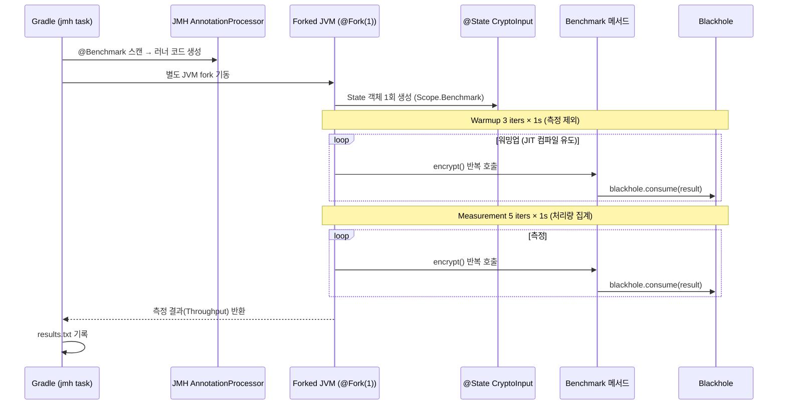
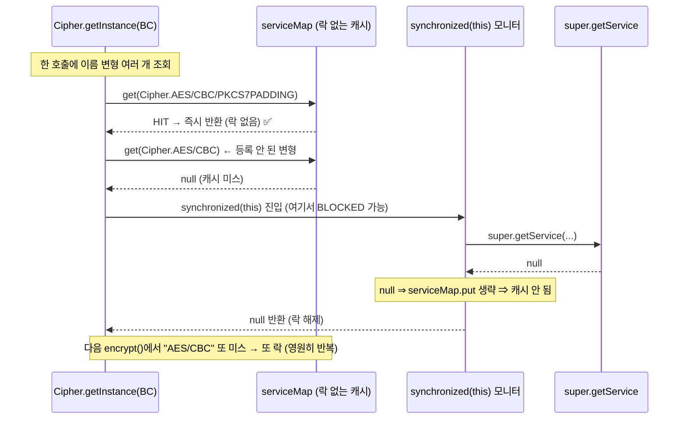
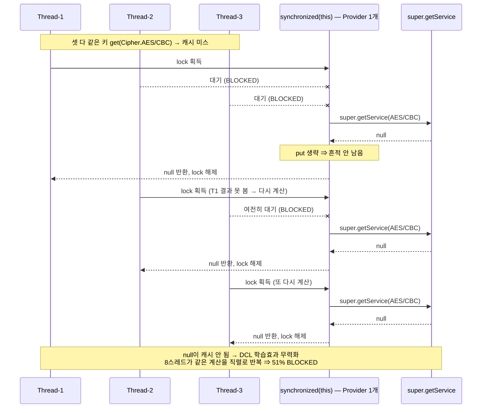

# java-sandbox

Java 언어 기능과 JVM 동작을 작은 코드로 관찰하는 샌드박스.

## AES Provider 등록 JMH 실험

### 목적

- `encrypt()`마다 `Security.addProvider(new BouncyCastleProvider())`를 부르는 구조 vs 초기화 때 1회만 등록하는 구조의 성능 차이를 JMH로 비교.
- 알고리즘 차이가 아니라 **Provider 반복 등록 시도 여부**만 다름. key·iv·plainText·알고리즘은 동일.

### 구조

- `AesUtilBefore`: `encrypt()`마다 `Security.addProvider(new BouncyCastleProvider())` 호출.
- `AesUtilAfter`: 클래스 초기화 때 `getProvider(...) == null`이면 1회만 등록.
- `AesProviderRegistrationSingleThreadBenchmark` / `...EightThreadsBenchmark`: 단일/8스레드 벤치마크. `@Threads`만 다르고 메서드는 동일.
- 벤치마크 메서드: `encrypt_withRepeatedProviderRegistration`, `encrypt_withProviderInitializedOnce`.

### 실행

```bash
./gradlew :java-sandbox:jmh                                                     # 전체
./gradlew :java-sandbox:jmh -PjmhIncludes='AesProviderRegistration.*Benchmark'  # 패턴 지정
```

- 결과 파일: `labs/java-sandbox/build/results/jmh/results.txt`

### JMH 실행 흐름

- `jmh` 태스크는 메서드를 그냥 호출하지 않음.
- `me.champeau.jmh` 플러그인이 `jmhAnnotationProcessor`로 `@Benchmark`를 감싼 러너를 생성.
- `@Fork(1)`에 따라 **별도 JVM**에서 워밍업과 측정을 분리해 실행 → JIT 워밍업·dead-code elimination 같은 변수를 통제.



- `Blackhole.consume()`: 암호화 결과가 "안 쓰이는 값"으로 판단돼 JIT에 제거되는 걸 막음.
- `@State(Scope.Benchmark)`: key/iv/plainText를 1회만 만들어 모든 호출이 공유 → 측정 차이가 Provider 반복 등록 여부로 좁혀짐.

### 출력 표 읽는 법

```text
Benchmark                                        Mode  Cnt       Score       Error  Units
...encrypt_withProviderInitializedOnce          thrpt    5  847912.879 ± 21680.632  ops/s
...encrypt_withRepeatedProviderRegistration     thrpt    5     567.199 ±    35.742  ops/s
```

- **Mode** — 측정 모드. `thrpt` = Throughput(처리량).
- **Cnt** — 집계에 들어간 측정 반복 수. `@Measurement(iterations = 5)` → 5 (워밍업 3회 제외).
- **Score** — 측정 평균. Units 단위로 읽음.
- **Error** — `±` 오차. 99.9% 신뢰구간의 절반. 작을수록 안정적.
- **Units** — 단위. 여기선 `ops/s`.

`ops/s` 단위:

- **operations per second** = 1초에 `encrypt()`를 몇 번 끝냈는가.
- Throughput 모드라 **클수록 빠름**. `847912 ops/s` → 1초에 약 84만 8천 번, `567 ops/s` → 약 567번.
- `AverageTime` 모드였다면 1회 소요 시간이라 작을수록 빠름.
- ⚠️ `@Threads(8)`의 ops/s는 **8스레드 합계**. 1개당은 8로 나눠야 함.

### 측정 결과

이 저장소 환경(18코어) 실측값. 절대값은 머신·JVM·부하에 따라 다르지만 경향은 유지됨.

| 벤치마크 | 단일(1스레드당) | 8스레드 합계 | 확장 배수 | 8스레드 1개당 |
| --- | ---: | ---: | ---: | ---: |
| `withProviderInitializedOnce` (1회 등록) | **853,343** | **1,221,121** | **×1.4** | ~152,600 |
| `withRepeatedProviderRegistration` (매번 등록) | **559** | **3,756** | **×6.7** | ~469 |
| **격차 (once ÷ repeated)** | 약 1,526배 | 약 325배 | — | — |

- **확장 배수** = 8스레드 합계 ÷ 단일. 이상적이면 ×8에 근접. once는 ×1.4로 거의 확장 안 됨, repeated는 ×6.7로 잘 확장. ← 이게 이 실험의 반전 포인트.
- once 8스레드 수치는 부하에 따라 변동 큼(다른 run에서 55만~122만 관측). "×8에 한참 못 미친다"는 경향이 핵심이지 절대값이 핵심이 아님.

### 프로파일링으로 검증 (-prof)

`-prof`는 JMH에 프로파일러를 붙여 "왜 이 숫자가 나오는가"를 측정하는 옵션. 위 두 추측(repeated=객체 생성, once=동기화)을 데이터로 못박는다.

```bash
# 할당량 측정
./gradlew :java-sandbox:jmh -PjmhIncludes=AesProviderRegistrationSingleThreadBenchmark -PjmhProfilers=gc
# 8스레드 once의 스레드 상태 분포(락 대기) 측정
./gradlew :java-sandbox:jmh -PjmhIncludes='AesProviderRegistrationEightThreadsBenchmark.encrypt_withProviderInitializedOnce' -PjmhProfilers=stack
```

#### gc 프로파일 — "repeated는 왜 느린가"

- `gc.alloc.rate.norm` = **op 1번당 새로 할당한 메모리 바이트** (norm = 호출 1회 기준으로 정규화).

| | gc.alloc.rate.norm | 의미 |
| --- | ---: | --- |
| once | **4,032 B/op** | 암호화 1번에 ~4KB. 결과 버퍼 정도. 정상. |
| repeated | **2,848,583 B/op** | 암호화 1번에 ~2.85MB. once의 **707배**. |

- 왜 repeated가 호출마다 2.85MB나 쓰나 → `encrypt()` 안에서 매번 `new BouncyCastleProvider()`를 만들기 때문. 이 생성자가 BC 지원 알고리즘 **수백 개를 내부 맵에 등록**해서 객체 하나가 2.85MB짜리.
- **결론: repeated가 느린 범인은 암호화 연산이 아니라 "매 호출 거대한 Provider 객체 생성/할당"이다.** (추측이 아니라 측정으로 확정)

#### stack 프로파일 — "8스레드 once는 왜 확장이 안 되는가"

- stack 프로파일 = 실행 중 스레드들이 **무슨 상태로, 어느 메서드에서** 시간을 보내는지 표본조사한 것.

```text
51%  BLOCKED   ← 스레드들이 절반의 시간을 "락 풀리기 기다리며" 멈춰 있음
  └ 99.9%  org.bouncycastle.jce.provider.BouncyCastleProvider.getService
```

- **BLOCKED** = 다른 스레드가 쥔 락(모니터)이 풀리길 기다리며 **아무 일도 못 하는** 상태. 이게 51%면 절반의 시간을 놀고 있다는 뜻.
- 그 BLOCKED의 거의 전부가 `BouncyCastleProvider.getService`에서 발생.
- 원인: `Cipher.getInstance(..., "BC")` → BC의 `Provider.getService()` 호출인데, 이 메서드가 **`synchronized`**(한 번에 한 스레드만 진입). 8스레드가 **하나뿐인 Provider 객체**의 그 메서드에 동시에 들어가려다 줄을 섬(= 직렬화).
- **결론: once가 18코어를 두고도 확장 못 하는 이유는 "공유 Provider 객체의 synchronized getService에서 8스레드가 직렬화되기 때문"이다.** (측정으로 확정)
- 참고: 이 경합은 처음 추측한 "JCE 내부 검증"이 아니라 **BouncyCastle `getService` 자체의 동기화**였다. 프로파일이 가설을 바로잡은 사례.

#### 왜 "매 호출" 락을 잡나 — getService 내부 구조

`getService`는 이중 검사 락(DCL)이라 fast path는 락이 없다. 그런데도 매번 락을 잡는 건 **null 결과를 캐시하지 않기 때문**이다.

```java
Service var5 = serviceMap.get(key);   // ① 락 없는 캐시 조회
if (var5 == null) {                    // ② 캐시에 있으면 여기서 끝(락 안 감)
    synchronized (this) {              // ③ 미스일 때만 진입 → 여기가 블락 지점
        Service s = super.getService(...);
        if (s == null) return null;    // ④ null이면 serviceMap.put 없이 리턴 ⇒ 캐시 안 됨
        else { serviceMap.put(key, s); ... }  // 결과 있을 때만 캐시
    }
}
```

- `Cipher.getInstance("AES/CBC/PKCS7Padding")`는 한 호출에 이름 변형을 **여러 개** 조회한다: `AES/CBC/PKCS7PADDING`, `AES/CBC`, `AES//PKCS7PADDING`, `AES` …
- 이 중 매칭되는 키는 ④에서 `serviceMap`에 박혀 다음부터 ①에서 락 없이 통과.
- 하지만 **null로 떨어지는 변형은 캐시에 안 박혀서(④)**, 다음 호출에서도 ①이 또 null → ③ `synchronized` 재진입. 즉 **null 키는 호출마다 영원히 락을 잡는다.**

한 번의 getService 호출 흐름:



8스레드가 같은 null 키를 **한 명씩 재계산**하는 모습 (T1의 null이 캐시에 안 남으니 T2~T8이 똑같은 헛수고를 반복):



> 만약 BC가 null도 캐시했다면(sentinel) → 첫 미스 1번만 락, 이후 전원 락-프리 → 경합 소멸. 이 직렬화는 **null 캐싱 누락**이 만든 특성이다.

### 해석 (프로파일러로 확정)

**1) 핵심 — 매 호출 Provider 등록은 압도적으로 느리다.**

- 단일 스레드에서도 약 1,526배 차이.
- gc 프로파일이 정체를 못박음: repeated는 op당 **2.85MB** 할당(once 4KB의 707배). 매 호출 `new BouncyCastleProvider()`(수백 개 알고리즘 매핑을 채우는 무거운 생성자)가 비용의 본체.
- once는 이 작업을 초기화 때 1회만. 암호화 본 연산(`init` + `doFinal`)은 둘이 동일.

**2) 반전 — 빠른 once가 오히려 스레드 확장이 안 된다.**

- "전역 락 쓰는 느린 repeated가 멀티스레드에서 더 손해 볼 것"이란 직관과 **반대**.
- repeated: ×6.7로 잘 확장(559 → 3,756). 지배 비용(객체 생성/할당)이 스레드 로컬이라 코어를 나눠 병렬 처리. `addProvider`의 전역 락은 전체에서 티끌.
- once: ×1.4로 거의 확장 안 됨(853k → 1.22M). stack 프로파일상 시간의 51%를 `BouncyCastleProvider.getService`(synchronized) **락 대기**로 소모 → 18코어가 있어도 공유 Provider 모니터 하나에 줄 서느라 직렬화.
- 그래서 격차가 1,526배 → 325배로 좁혀짐. repeated가 빨라져서가 아니라, **둘 다 확장하되 repeated가 훨씬 더 잘 확장**해서.

**3) 교훈 — 암달의 법칙.**

- 병목은 "느려 보이는 쪽"이 아니라 **"직렬 구간 비중이 큰 쪽"**에서 터진다. once는 일이 적어 `synchronized getService` 한 군데가 곧 전체 시간 → 확장 불가. repeated는 일(할당)이 많아 작은 락을 병렬 작업 뒤에 숨김.
- "멀티스레드면 차이가 무조건 커진다"는 추측은 측정 앞에서 빗나갔고, 프로파일러 없이는 원인을 거꾸로 짚을 뻔했다.
- 단 **결론(매 호출 Provider 등록을 피하라)** 은 불변. once 경로의 `getService` 경합은 그와 별개인 BC 내부 특성이라 여기선 관찰까지만.

> Provider 목록은 JVM 전역 상태고 같은 fork 안에서 두 벤치마크가 순차 실행되므로 한쪽 등록분이 다른 쪽에 남음. 초점은 "실제 추가 횟수"가 아니라 "매 호출 생성·등록을 **시도하는** 경로의 비용".