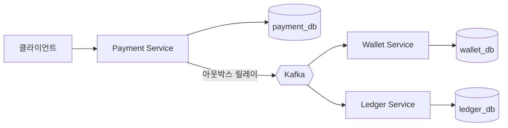

# payment-system

장애·메시지 유실·동시성이 있는 상태에서도 돈이 맞아떨어지는 결제 시스템을 직접 만들어 보는 실험실.

자금 흐름은 세 단계다.

```text
결제 처리 → 잔액 정산 → 장부 기록
```

`distributed-transaction-*` 실험실이 "부분 커밋을 어떻게 막을까"를 다뤘다면, 여기서는 애초에 전체를 하나의 트랜잭션으로 묶지 않는다. 각 서비스가 로컬 트랜잭션만 쓰고, 그 사이를 Kafka 이벤트와 재시도·대사(reconciliation)로 잇는다. 중간이 깨져도 최종적으로 상태가 수렴하는 쪽을 택한다.

## 구성



| 서비스 | 책임 | Gradle 프로젝트 | 포트 |
| --- | --- | --- | ---: |
| Payment | 결제 요청 수락, PSP 호출, 실패 재시도 | `:payment-system-payment-service` | 8090 |
| Wallet | 결제 결과를 받아 잔액 정산 | `:payment-system-wallet-service` | 8091 |
| Ledger | 복식부기 장부 기록과 거래 추적 | `:payment-system-ledger-service` | 8092 |

서비스는 다른 서비스의 테이블을 직접 읽거나 쓰지 않는다. Payment가 자기 DB에 커밋한 사실을 이벤트로 알리고, Wallet과 Ledger가 각자 받아서 처리한다.

## 다룰 주제

| 주제 | 어디서 | 무엇을 재현하나 |
| --- | --- | --- |
| 트랜잭셔널 아웃박스 | Payment | 커밋은 됐는데 이벤트 발행이 실패하는 창(window)을 없앤다 |
| Retry Queue / DLQ | Wallet, Ledger | 소비 실패한 메시지를 유실하지 않고 재시도·격리한다 |
| Bulkhead | Payment | 한 PSP가 느려질 때 다른 결제까지 같이 죽지 않게 막는다 |
| 결제 재시도 | Payment | 실패한 결제를 재시도해 최종적으로 완료 상태로 보낸다 |
| 낙관적 락 | Wallet | 같은 지갑에 정산이 동시에 몰릴 때의 Lost Update |
| 순서 보장 | Kafka | 같은 결제 건의 이벤트가 뒤바뀌어 처리되는 경우 |
| 불변 장부 | Ledger | DB 트리거로 `UPDATE`·`DELETE`를 막아 append-only를 강제한다 |
| 복식부기 | Ledger | 차변·대변 합이 0이 아니면 커밋되지 않게 한다 |
| Reconciliation | 전체 | 서비스 간 데이터가 어긋났을 때 대조로 찾아내고 복구한다 |

## 패키지 구조

세 서비스 모두 같은 레이어를 쓴다.

```text
dev.deepdive.paymentsystem.{payment,wallet,ledger}
├── domain             # 엔티티와 도메인 규칙
├── application        # 유스케이스, @Transactional 경계
├── presentation       # 컨트롤러와 dto/{request,response}
└── infrastructure     # repository, kafka, 외부 연동
```

## 실행

MySQL과 Kafka는 별도로 띄우지 않는다. 테스트는 Testcontainers로 컨테이너를 직접 올린다.

```bash
./gradlew :payment-system-payment-service:test
./gradlew :payment-system-wallet-service:test
./gradlew :payment-system-ledger-service:test
```

애플리케이션으로 직접 띄우려면 `application` 플러그인의 `run`을 쓴다. 이때는 `application.yml`이 기대하는 MySQL과 Kafka가 로컬에 있어야 한다.

```bash
./gradlew :payment-system-payment-service:run
```

접속 정보는 전부 환경 변수로 덮어쓸 수 있다 — `PAYMENT_DB_URL`, `WALLET_DB_URL`, `LEDGER_DB_URL`, `KAFKA_BOOTSTRAP_SERVERS`.

## 현재 상태

지금은 스캐폴딩만 있다. 세 모듈의 Gradle 설정, `@SpringBootApplication` 진입점, `application.yml`까지다. 도메인과 이벤트 흐름은 위 표의 주제를 하나씩 붙여 가면서 채운다.
