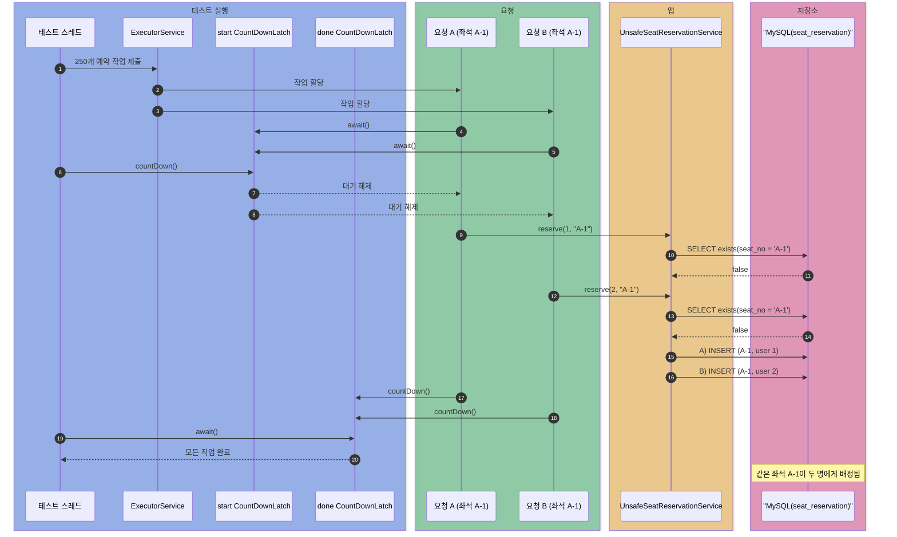
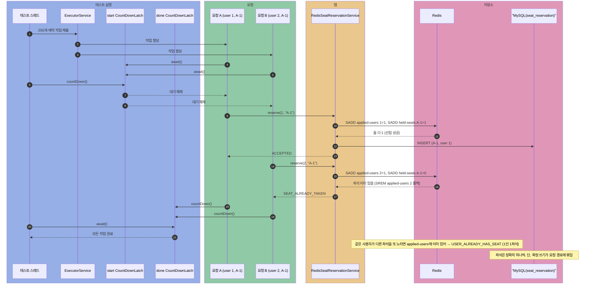
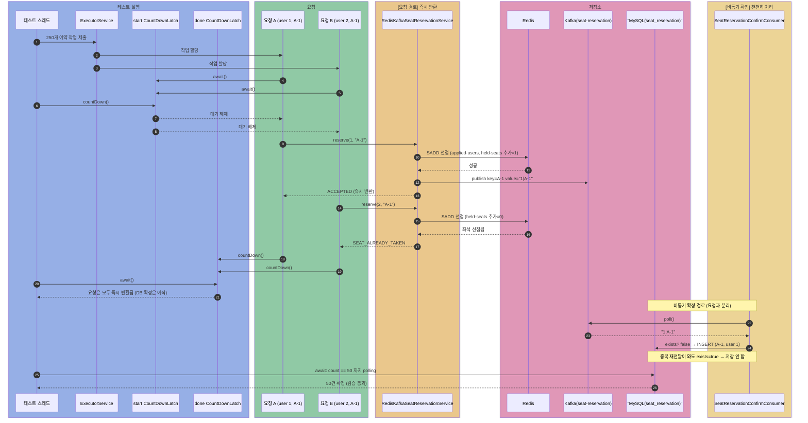
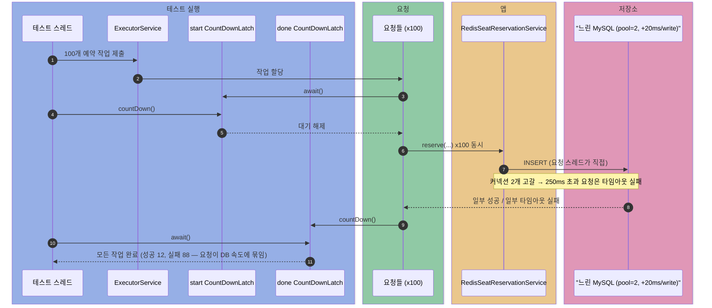
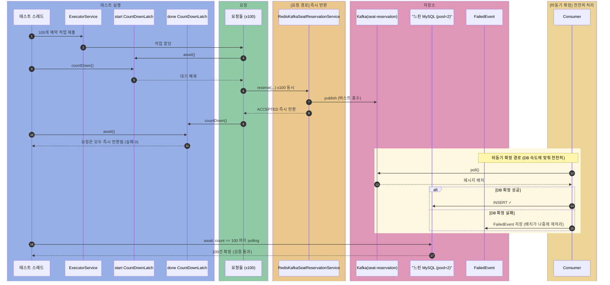

# seat-reservation

콘서트 좌석 예약에서 같은 좌석을 여러 명이 동시에 노릴 때 생기는 동시성 문제와,
예약이 한꺼번에 몰릴 때 RDB가 병목이 되는 부하 문제를 단계로 쌓아 실험.

두 가지 불변식을 지켜야 한다.

- **이중 배정 금지**: 한 좌석은 한 명에게만 배정
- **1인 1좌석**: 한 사람은 한 좌석만 예약

해결 과정:

1. 동시성 제어 없음 → 같은 좌석이 여러 명에게 배정됨
2. Redis 선점(SADD) → 두 불변식(이중 배정·1인 1좌석)을 보장 (동시성 해결)
3. Redis + Kafka → DB 확정을 요청 경로에서 분리 (결합·내구성 문제 해결)
4. 버스트 부하 비교 & 실패 처리 → DB가 병목일 때 Kafka가 몰린 요청을 받아 내고, 확정이 실패해도 FailedEvent로 남겨 배치가 재처리

## 공통 환경

- Testcontainers MySQL 8.0.36 (예약 확정 저장소)
- Redis 케이스: Testcontainers Redis 7.2.5 추가
- Kafka 케이스: Testcontainers Kafka(`apache/kafka:3.8.1`) 추가
- 좌석은 `A-0` ~ `A-49` 50개, 좌석마다 5명이 동시에 노림 → 요청 250개
- 모두 Docker 기반으로 띄우므로 테스트 실행 전 Docker가 떠 있어야 함

## 케이스 1. 동시성 제어 없음

흐름:

```text
SELECT 좌석 존재 여부 -> 없으면 INSERT
```

코드 흐름:

```java
@Transactional
public SeatReservationRequestResult reserve(long userId, String seatNo) {
    if (seatReservationRepository.existsBySeatNo(seatNo)) {
        return new SeatReservationRequestResult(userId, seatNo, SEAT_ALREADY_TAKEN);
    }
    Thread.yield();
    seatReservationRepository.save(new SeatReservation(seatNo, userId));
    return new SeatReservationRequestResult(userId, seatNo, ACCEPTED);
}
```

결과:

- 기대값: 좌석 50개 → 예약 50건
- 실제 결과: 같은 좌석이 여러 명에게 배정되어 예약이 50건보다 많아짐 (실행 예: 53건)
- 테스트 단언문: `assertThat(reservationCount).isGreaterThan(SEATS)`

이유:

- 같은 좌석을 노린 여러 스레드가 동시에 `existsBySeatNo` 조회 → 아직 아무도 저장 전이라 모두 `false`
- 모두 "빈 좌석"으로 판단하고 각자 `INSERT`
- 같은 좌석이 여러 명에게 배정 (이중 배정)
- 쿠폰의 lost update와 같은 뿌리



## 케이스 2. Redis 선점 (SADD)

좌석/사용자의 불변식은 본질이 **유니크 멤버십**이라 Set이 자연스럽다.
`SADD`는 집합에 **새로 추가됐을 때만 1**을 반환하므로, 1이면 그 멤버를 처음 넣은 요청(=선점)이다.
분산락 `SET NX`·카운터 `INCR`은 coupon-issue 쪽 주제라, 여기선 Set으로.
사용자를 먼저 집합에 넣고 좌석을 넣되, 좌석 선점에 실패하면 넣어 둔 사용자를 되돌린다.

흐름:

```text
SADD seat:applied-users {userId} -> 1이 아니면(이미 있음) USER_ALREADY_HAS_SEAT
SADD seat:held-seats {seatNo}   -> 1이 아니면 사용자 롤백(SREM) 후 SEAT_ALREADY_TAKEN
둘 다 1(선점 성공)인 요청만 DB에 예약 확정
```

선점 코드:

```java
public SeatReservationStatus hold(long userId, String seatNo) {
    // 1인 1좌석: 사용자를 집합에 추가, 이미 있으면 좌석 보유 중
    if (!added("seat:applied-users", String.valueOf(userId))) {
        return USER_ALREADY_HAS_SEAT;
    }
    // 이중 배정 방지: 좌석을 집합에 추가, 이미 있으면 선점됨
    if (!added("seat:held-seats", seatNo)) {
        redisTemplate.opsForSet().remove("seat:applied-users", String.valueOf(userId));   // 좌석 밀림 → 되돌림
        return SEAT_ALREADY_TAKEN;
    }
    return ACCEPTED;
}

// SADD 결과가 1이면 집합에 새로 추가된 것 = 그 멤버를 처음 넣은 요청 = 선점 성공
private boolean added(String setKey, String member) {
    Long addedCount = redisTemplate.opsForSet().add(setKey, member);
    return addedCount != null && addedCount == 1L;
}
```

코드 흐름:

```java
public SeatReservationRequestResult reserve(long userId, String seatNo) {
    SeatReservationStatus status = seatHoldStore.hold(userId, seatNo);
    if (status != ACCEPTED) {
        return new SeatReservationRequestResult(userId, seatNo, status);
    }
    seatReservationWriter.save(userId, seatNo);   // 요청 스레드가 직접 DB 확정
    return new SeatReservationRequestResult(userId, seatNo, ACCEPTED);
}
```

결과:

- 좌석 50개가 정확히 하나씩 예약 (이중 배정 없음)
- 같은 사용자가 좌석 50개를 동시에 노려도 1건만 성공 (1인 1좌석)
- 테스트 단언문:
  - `assertThat(acceptedCount.get()).isEqualTo(50)`, `assertThat(repository.count()).isEqualTo(50)`
  - 1인 1좌석: `assertThat(acceptedCount.get()).isEqualTo(1)`, `assertThat(repository.existsByUserId(userId)).isTrue()`

이유:

- Redis는 단일 스레드라 `SADD`가 원자적으로 실행 → 동시에 넣어도 정확히 한 요청만 1을 받음
- 같은 좌석을 노린 요청 중 `seat:held-seats`에 그 좌석을 처음 넣은 하나만 선점 (이중 배정 차단)
- 같은 사용자가 여러 좌석을 노려도 `seat:applied-users`에 한 번만 들어감 (1인 1좌석 차단)
- 좌석 선점에 실패하면 사용자를 `SREM`으로 빼, 밀린 사용자가 다른 좌석을 다시 시도할 수 있음

한계 (→ 케이스 3에서 Kafka로 해결):

- **요청 경로에 DB 쓰기가 결합** — 선점에 성공한 요청 스레드가 그대로 DB `INSERT`까지 끝내야 응답. 매진 오픈처럼 트래픽이 몰리면 확정 쓰기가 한꺼번에 DB로 쏟아짐
- **RDB가 병목이면 그 지연이 요청으로 전파** — DB 처리량을 넘는 요청이 들어오면 뒤 요청은 앞 작업이 끝날 때까지 대기 → 타임아웃·리소스 고갈
- **Redis 카운트는 내구성의 기준이 아님** — 선점 카운트는 메모리 상태. 선점 후 DB 확정 전에 앱이 죽으면 좌석은 잡혀 있는데 예약 레코드는 없음



## 케이스 3. Redis + Kafka

흐름:

```text
SADD 선점 -> 성공 요청만 Kafka로 확정 커맨드 publish -> 즉시 반환
Consumer가 토픽을 소비해 DB에 멱등하게 예약 확정 (같은 좌석/사용자는 한 번만)
```

요청 측 코드:

```java
public SeatReservationRequestResult reserve(long userId, String seatNo) {
    SeatReservationStatus status = seatHoldStore.hold(userId, seatNo);
    if (status != ACCEPTED) {
        return new SeatReservationRequestResult(userId, seatNo, status);
    }
    // DB 쓰기를 요청 경로에서 분리: 확정 커맨드만 Kafka에 적재하고 즉시 반환
    commandPublisher.publish(userId, seatNo);
    return new SeatReservationRequestResult(userId, seatNo, ACCEPTED);
}
```

프로듀서 (`SeatReservationCommandPublisher`) — Kafka로 보내는 한 줄을 클래스로 분리:

```java
public void publish(long userId, String seatNo) {
    kafkaTemplate.send(TOPIC, seatNo, new SeatReservationCommand(userId, seatNo).serialize());
}
```

소비 측 코드:

```java
@KafkaListener(topics = "seat-reservation", groupId = "seat-reservation-confirm")
public void consume(String message) {
    SeatReservationCommand command = SeatReservationCommand.parse(message);
    seatReservationWriter.save(command.userId(), command.seatNo());   // 아래 '실패 처리 메커니즘'에서 try/catch로 감쌈
}

@Transactional
public boolean save(long userId, String seatNo) {
    if (existsBySeatNo(seatNo) || existsByUserId(userId)) {
        return false;   // 멱등: 같은 좌석/사용자 커맨드가 또 와도 중복 저장 안 함
    }
    seatReservationRepository.save(new SeatReservation(seatNo, userId));
    return true;
}
```

결과:

- 선점 성공한 좌석만 Kafka로 적재 → Consumer가 비동기로 DB 확정 → 좌석 50개 하나씩
- Kafka 중복 메시지(at-least-once 재전달)가 와도 DB 예약은 좌석당 1건
- 테스트 단언문: `await(...).untilAsserted(() -> assertThat(repository.count()).isEqualTo(50))`

이유:

- 요청 경로는 **Redis 선점 + Kafka publish**까지만 → 빠르게 반환 (DB 쓰기 대기 없음)
- 좌석 번호를 메시지 키로 써서 같은 좌석 커맨드는 같은 파티션에서 순서대로 처리
- Consumer가 토픽을 **DB가 감당할 속도로** 소비 → 트래픽 스파이크를 Kafka가 흡수(버퍼링)
- **Kafka는 at-least-once 보장**: 같은 메시지가 여러 번 전달될 수 있음 (네트워크 재시도, 컨슈머 재시작 등). 예: Consumer가 메시지 처리 후 오프셋 커밋 전에 재시작 → 같은 메시지 재전달. 이를 좌석/사용자 기준 **멱등** 저장으로 흡수 (`existsBySeatNo || existsByUserId` 체크 후 저장)
- Kafka 로그는 내구성이 있어, 앱이 죽어도 커맨드가 사라지지 않고 재처리 가능



## 케이스 4. 버스트 부하 & 실패 처리 — Redis 직접 쓰기 vs Kafka 경유

쿠폰/예약처럼 **확정 쓰기가 한꺼번에 RDB로 몰리면** DB가 병목이 된다.
처리량을 넘는 요청이 들어오면 뒤 작업은 대기하고, 대기가 길어지면 타임아웃·리소스 고갈로 이어진다.
RDB를 다른 서비스와 공유한다면 그 장애가 전체로 번질 수도 있다.

> 완전한 재현(RDB CPU 폭주 → 실제 장애)은 nGrinder·AWS 같은 실부하 환경이 필요하다.
> 이 테스트는 그 **구조적 인과**를 단위 테스트에서 결정적으로 재현한다:
> 커넥션 풀을 2로 줄이고, 커넥션 타임아웃을 250ms로, 쓰기마다 20ms 지연을 줘서
> "처리량이 제한된 느린 DB"를 흉내 낸다. 사용자마다 다른 좌석 100개를 한꺼번에 요청한다.

설정:

```java
registry.add("spring.datasource.hikari.maximum-pool-size", () -> 2);
registry.add("spring.datasource.hikari.connection-timeout", () -> 250);
registry.add("seat.db.write-delay-millis", () -> 20);
```

결과 (예시 출력 — 환경에 따라 수치는 달라짐):

```text
직접 쓰기  - 요청 반환까지 298ms, 성공 12건, 실패(타임아웃 등) 88건
Kafka 경유 - 요청 반환까지 21ms, 실패 0건 / DB 전부 확정까지 3780ms
```

- **직접 쓰기**: 요청 스레드가 느린 DB에 묶임 → 작은 커넥션 풀이 고갈 → `connection-timeout` 초과 요청은 실패. 요청 반환 시간이 DB 속도에 묶임
- **Kafka 경유**: 
  - **요청 경로**: Redis 선점 + publish만 하고 즉시 반환 → 실패 0건
  - **확정 경로**: 몰린 쓰기는 토픽이 받아 두고, Consumer가 DB 속도에 맞춰 천천히 소진 → 결국 100건 전부 확정
  - **실패 처리**: Consumer의 DB 확정이 실패해도 FailedEvent로 기록 → 배치가 나중에 재처리 → 최종적으로 모든 선점이 확정됨

테스트 단언문:

```java
assertThat(kafkaFailed.get()).isZero();
assertThat(kafkaElapsedMillis).isLessThan(directElapsedMillis);
assertThat(directFailed.get()).isGreaterThan(0);
assertThat(repository.countBySeatNoStartingWith("K-")).isEqualTo(100);
```

직접 쓰기 — 요청 경로가 느린 DB에 묶임:



Kafka 경유 — 요청은 publish까지만:



### 실패 처리 메커니즘

**Consumer의 try-catch:** Redis 선점은 됐는데 DB 확정이 실패하면, FailedEvent로 기록해 배치가 나중에 처리하도록 함.

```java
@KafkaListener(topics = "seat-reservation", groupId = "seat-reservation-confirm")
public void consume(String message) {
    SeatReservationCommand command = SeatReservationCommand.parse(message);
    try {
        seatReservationWriter.save(command.userId(), command.seatNo());
    } catch (Exception e) {
        log.error("좌석 예약 확정 실패. userId={}, seatNo={}", command.userId(), command.seatNo(), e);
        failedEventRepository.save(new FailedEvent(command.userId(), command.seatNo()));
        // ← 예외를 처리 완료 → 리스너는 정상 종료 → 오프셋 커밋 → 무한 재시도 방지
    }
}
```

**배치 (향후 구현):**
```java
@Scheduled(fixedRate = 300_000)  // 5분마다
public void retryFailedEvents() {
    List<FailedEvent> failed = failedEventRepository.findAll();
    for (FailedEvent event : failed) {
        try {
            seatReservationWriter.save(event.userId(), event.seatNo());
            failedEventRepository.delete(event);  // 성공 시 제거
        } catch (Exception e) {
            log.warn("배치 재시도 실패. userId={}, seatNo={}", event.userId(), event.seatNo());
        }
    }
}
```