# spring-boot-actuator

Spring Boot Actuator 운영 관찰 실험실.

- App: `http://localhost:8080`
- Actuator: `http://localhost:9090/actuator`
- Postman Collection: `labs/spring-boot-actuator/spring-boot-actuator.postman_collection.json`

## 실행

프로젝트 루트 기준.

```bash
cd /Users/hanjichan/Desktop/git/deep-dive
./gradlew :spring-boot-actuator:run
```

Postman 컬렉션 변수:

| 변수 | 값 |
| --- | --- |
| `appUrl` | `http://localhost:8080` |
| `actuatorUrl` | `http://localhost:9090` |

## 학습 흐름

앱 실행 후 Postman 폴더를 위에서 아래로 실행.

1. Postman 컬렉션 import
2. `0. Basic Actuator` 실행
3. `1. Health`부터 순서대로 실행
4. App API response 확인
5. Actuator response 확인
6. `/actuator/metrics/{name}` 값 변화 확인

실습 API와 actuator 확장 기능은 기본 Bean으로 등록.

Postman 순서:

| 순서 | 폴더 | 핵심 |
| --- | --- | --- |
| 0 | `0. Basic Actuator` | endpoint 목록, health, info |
| 1 | `1. Health` | custom health 상태 변경 |
| 2 | `2. Info` | custom info contributor |
| 3 | `3. Metrics Basic` | JVM, CPU, process metric |
| 4 | `4. Counter and Tags` | 누적 횟수, tag 필터 |
| 5 | `5. Common Tags` | 공통 tag, cardinality |
| 6 | `6. Gauge` | 현재 대기 개수 |
| 7 | `7. Timer.record` | 코드 블록 소요 시간 |
| 8 | `8. Timer.Sample` | 결과별 timer tag |
| 9 | `9. @Timed` | 메서드 실행 시간 |
| 10 | `10. Percentile` | p50, p95, p99 |
| 11 | `11. HTTP Metrics` | `http.server.requests` |
| 12 | `12. Custom Endpoint` | custom actuator endpoint |

## 설정

현재 설정:

```yaml
spring:
  output:
    ansi:
      enabled: always
  application:
    name: spring-boot-actuator

management:
  server:
    port: 9090
  endpoints:
    web:
      exposure:
        include:
          - health
          - info
          - metrics
          - features
  endpoint:
    health:
      show-details: always
      show-components: always
  info:
    env:
      enabled: true
    git:
      mode: simple
  metrics:
    tags:
      application: actuator-lab
      environment: local
      region: kr
```

설정 의미:

| 설정 | 의미 | response 영향 |
| --- | --- | --- |
| `spring.output.ansi.enabled=always` | 로그 색상 출력 | 터미널 로그 가독성 |
| `spring.application.name` | 앱 이름 | 로그, metric 식별 정보 |
| `management.server.port=9090` | actuator 전용 포트 | App은 `8080`, Actuator는 `9090` |
| `management.endpoints.web.exposure.include` | 웹 노출 endpoint | `/actuator` 링크 목록 |
| `management.endpoint.health.show-details=always` | health detail 노출 | `components`, `details` 표시 |
| `management.endpoint.health.show-components=always` | component 목록 노출 | `diskSpace`, `ping`, custom health 표시 |
| `management.info.env.enabled=true` | `info.*` 설정 노출 | `/actuator/info`에 `app`, `team` 표시 |
| `management.info.git.mode=simple` | git 정보 간단 노출 | branch, commit id/time |
| `management.metrics.tags.*` | 공통 metric tag | 모든 metric의 `availableTags`에 공통 tag |

## Response 읽기

Health:

```json
{
  "status": "UP",
  "components": {
    "diskSpace": {
      "status": "UP",
      "details": {
        "free": 649000000000
      }
    }
  }
}
```

| 필드 | 의미 |
| --- | --- |
| `status` | 전체 상태 |
| `components` | health indicator별 상태 |
| `details` | indicator 상세 정보 |

Info:

```json
{
  "app": {
    "name": "spring-boot-actuator",
    "version": "0.1.0-SNAPSHOT"
  },
  "git": {
    "branch": "main",
    "commit": {
      "id": "599ecf8"
    }
  },
  "build": {
    "artifact": "spring-boot-actuator"
  }
}
```

| 필드 | 의미 |
| --- | --- |
| `app` | `info.app.*` 설정 |
| `git` | `git.properties` 기반 |
| `build` | `build-info.properties` 기반 |
| `release` | `ReleaseInfoContributor` 기반 |

Metric response 예시:

```json
{
  "name": "app.file.conversion.time",
  "baseUnit": "seconds",
  "measurements": [
    { "statistic": "COUNT", "value": 1.0 },
    { "statistic": "TOTAL_TIME", "value": 2.0 },
    { "statistic": "MAX", "value": 2.0 }
  ],
  "availableTags": [
    { "tag": "uri", "values": ["/files/convert"] }
  ]
}
```

| 필드 | 의미 |
| --- | --- |
| `name` | metric 이름 |
| `baseUnit` | 단위 |
| `measurements` | 측정값 |
| `availableTags` | 필터 가능한 tag |

| statistic | 의미 |
| --- | --- |
| `COUNT` | 누적 호출/발생 횟수 |
| `VALUE` | 현재 값 |
| `TOTAL_TIME` | 총 소요 시간 |
| `MAX` | 최근 윈도우 최대값 |

Timer 평균:

```text
평균 소요 시간 = TOTAL_TIME / COUNT
```

Metric tag 필터:

```text
GET /actuator/metrics/app.notification.sent?tag=channel:email
GET /actuator/metrics/http.server.requests?tag=method:POST&tag=status:200
```

필터는 `availableTags`에 보이는 값 기준.

## 시작점

```text
src/main/java/dev/deepdive/actuator
├── config        # AOP metric aspect, common tags
├── content       # percentile
├── document      # Timer.Sample
├── endpoint      # custom @Endpoint
├── file          # Timer.record
├── health        # custom HealthIndicator
├── info          # custom InfoContributor
├── notification  # Counter, @Counted, Gauge, tags
├── partner       # 외부 시스템 상태 시뮬레이션
└── report        # @Timed
```

핵심 의존성:

```gradle
implementation 'org.springframework.boot:spring-boot-starter-web'
implementation 'org.springframework.boot:spring-boot-starter-actuator'
implementation 'org.springframework.boot:spring-boot-starter-aop'
```

`@Counted`, `@Timed`는 AOP 기반. `spring-boot-starter-aop` 필요.

## 코드 읽는 방식

각 섹션은 같은 순서로 읽는다.

```text
Postman 폴더
-> 코드 / 자동 수집 항목
-> 흐름
-> 구현체 코드
-> 요청 순서
-> 대표 response
-> 포인트 / 비교
```

`구현체 코드`는 전체 파일 복붙이 아니라 핵심 흐름만 남긴 발췌.

## 0. Basic Actuator

Postman 폴더: `0. Basic Actuator`

자동 수집:

- `spring-boot-starter-actuator`
- `management.endpoints.web.exposure.include`

흐름:

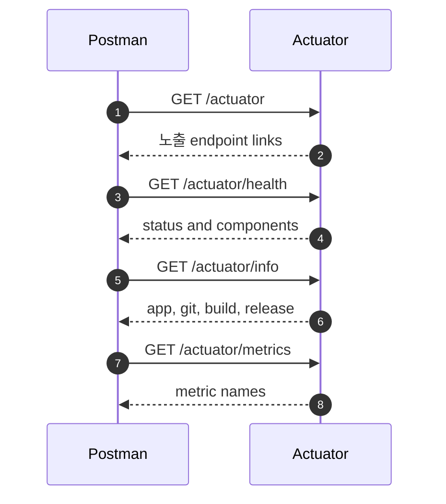

구현체 코드:

```yaml
management:
  server:
    port: 9090
  endpoints:
    web:
      exposure:
        include:
          - health
          - info
          - metrics
          - features
```

요청 순서:

| 요청 | API | 관찰 |
| --- | --- | --- |
| `Actuator Links` | `GET {{actuatorUrl}}/actuator` | 노출 endpoint 목록 |
| `Health` | `GET {{actuatorUrl}}/actuator/health` | 전체 상태, component |
| `Info` | `GET {{actuatorUrl}}/actuator/info` | app, team, git, build, release |
| `Metrics Names` | `GET {{actuatorUrl}}/actuator/metrics` | metric 이름 목록 |

대표 response:

```json
{
  "_links": {
    "health": { "href": "http://localhost:9090/actuator/health" },
    "info": { "href": "http://localhost:9090/actuator/info" },
    "metrics": { "href": "http://localhost:9090/actuator/metrics" },
    "features": { "href": "http://localhost:9090/actuator/features" }
  }
}
```

포인트:

- `/actuator`는 목차
- `/actuator/health`는 지금 트래픽을 받을 수 있는지 확인
- `/actuator/info`는 어떤 빌드가 떠 있는지 확인
- `/actuator/metrics`는 metric drill-down 시작점

## 1. Health

Postman 폴더: `1. Health`

코드:

- `PartnerSystemHealthIndicator`
- `PartnerSystemSimulator`
- `PartnerSystemController`

흐름:

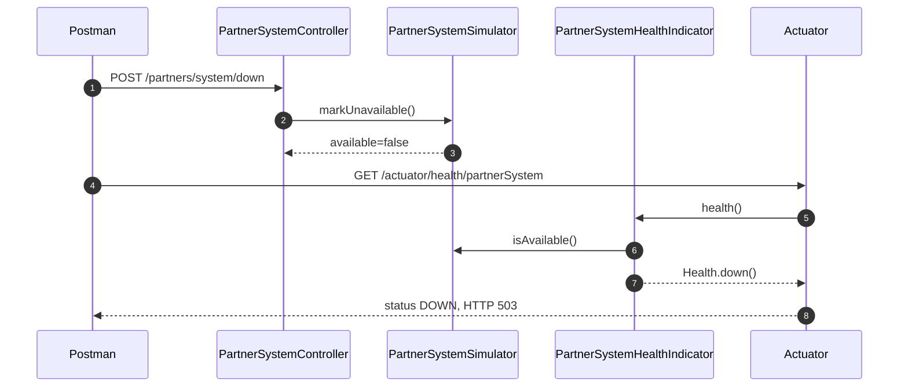

구현체 코드:

```java
@RestController
@RequestMapping("/partners/system")
public class PartnerSystemController {

    private final PartnerSystemSimulator partnerSystem;

    @GetMapping
    public Map<String, Object> status() {
        return response();
    }

    @PostMapping("/up")
    public Map<String, Object> up() {
        // App API로 상태를 바꾸면 actuator health response도 같은 상태를 읽는다.
        partnerSystem.markAvailable();
        return response();
    }

    @PostMapping("/down")
    public Map<String, Object> down() {
        // DOWN 상태에서는 /actuator/health/partnerSystem 응답 status가 DOWN이 된다.
        partnerSystem.markUnavailable();
        return response();
    }

    private Map<String, Object> response() {
        return Map.of(
                "available", partnerSystem.isAvailable(),
                "changedAt", partnerSystem.changedAt()
        );
    }
}
```

```java
@Component
public class PartnerSystemSimulator {

    // HealthIndicator가 읽는 외부 시스템 상태를 메모리로 단순화한 실습용 상태값
    private volatile boolean available = true;
    private volatile Instant changedAt = Instant.now();

    public void markAvailable() {
        // Postman에서 /partners/system/up 호출 시 health가 다시 UP으로 바뀌는 기준값
        available = true;
        changedAt = Instant.now();
    }

    public void markUnavailable() {
        // Postman에서 /partners/system/down 호출 시 health가 DOWN으로 바뀌는 기준값
        available = false;
        changedAt = Instant.now();
    }
}
```

```java
@Component
public class PartnerSystemHealthIndicator implements HealthIndicator {

    private final PartnerSystemSimulator partnerSystem;

    @Override
    public Health health() {
        // HealthIndicator Bean 이름에서 Indicator를 뺀 partnerSystem이 actuator component id가 된다.
        if (partnerSystem.isAvailable()) {
            return Health.up()
                    .withDetail("system", "partner-notification-gateway")
                    .withDetail("checkedAt", partnerSystem.changedAt())
                    .withDetail("message", "Partner system is reachable")
                    .build();
        }

        // DOWN을 반환하면 health endpoint의 HTTP status도 기본적으로 503으로 내려간다.
        return Health.down()
                .withDetail("system", "partner-notification-gateway")
                .withDetail("checkedAt", partnerSystem.changedAt())
                .withDetail("message", "Partner system is unavailable")
                .build();
    }
}
```

요청 순서:

| 순서 | 요청 | API | 기대 |
| --- | --- | --- | --- |
| 1 | `Partner System Status` | `GET {{appUrl}}/partners/system` | `available: true` |
| 2 | `Partner Health` | `GET {{actuatorUrl}}/actuator/health/partnerSystem` | `status: UP` |
| 3 | `Partner System Down` | `POST {{appUrl}}/partners/system/down` | `available: false` |
| 4 | `Partner Health After Down` | `GET {{actuatorUrl}}/actuator/health/partnerSystem` | body `status: DOWN`, HTTP status `503` |
| 5 | `Partner System Up` | `POST {{appUrl}}/partners/system/up` | `available: true` |

대표 response:

App API:

```json
{
  "available": false,
  "changedAt": "2026-06-29T11:30:00.000Z"
}
```

Actuator health:

```json
{
  "status": "DOWN",
  "details": {
    "system": "partner-notification-gateway",
    "message": "Partner system is unavailable"
  }
}
```

`HealthIndicator`가 `DOWN`을 반환하면 actuator health HTTP status는 기본적으로 `503`. Postman에서는 response body의 `status`, `details.message`를 같이 확인.

## 2. Info

Postman 폴더: `2. Info`

코드:

- `ReleaseInfoContributor`
- `build.gradle`의 `generateBuildInfo`
- `build.gradle`의 `generateGitProperties`

흐름:

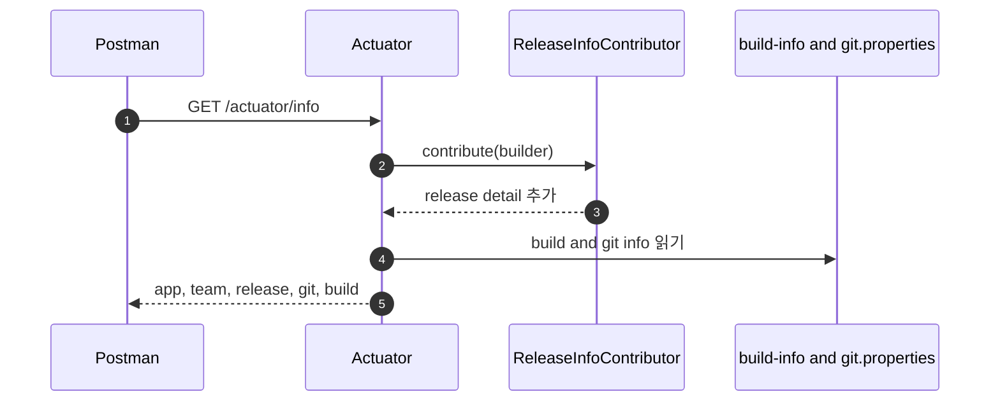

구현체 코드:

```java
@Component
public class ReleaseInfoContributor implements InfoContributor {

    private final Environment environment;

    @Override
    public void contribute(Info.Builder builder) {
        // /actuator/info response에 release 블록을 추가하는 custom contributor
        builder.withDetail("release", new ReleaseInfo(
                "backend-platform",
                LocalDate.of(2026, 6, 29).toString(),
                "#actuator-lab",
                activeProfiles()
        ));
    }

    private String activeProfiles() {
        String[] profiles = environment.getActiveProfiles();
        if (profiles.length == 0) {
            // active profile이 없으면 actuator response에서 default로 읽기 쉽게 표시
            return "default";
        }
        return String.join(",", profiles);
    }

    public record ReleaseInfo(
            String releaseManager,
            String releasedAt,
            String supportChannel,
            String activeProfile
    ) {
    }
}
```

```yaml
info:
  app:
    name: spring-boot-actuator
    version: 0.1.0-SNAPSHOT
    description: Spring Boot Actuator learning lab
  team: backend-lab
```

요청 순서:

| 요청 | API | 관찰 |
| --- | --- | --- |
| `Info With Release` | `GET {{actuatorUrl}}/actuator/info` | `release`, `build`, `git` |

대표 response:

```json
{
  "app": {
    "name": "spring-boot-actuator",
    "version": "0.1.0-SNAPSHOT"
  },
  "team": "backend-lab",
  "release": {
    "releaseManager": "backend-platform",
    "supportChannel": "#actuator-lab",
    "activeProfile": "default"
  },
  "git": {
    "branch": "main",
    "commit": { "id": "599ecf8" }
  },
  "build": {
    "artifact": "spring-boot-actuator"
  }
}
```

Info는 “어떤 버전이 떠 있는가”를 보는 endpoint.

## 3. Metrics Basic

Postman 폴더: `3. Metrics Basic`

자동 수집:

| metric | 제공 주체 | 의미 |
| --- | --- | --- |
| `jvm.memory.used` | Spring Boot Actuator + Micrometer JVM binder | JVM 메모리 사용량 |
| `jvm.gc.pause` | Micrometer JVM binder | GC pause 시간 |
| `jvm.threads.live` | Micrometer JVM binder | live thread 수 |
| `system.cpu.usage` | system metrics binder | 시스템 CPU 사용률 |
| `process.cpu.usage` | process metrics binder | 현재 JVM process CPU 사용률 |
| `process.uptime` | process metrics binder | 프로세스 실행 시간 |

흐름:

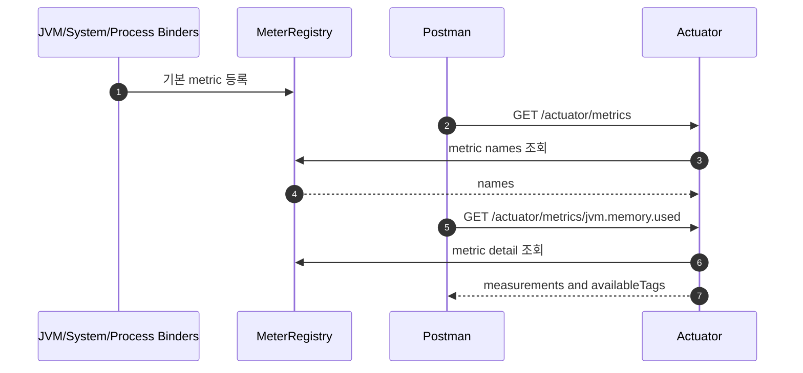

구현체 코드:

```text
별도 Controller/Service 코드 없음.

spring-boot-starter-actuator
-> Micrometer binder 자동 등록
-> /actuator/metrics 에서 metric 조회
```

요청 순서:

| 요청 | API | 관찰 |
| --- | --- | --- |
| `Metrics Names` | `GET {{actuatorUrl}}/actuator/metrics` | 전체 metric 이름 |
| `JVM Memory Used` | `GET {{actuatorUrl}}/actuator/metrics/jvm.memory.used` | heap/nonheap 메모리 사용량 |
| `JVM GC Pause` | `GET {{actuatorUrl}}/actuator/metrics/jvm.gc.pause` | GC pause 횟수/시간 |
| `JVM Threads Live` | `GET {{actuatorUrl}}/actuator/metrics/jvm.threads.live` | live thread 수 |
| `System CPU Usage` | `GET {{actuatorUrl}}/actuator/metrics/system.cpu.usage` | 시스템 CPU 사용률 |
| `Process CPU Usage` | `GET {{actuatorUrl}}/actuator/metrics/process.cpu.usage` | 현재 프로세스 CPU 사용률 |
| `Process Uptime` | `GET {{actuatorUrl}}/actuator/metrics/process.uptime` | 프로세스 실행 시간 |

대표 response:

```json
{
  "name": "jvm.memory.used",
  "baseUnit": "bytes",
  "measurements": [
    { "statistic": "VALUE", "value": 123456789 }
  ],
  "availableTags": [
    { "tag": "area", "values": ["heap", "nonheap"] },
    { "tag": "id", "values": ["G1 Eden Space"] }
  ]
}
```

Health는 상태, Metrics는 추세.

## 4. Counter and Tags

Postman 폴더: `4. Counter and Tags`

코드:

- `NotificationService`
- `NotificationController`
- `Counter.builder("app.notification.sent")`
- `@Counted(value = "app.notification.requested")`

흐름:

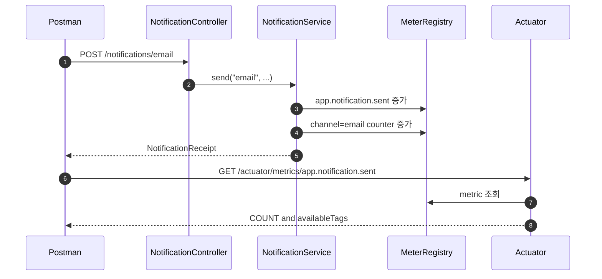

구현체 코드:

```java
@RestController
public class NotificationController {

    private final NotificationService notificationService;

    @PostMapping("/notifications/send")
    public NotificationReceipt send(
            @RequestParam(defaultValue = "email") String channel,
            @RequestParam(defaultValue = "user@example.com") String recipient,
            @RequestParam(defaultValue = "Actuator lab notification") String message
    ) {
        return notificationService.send(channel, recipient, message);
    }

    @PostMapping("/notifications/email")
    public NotificationReceipt email(
            @RequestParam(defaultValue = "user@example.com") String recipient,
            @RequestParam(defaultValue = "Email notification") String message
    ) {
        return notificationService.send("email", recipient, message);
    }

    @PostMapping("/notifications/sms")
    public NotificationReceipt sms(
            @RequestParam(defaultValue = "010-0000-0000") String recipient,
            @RequestParam(defaultValue = "SMS notification") String message
    ) {
        return notificationService.send("sms", recipient, message);
    }
}
```

```java
@Service
public class NotificationService {

    private final Counter notificationSentCounter;
    private final Counter emailNotificationCounter;
    private final Counter smsNotificationCounter;

    public NotificationService(MeterRegistry meterRegistry) {
        // tag 없는 counter: 전체 발송 성공 횟수를 볼 때 사용
        this.notificationSentCounter = Counter.builder("app.notification.sent")
                .description("성공적으로 발송된 알림 수")
                .register(meterRegistry);
        // 같은 metric 이름에 channel/region tag를 붙이면 필터링 가능한 시계열이 된다.
        this.emailNotificationCounter = Counter.builder("app.notification.sent")
                .description("성공적으로 발송된 알림 수")
                .tag("channel", "email")
                .tag("region", "kr")
                .register(meterRegistry);
        // channel=sms만 보고 싶으면 /actuator/metrics/app.notification.sent?tag=channel:sms
        this.smsNotificationCounter = Counter.builder("app.notification.sent")
                .description("성공적으로 발송된 알림 수")
                .tag("channel", "sms")
                .tag("region", "kr")
                .register(meterRegistry);
    }

    @Counted(value = "app.notification.requested", description = "알림 발송 요청 횟수")
    public NotificationReceipt send(String channel, String recipient, String message) {
        // @Counted는 메서드 호출 횟수를 AOP로 기록하고, 아래 Counter는 성공 처리 후 직접 증가시킨다.
        NotificationReceipt receipt = new NotificationReceipt(channel, recipient, message, "SENT");
        notificationSentCounter.increment();

        if ("email".equals(channel)) {
            emailNotificationCounter.increment();
        } else if ("sms".equals(channel)) {
            smsNotificationCounter.increment();
        }

        return receipt;
    }
}
```

`@Counted`가 동작하려면 Aspect Bean 필요.

```java
@Configuration
public class MetricsAspectConfig {

    @Bean
    public CountedAspect countedAspect(MeterRegistry meterRegistry) {
        return new CountedAspect(meterRegistry);
    }
}
```

요청 순서:

| 순서 | 요청 | API | 효과 |
| --- | --- | --- | --- |
| 1 | `Send Generic Notification` | `POST {{appUrl}}/notifications/send` | 전체 counter 증가 |
| 2 | `Send Email Notification` | `POST {{appUrl}}/notifications/email` | `channel=email` counter 증가 |
| 3 | `Send SMS Notification` | `POST {{appUrl}}/notifications/sms` | `channel=sms` counter 증가 |
| 4 | `Notification Sent Counter` | `GET {{actuatorUrl}}/actuator/metrics/app.notification.sent` | 전체 count, tag 후보 |
| 5 | `Notification Sent Counter - Email` | `GET ...?tag=channel:email` | email만 필터 |
| 6 | `Notification Sent Counter - SMS` | `GET ...?tag=channel:sms` | sms만 필터 |
| 7 | `Notification Sent Counter - Email KR` | `GET ...?tag=channel:email&tag=region:kr` | 복수 tag 필터 |
| 8 | `Notification Requested Counted` | `GET {{actuatorUrl}}/actuator/metrics/app.notification.requested` | `@Counted` 호출 수 |

대표 response:

App API:

```json
{
  "channel": "email",
  "recipient": "user@example.com",
  "message": "Email notification",
  "status": "SENT"
}
```

Metric:

```json
{
  "name": "app.notification.sent",
  "measurements": [
    { "statistic": "COUNT", "value": 3.0 }
  ],
  "availableTags": [
    { "tag": "channel", "values": ["email", "sms"] },
    { "tag": "region", "values": ["kr"] }
  ]
}
```

비교:

| 방식 | 쓰임 |
| --- | --- |
| `Counter` | 성공한 경우만 직접 증가 |
| `@Counted` | 메서드 호출 횟수 자동 기록 |
| tag | 낮은 종류의 분류 기준 |

## 5. Common Tags

Postman 폴더: `5. Common Tags`

코드:

- `MetricsTagConfig`
- `MeterFilter.commonTags`
- `management.metrics.tags`

흐름:

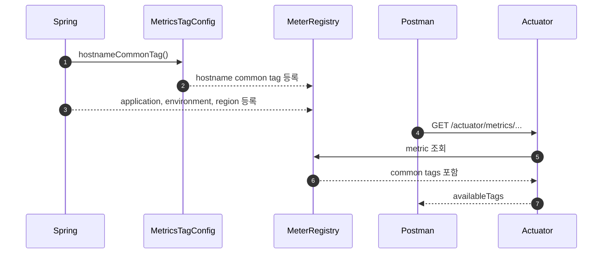

구현체 코드:

설정 기반 common tag:

```yaml
management:
  metrics:
    tags:
      application: actuator-lab
      environment: local
      region: kr
```

코드 기반 common tag:

```java
@Configuration
public class MetricsTagConfig {

    @Bean
    public MeterFilter hostnameCommonTag() {
        // 설정 기반 common tag 외에 코드로 hostname tag를 모든 metric에 붙인다.
        return MeterFilter.commonTags(List.of(Tag.of("hostname", hostname())));
    }

    private String hostname() {
        try {
            return InetAddress.getLocalHost().getHostName();
        } catch (UnknownHostException exception) {
            return "unknown";
        }
    }
}
```

요청 순서:

| 요청 | API | 관찰 |
| --- | --- | --- |
| `HTTP Server Requests With Common Tags` | `GET {{actuatorUrl}}/actuator/metrics/http.server.requests` | `application`, `environment`, `region`, `hostname` |
| `Notification Sent With Common Tags` | `GET {{actuatorUrl}}/actuator/metrics/app.notification.sent` | custom metric에도 common tag 적용 |

대표 response:

```json
{
  "availableTags": [
    { "tag": "application", "values": ["actuator-lab"] },
    { "tag": "environment", "values": ["local"] },
    { "tag": "region", "values": ["kr"] },
    { "tag": "hostname", "values": ["hanjichan-mac"] }
  ]
}
```

| 좋은 tag | 나쁜 tag |
| --- | --- |
| `application`, `environment`, `region`, `hostname` | `userId`, `email`, `requestId`, 전체 URL |

tag 값 종류가 무한히 늘면 cardinality 폭발.

## 6. Gauge

Postman 폴더: `6. Gauge`

코드:

- `PendingNotificationManager`
- `Gauge.builder("app.notification.pending.size", pendingNotifications, List::size)`
- `PendingNotificationController`

흐름:

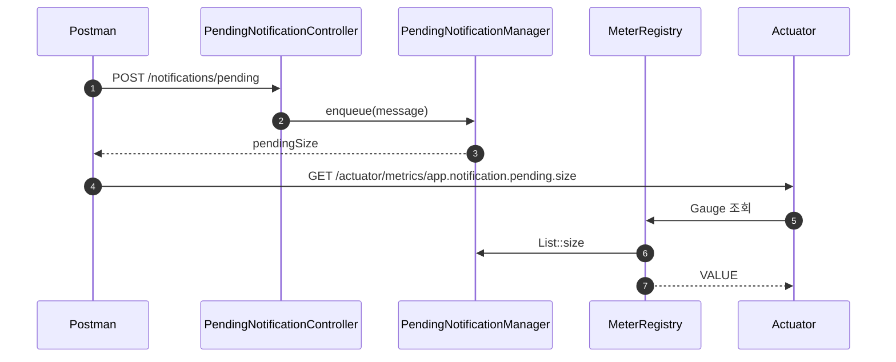

구현체 코드:

```java
@RestController
public class PendingNotificationController {

    private final PendingNotificationManager pendingNotificationManager;

    @PostMapping("/notifications/pending")
    public Map<String, Object> enqueue(@RequestParam(defaultValue = "pending notification") String message) {
        return Map.of("pendingSize", pendingNotificationManager.enqueue(message));
    }

    @DeleteMapping("/notifications/pending")
    public Map<String, Object> dequeue() {
        return Map.of("pendingSize", pendingNotificationManager.dequeue());
    }
}
```

```java
@Component
public class PendingNotificationManager {

    private final List<String> pendingNotifications = Collections.synchronizedList(new ArrayList<>());

    public PendingNotificationManager(MeterRegistry meterRegistry) {
        // Gauge는 값을 저장하지 않고 actuator 조회 시점에 List::size를 호출한다.
        Gauge.builder("app.notification.pending.size", pendingNotifications, List::size)
                .description("현재 발송 대기 중인 알림 수")
                .register(meterRegistry);
    }

    public int enqueue(String message) {
        pendingNotifications.add(message);
        return pendingNotifications.size();
    }

    public int dequeue() {
        if (!pendingNotifications.isEmpty()) {
            pendingNotifications.removeFirst();
        }
        return pendingNotifications.size();
    }
}
```

요청 순서:

| 순서 | 요청 | API | 기대 |
| --- | --- | --- | --- |
| 1 | `Enqueue Pending Notification` | `POST {{appUrl}}/notifications/pending` | `pendingSize: 1` |
| 2 | `Enqueue Retry Pending Notification` | `POST {{appUrl}}/notifications/pending?message=retry` | `pendingSize: 2` |
| 3 | `Pending Notification Gauge` | `GET {{actuatorUrl}}/actuator/metrics/app.notification.pending.size` | `VALUE: 2` |
| 4 | `Dequeue Pending Notification` | `DELETE {{appUrl}}/notifications/pending` | `pendingSize: 1` |
| 5 | `Pending Notification Gauge After Dequeue` | `GET {{actuatorUrl}}/actuator/metrics/app.notification.pending.size` | `VALUE: 1` |

대표 response:

App API:

```json
{
  "pendingSize": 2
}
```

Metric:

```json
{
  "name": "app.notification.pending.size",
  "measurements": [
    { "statistic": "VALUE", "value": 2.0 }
  ]
}
```

| 타입 | 질문 |
| --- | --- |
| Counter | 몇 번 발생했나 |
| Gauge | 지금 몇 개인가 |

## 7. Timer.record

Postman 폴더: `7. Timer.record`

코드:

- `FileProcessingService`
- `Timer.builder("app.file.conversion.time")`
- `fileConversionTimer.record(() -> doConvert(...))`

흐름:

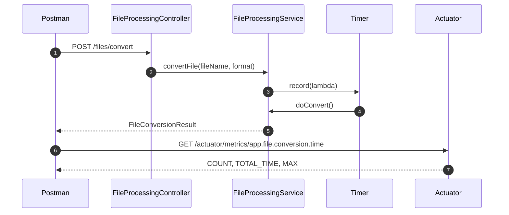

구현체 코드:

```java
@RestController
public class FileProcessingController {

    private final FileProcessingService fileProcessingService;

    @PostMapping("/files/convert")
    public FileConversionResult convert(
            @RequestParam(defaultValue = "monthly-report.csv") String fileName,
            @RequestParam(defaultValue = "pdf") String format
    ) {
        return fileProcessingService.convertFile(fileName, format);
    }
}
```

```java
@Service
public class FileProcessingService {

    private final Timer fileConversionTimer;

    public FileProcessingService(MeterRegistry meterRegistry) {
        // Timer는 호출 횟수(COUNT)와 소요 시간(TOTAL_TIME, MAX)을 함께 기록한다.
        this.fileConversionTimer = Timer.builder("app.file.conversion.time")
                .description("파일 변환 작업 소요 시간")
                .register(meterRegistry);
    }

    public FileConversionResult convertFile(String fileName, String format) {
        // record 안에서 실행된 doConvert 시간이 app.file.conversion.time에 쌓인다.
        return fileConversionTimer.record(() -> doConvert(fileName, format));
    }

    private FileConversionResult doConvert(String fileName, String format) {
        // Timer 값을 눈으로 확인하기 쉽도록 의도적으로 2초짜리 작업을 만든다.
        sleep(2_000);
        return new FileConversionResult(fileName, format, "CONVERTED");
    }
}
```

요청 순서:

| 순서 | 요청 | API | 효과 |
| --- | --- | --- | --- |
| 1 | `Convert File` | `POST {{appUrl}}/files/convert` | 기본 변환, 약 2초 |
| 2 | `Convert CSV To PDF` | `POST {{appUrl}}/files/convert?fileName=monthly-report.csv&format=pdf` | 파라미터 포함 변환 |
| 3 | `File Conversion Timer` | `GET {{actuatorUrl}}/actuator/metrics/app.file.conversion.time` | count/total/max |
| 4 | `HTTP Requests For File API` | `GET .../http.server.requests?tag=uri:/files/convert` | HTTP 자동 timer |

대표 response:

App API:

```json
{
  "fileName": "monthly-report.csv",
  "format": "pdf",
  "status": "CONVERTED"
}
```

Metric:

```json
{
  "name": "app.file.conversion.time",
  "baseUnit": "seconds",
  "measurements": [
    { "statistic": "COUNT", "value": 2.0 },
    { "statistic": "TOTAL_TIME", "value": 4.0 },
    { "statistic": "MAX", "value": 2.0 }
  ]
}
```

특정 코드 블록만 재고 싶을 때 `Timer.record`.

## 8. Timer.Sample

Postman 폴더: `8. Timer.Sample`

코드:

- `DocumentValidationService`
- `Timer.Sample sample = Timer.start(meterRegistry)`
- `sample.stop(timer)`
- `result=success|fail`

흐름:

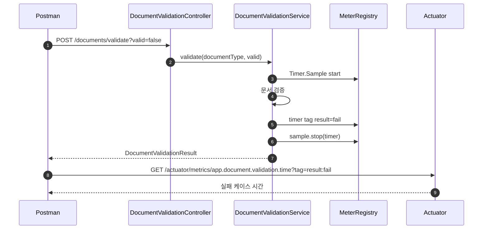

구현체 코드:

```java
@RestController
public class DocumentValidationController {

    private final DocumentValidationService documentValidationService;

    @PostMapping("/documents/validate")
    public DocumentValidationResult validate(
            @RequestParam(defaultValue = "contract") String documentType,
            @RequestParam(defaultValue = "true") boolean valid
    ) {
        return documentValidationService.validate(documentType, valid);
    }
}
```

```java
@Service
public class DocumentValidationService {

    private final MeterRegistry meterRegistry;

    public DocumentValidationResult validate(String documentType, boolean valid) {
        // Timer.Sample은 시작 시점과 기록 시점을 분리할 때 사용한다.
        Timer.Sample sample = Timer.start(meterRegistry);
        String result = valid ? "success" : "fail";

        try {
            sleep(valid ? 350 : 600);
            return new DocumentValidationResult(documentType, valid, result);
        } finally {
            // 결과를 알고 난 뒤 result tag를 정해서 같은 timer 이름에 success/fail을 분리한다.
            Timer timer = Timer.builder("app.document.validation.time")
                    .description("외부 문서 검증 작업 소요 시간")
                    .tag("result", result)
                    .register(meterRegistry);
            sample.stop(timer);
        }
    }
}
```

요청 순서:

| 순서 | 요청 | API | 효과 |
| --- | --- | --- | --- |
| 1 | `Validate Document Success` | `POST {{appUrl}}/documents/validate?valid=true` | `result=success` timer 기록 |
| 2 | `Validate Document Fail` | `POST {{appUrl}}/documents/validate?valid=false` | `result=fail` timer 기록 |
| 3 | `Document Validation Timer` | `GET {{actuatorUrl}}/actuator/metrics/app.document.validation.time` | result tag 후보 |
| 4 | `Document Validation Timer - Fail` | `GET ...?tag=result:fail` | 실패 케이스만 |
| 5 | `Document Validation Timer - Success` | `GET ...?tag=result:success` | 성공 케이스만 |

대표 response:

App API:

```json
{
  "documentType": "contract",
  "valid": false,
  "result": "fail"
}
```

Metric:

```json
{
  "name": "app.document.validation.time",
  "measurements": [
    { "statistic": "COUNT", "value": 2.0 },
    { "statistic": "TOTAL_TIME", "value": 0.95 },
    { "statistic": "MAX", "value": 0.6 }
  ],
  "availableTags": [
    { "tag": "result", "values": ["success", "fail"] }
  ]
}
```

쓰는 때:

- 시작과 종료 위치가 다름
- 결과를 본 뒤 tag 결정
- `try/finally`로 `stop()` 보장

## 9. @Timed

Postman 폴더: `9. @Timed`

코드:

- `ReportService`
- `@Timed(value = "app.report.generation.time")`
- `MetricsAspectConfig`

흐름:

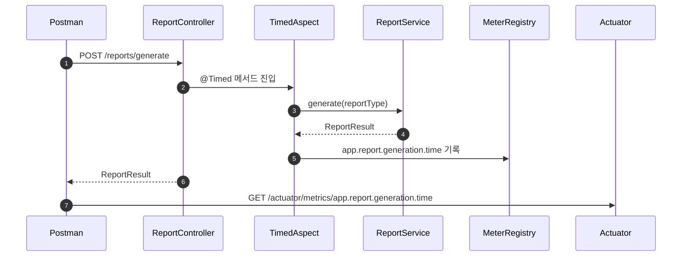

구현체 코드:

```java
@RestController
public class ReportController {

    private final ReportService reportService;

    @PostMapping("/reports/generate")
    public ReportResult generate(@RequestParam(defaultValue = "daily-sales") String reportType) {
        return reportService.generate(reportType);
    }
}
```

```java
@Service
public class ReportService {

    // @Timed는 메서드 전체 실행 시간을 AOP로 감싼 뒤 timer metric으로 기록한다.
    @Timed(value = "app.report.generation.time", description = "리포트 생성 작업 소요 시간")
    public ReportResult generate(String reportType) {
        sleep(750);
        return new ReportResult(reportType, "GENERATED");
    }
}
```

```java
@Configuration
public class MetricsAspectConfig {

    @Bean
    public TimedAspect timedAspect(MeterRegistry meterRegistry) {
        return new TimedAspect(meterRegistry);
    }
}
```

요청 순서:

| 순서 | 요청 | API | 효과 |
| --- | --- | --- | --- |
| 1 | `Generate Report` | `POST {{appUrl}}/reports/generate` | 기본 report 생성 |
| 2 | `Generate Weekly Report` | `POST {{appUrl}}/reports/generate?reportType=weekly-sales` | 파라미터 포함 생성 |
| 3 | `Report Generation Timer` | `GET {{actuatorUrl}}/actuator/metrics/app.report.generation.time` | `@Timed` metric |
| 4 | `HTTP Requests For Report API` | `GET .../http.server.requests?tag=uri:/reports/generate` | HTTP 자동 timer |

대표 response:

App API:

```json
{
  "reportType": "weekly-sales",
  "status": "GENERATED"
}
```

Metric:

```json
{
  "name": "app.report.generation.time",
  "baseUnit": "seconds",
  "measurements": [
    { "statistic": "COUNT", "value": 2.0 },
    { "statistic": "TOTAL_TIME", "value": 1.5 },
    { "statistic": "MAX", "value": 0.75 }
  ]
}
```

| 방식 | 쓰임 |
| --- | --- |
| `Timer.record` | 특정 코드 블록 측정 |
| `Timer.Sample` | 결과 기반 tag |
| `@Timed` | 메서드 전체 시간 측정 |

## 10. Percentile

Postman 폴더: `10. Percentile`

코드:

- `ContentSearchService`
- `@Timed(value = "app.content.search.time", percentiles = {0.5, 0.95, 0.99})`

흐름:

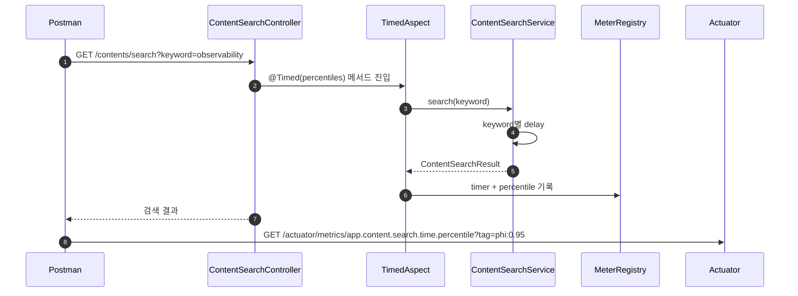

구현체 코드:

```java
@RestController
public class ContentSearchController {

    private final ContentSearchService contentSearchService;

    @GetMapping("/contents/search")
    public ContentSearchResult search(@RequestParam(defaultValue = "actuator") String keyword) {
        return contentSearchService.search(keyword);
    }
}
```

```java
@Service
public class ContentSearchService {

    // percentiles를 켜면 app.content.search.time.percentile metric에서 p50/p95/p99를 조회할 수 있다.
    @Timed(
            value = "app.content.search.time",
            description = "콘텐츠 검색 API 응답 시간",
            percentiles = {0.5, 0.95, 0.99}
    )
    public ContentSearchResult search(String keyword) {
        // keyword별로 지연 시간을 다르게 만들어 percentile 차이를 관찰한다.
        sleep(delayFor(keyword));
        return new ContentSearchResult(keyword, List.of(
                keyword + " 실습 노트",
                keyword + " 운영 체크리스트",
                keyword + " 장애 분석 기록"
        ));
    }

    private long delayFor(String keyword) {
        return switch (keyword.length() % 3) {
            case 0 -> 120;
            case 1 -> 450;
            default -> 900;
        };
    }
}
```

요청 순서:

| 순서 | 요청 | API | 효과 |
| --- | --- | --- | --- |
| 1 | `Search Content - Actuator` | `GET {{appUrl}}/contents/search?keyword=actuator` | 검색 API 호출 |
| 2 | `Search Content - Observability` | `GET {{appUrl}}/contents/search?keyword=observability` | 다른 지연 케이스 |
| 3 | `Content Search Timer` | `GET {{actuatorUrl}}/actuator/metrics/app.content.search.time` | 일반 timer |
| 4 | `Content Search Percentile` | `GET {{actuatorUrl}}/actuator/metrics/app.content.search.time.percentile` | percentile metric |
| 5 | `Content Search Percentile - p95` | `GET ...?tag=phi:0.95` | p95만 |
| 6 | `Content Search Percentile - p99` | `GET ...?tag=phi:0.99` | p99만 |

대표 response:

App API:

```json
{
  "keyword": "actuator",
  "titles": [
    "actuator 실습 노트",
    "actuator 운영 체크리스트",
    "actuator 장애 분석 기록"
  ]
}
```

Metric:

```json
{
  "name": "app.content.search.time.percentile",
  "baseUnit": "seconds",
  "measurements": [
    { "statistic": "VALUE", "value": 0.45 }
  ],
  "availableTags": [
    { "tag": "phi", "values": ["0.5", "0.95", "0.99"] }
  ]
}
```

| 지표 | 의미 |
| --- | --- |
| p50 | 중앙값 |
| p95 | 95% 요청이 이 시간 이하 |
| p99 | 느린 꼬리 구간 |

## 11. HTTP Metrics

Postman 폴더: `11. HTTP Metrics`

자동 수집:

- `http.server.requests`
- 앞 섹션의 App API 호출 이후 값 생성

흐름:

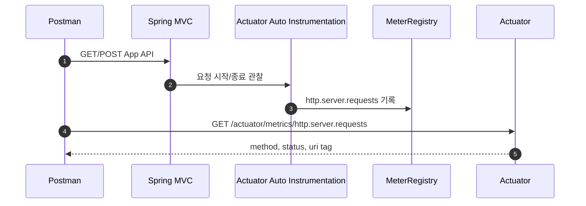

구현체 코드:

```text
별도 Controller/Service 코드 없음.

spring-boot-starter-actuator
-> Spring MVC 요청 처리 관찰
-> 요청 종료 후 http.server.requests Timer 기록
```

수집되는 기본 tag:

```text
method, status, uri, outcome, exception
```

요청 순서:

| 요청 | API | 관찰 |
| --- | --- | --- |
| `HTTP Server Requests` | `GET {{actuatorUrl}}/actuator/metrics/http.server.requests` | 전체 HTTP 요청 timer |
| `HTTP Server Requests - GET` | `GET ...?tag=method:GET` | GET만 |
| `HTTP Server Requests - POST` | `GET ...?tag=method:POST` | POST만 |
| `HTTP Server Requests - 200` | `GET ...?tag=status:200` | 성공 응답만 |
| `HTTP Server Requests - 404` | `GET ...?tag=status:404` | 404 응답만 |
| `HTTP Server Requests - File API` | `GET ...?tag=uri:/files/convert` | 파일 API만 |
| `HTTP Server Requests - Report API` | `GET ...?tag=uri:/reports/generate` | 리포트 API만 |

대표 response:

```json
{
  "name": "http.server.requests",
  "baseUnit": "seconds",
  "measurements": [
    { "statistic": "COUNT", "value": 5.0 },
    { "statistic": "TOTAL_TIME", "value": 6.2 },
    { "statistic": "MAX", "value": 2.0 }
  ],
  "availableTags": [
    { "tag": "method", "values": ["GET", "POST"] },
    { "tag": "status", "values": ["200", "404"] },
    { "tag": "uri", "values": ["/files/convert", "/reports/generate"] }
  ]
}
```

기본 tag:

- `method`
- `status`
- `uri`
- `outcome`
- `exception`

## 12. Custom Endpoint

Postman 폴더: `12. Custom Endpoint`

코드:

- `FeatureToggleEndpoint`
- `@Endpoint(id = "features")`
- `@ReadOperation`, `@WriteOperation`, `@DeleteOperation`

흐름:

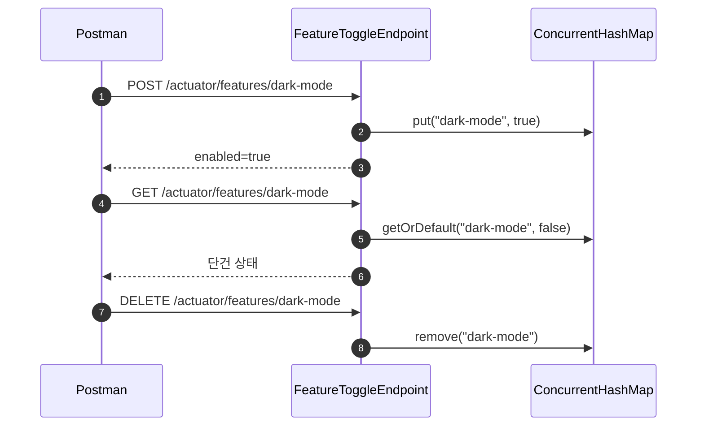

구현체 코드:

```java
@Component
@Endpoint(id = "features")
public class FeatureToggleEndpoint {

    // 실제로는 DB나 외부 설정 저장소를 쓰겠지만, 예제라서 메모리에만 둠
    private final Map<String, Boolean> toggles = new ConcurrentHashMap<>();

    // GET /actuator/features -> 전체 토글 상태 반환
    @ReadOperation
    public Map<String, Boolean> features() {
        return toggles;
    }

    // GET /actuator/features/{name} -> @Selector로 path 변수를 받아 단건 조회
    @ReadOperation
    public Map<String, Object> feature(@Selector String name) {
        return Map.of(
                "name", name,
                "enabled", toggles.getOrDefault(name, false));
    }

    // POST /actuator/features/{name}  body: {"enabled": true}
    // @WriteOperation의 파라미터는 요청 body의 key와 매핑됨 (enabled가 없으면 기본 true)
    @WriteOperation
    public Map<String, Object> setFeature(@Selector String name, Boolean enabled) {
        boolean value = enabled == null || enabled;
        toggles.put(name, value);
        return Map.of(
                "name", name,
                "enabled", value);
    }

    // DELETE /actuator/features/{name} -> 토글 제거
    @DeleteOperation
    public Map<String, Object> removeFeature(@Selector String name) {
        Boolean removed = toggles.remove(name);
        return Map.of(
                "name", name,
                "removed", removed != null);
    }
}
```

요청 순서:

| 순서 | 요청 | API | 효과 |
| --- | --- | --- | --- |
| 1 | `Set Dark Mode Feature` | `POST {{actuatorUrl}}/actuator/features/dark-mode` | `dark-mode=true` 저장 |
| 2 | `Feature Toggles` | `GET {{actuatorUrl}}/actuator/features` | 전체 toggle 조회 |
| 3 | `Dark Mode Feature` | `GET {{actuatorUrl}}/actuator/features/dark-mode` | 단건 조회 |
| 4 | `Remove Dark Mode Feature` | `DELETE {{actuatorUrl}}/actuator/features/dark-mode` | toggle 제거 |

Request body:

```json
{
  "enabled": true
}
```

대표 response:

```json
{
  "name": "dark-mode",
  "enabled": true
}
```

```json
{
  "dark-mode": true
}
```

```json
{
  "name": "dark-mode",
  "removed": true
}
```

운영용 custom endpoint는 인증/인가와 노출 범위 제어 필요.

## 선택 기준

| 상황 | 선택 |
| --- | --- |
| 정상/비정상 상태 확인 | Health |
| 현재 배포 버전 확인 | Info |
| 발생 횟수 누적 | Counter |
| 현재 개수 관찰 | Gauge |
| 소요 시간 측정 | Timer |
| 조건별 분리 | Tag |
| 앱/환경/인스턴스 공통 식별 | Common Tags |
| tail latency 확인 | Percentile |

## 체크리스트

| 증상 | 먼저 볼 것 |
| --- | --- |
| App API가 `404` | URL, HTTP method, 앱 포트 `8080` |
| actuator endpoint가 목록에 없음 | `management.endpoints.web.exposure.include` |
| `/actuator/info`에 값이 적음 | `management.info.env.enabled`, build/git resource |
| metric 이름이 없음 | 관련 App API 호출 여부 |
| tag 필터 결과가 이상함 | 필터 없는 metric의 `availableTags` |
| `COUNT`가 기대보다 큼 | 이전 실행에서 누적된 호출 포함 여부 |
| `MAX`가 갑자기 낮음 | Micrometer time window 리셋 가능성 |

## curl

Postman 대신 터미널로 빠르게 확인할 때 사용.

```bash
./labs/spring-boot-actuator/scripts/curl-actuator.sh
```
