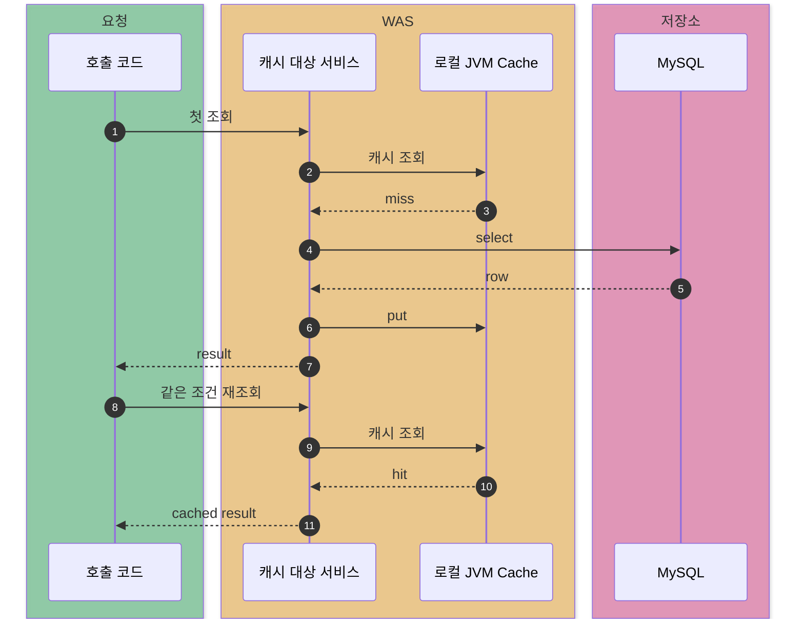
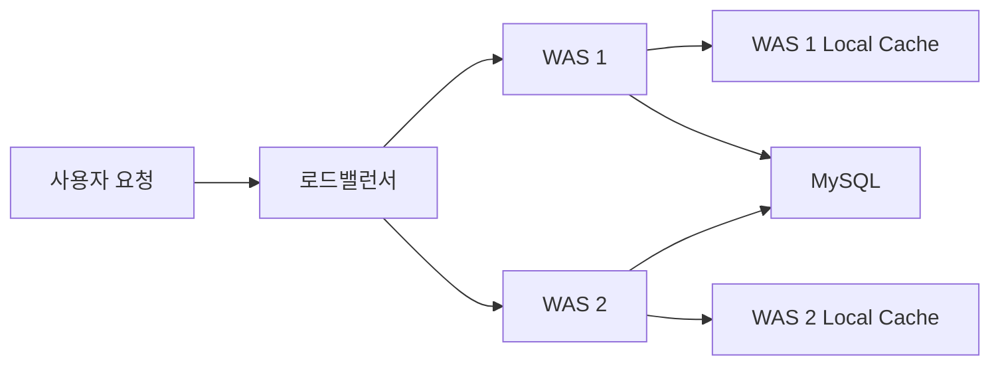
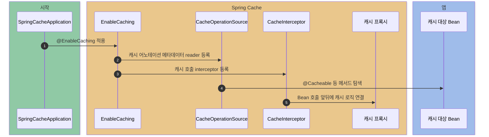
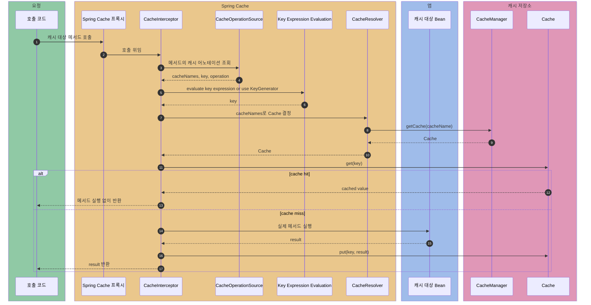
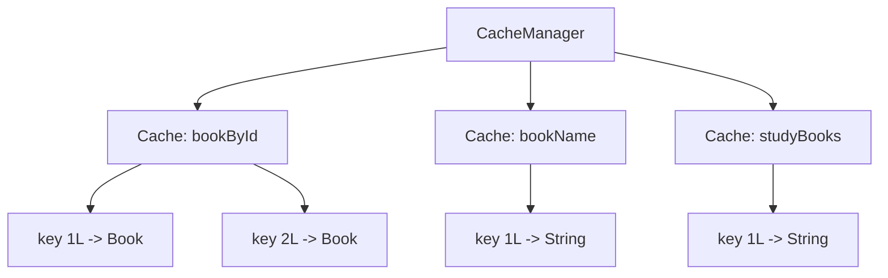
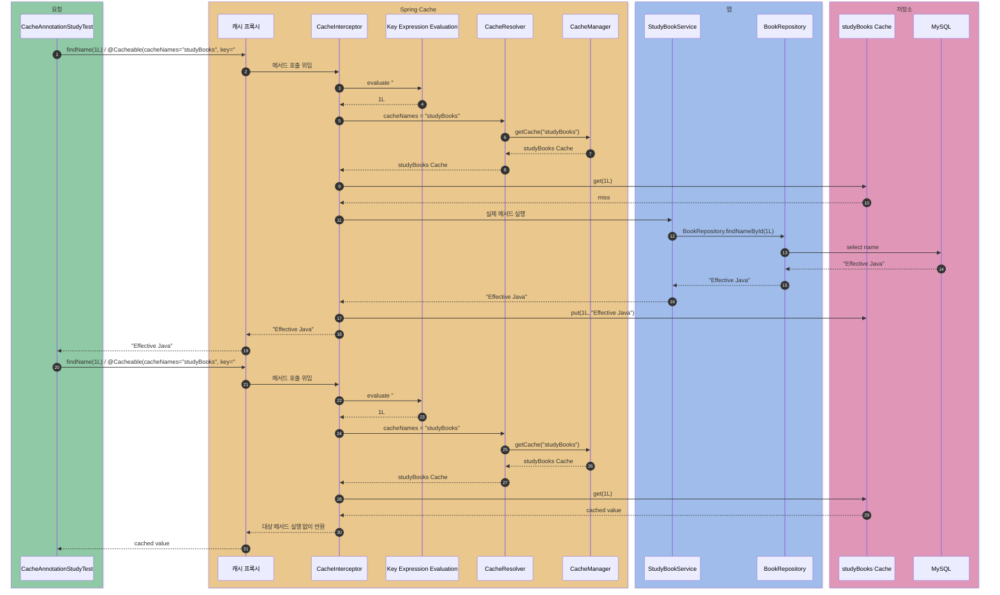
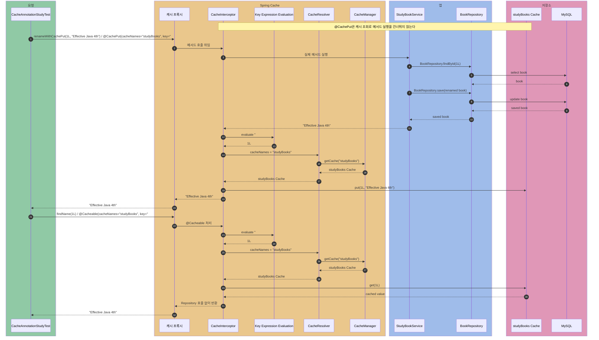
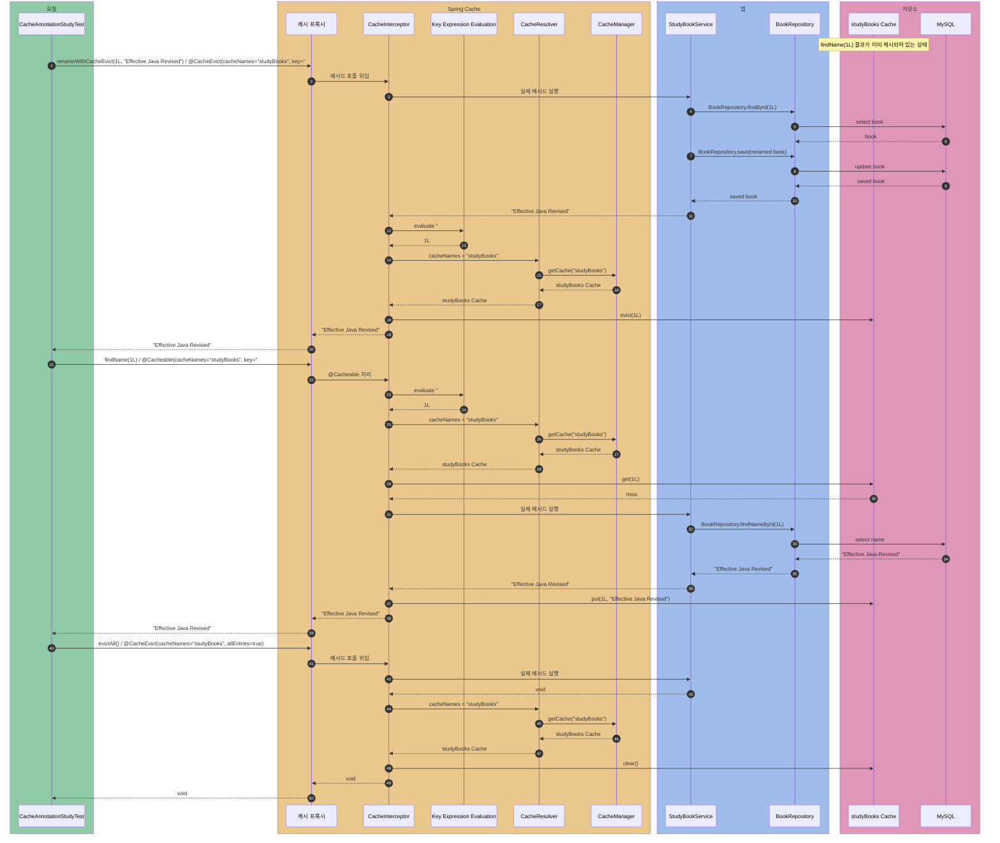

# spring-cache-local

Spring Cache를 로컬 인메모리 캐시로 사용할 때의 동작을 관찰하는 실험실.

Redis 같은 외부 캐시 실험과 구분하기 위해, 이 모듈은 `ConcurrentMapCacheManager` 기반 로컬 캐시에만 집중한다. 

## 로컬 캐싱

로컬 캐싱은 서버 자신의 JVM 메모리에 데이터를 저장한다.

이 모듈은 원본 데이터 저장소로 MySQL을 사용하고, 외부 Redis 없이 Spring의 `ConcurrentMapCacheManager`를 직접 등록해서 로컬 캐시를 관찰한다. `ConcurrentMapCacheManager`가 만드는 실제 캐시 저장소는 JVM 내부의 `ConcurrentHashMap` 기반이다.

즉 첫 조회에서 MySQL을 읽고 캐시에 저장하면, 같은 WAS 안의 다음 조회는 MySQL까지 가지 않고 JVM 메모리에서 값을 꺼낸다.



로컬 캐시는 빠르지만, 캐시 데이터가 각 WAS 메모리에 따로 존재한다. WAS가 두 대라면 A 서버의 캐시와 B 서버의 캐시는 서로 모른다.



그래서 로컬 캐시는 “빠른 조회”에는 좋지만 “여러 서버의 캐시를 동시에 바꾸는 문제”는 직접 해결하지 않는다.

잘 맞는 데이터:

- 국가별 공휴일 목록
- 서비스 설정값
- 거의 바뀌지 않는 코드성 데이터

주의할 데이터:

- 사용자별로 값이 다른 데이터
- 서버가 여러 대일 때 서버 간 동기화가 필요한 데이터
- JVM 메모리를 크게 차지할 수 있는 대용량 데이터

## Spring Cache 추상화

비즈니스 코드는 어노테이션으로 캐싱 의도만 드러낸다.

Spring Cache는 DB나 Repository를 자동으로 캐시하는 기능이 아니다. Spring Bean의 메서드 호출 앞뒤에 프록시를 끼워 넣고, 그 프록시가 캐시 조회/저장/삭제를 대신 수행하는 메서드 레벨 추상화다.

동작 조건:

- 캐시 대상 객체가 Spring Bean이어야 한다.
  - 직접 new로 만든 객체는 동작 안함.
- `@EnableCaching`으로 캐시 AOP 인프라가 켜져 있어야 한다.
- 호출이 캐시 프록시를 지나야 한다.
- `CacheManager` Bean이 있어야 한다.
- 메서드에 `@Cacheable`, `@CachePut`, `@CacheEvict` 같은 캐시 어노테이션이 있어야 한다.

| 어노테이션 | 동작 |
| --- | --- |
| `@Cacheable` | 캐시를 먼저 확인하고, miss면 메서드 실행 후 결과 저장 |
| `@CachePut` | 메서드를 항상 실행하고 결과로 캐시를 덮어씀 |
| `@CacheEvict` | 메서드 실행 후 지정한 캐시 제거 |

애플리케이션 시작 시점에는 `@EnableCaching`이 캐시 어노테이션을 처리할 인프라를 등록한다. 이후 Spring은 캐시 어노테이션이 붙은 Bean 호출을 프록시로 감싼다.



런타임 호출 흐름:



이 모듈에서는 `CacheManager` 구현체로 `ConcurrentMapCacheManager`를 사용한다. 실제 캐시 저장소가 로컬인지 Redis인지는 비즈니스 코드가 아니라 `CacheManager`가 숨긴다.

`cacheName`과 `key`는 서로 다른 층의 식별자다. `cacheName`은 어떤 `Cache` 저장소를 쓸지 고르고, `key`는 그 `Cache` 안의 어떤 값을 쓸지 고른다.



같은 `1L` key라도 `bookById` 캐시 안에서는 `Book` 객체일 수 있고, `bookName` 캐시 안에서는 책 이름 문자열일 수 있다. 그래서 cache name은 캐시 공간을 나누는 이름이고, key는 그 공간 안의 항목을 찾는 값이다.

Spring Cache 구성요소:

| 구성 요소 | 이 모듈의 예 | 역할 |
| --- | --- | --- |
| `@EnableCaching` | `SpringCacheApplication` | 캐시 어노테이션을 해석하는 AOP 인프라를 켠다 |
| `CacheInterceptor` | Spring이 등록 | 프록시 뒤에서 `@Cacheable`, `@CachePut`, `@CacheEvict` 동작을 실행한다 |
| `CacheOperationSource` | Spring이 등록 | 메서드에 붙은 캐시 어노테이션 메타데이터를 읽는다 |
| `CacheResolver` | 기본 `SimpleCacheResolver` | cache name으로 사용할 `Cache`를 결정한다 |
| `CacheManager` | `ConcurrentMapCacheManager` | cache name으로 실제 `Cache` 객체를 찾아준다 |
| `Cache` | `studyBooks`, `bookById` 등 | `get`, `put`, `evict`, `clear`를 수행하는 캐시 저장소 추상화 |
| key | `#id`, `{updatedAt, id}` 등 | 같은 `Cache` 안에서 값을 구분하는 식별자 |

현재 프로젝트에서 `CacheConfig`의 `ConcurrentMapCacheManager("studyBooks", ...)`가 바로 `CacheManager` Bean이다. `studyBooks`는 cache name이고, 그 안의 `1L`이 key다.

이 문서에서는 `key = "#id"`처럼 명시한 SpEL key를 계산하는 단계를 `Key Expression Evaluation`이라고 쓴다. `key` 속성을 생략한 경우에는 Spring의 `KeyGenerator`가 메서드 파라미터로 기본 key를 만든다.

## 어노테이션 빠른 학습

`CacheAnnotationStudyTest`는 Testcontainers MySQL에 데이터를 넣고, `StudyBookService`가 JPA Repository로 조회/수정하는 흐름에서 캐시 어노테이션을 관찰한다.

| 어노테이션 | 테스트에서 보는 것 |
| --- | --- |
| `@Cacheable` | 첫 호출은 miss로 메서드 실행, 두 번째 호출은 hit로 메서드 생략 |
| `@CachePut` | 캐시 hit 여부와 상관없이 메서드 실행 후 결과로 캐시 덮어쓰기 |
| `@CacheEvict` | 메서드 실행 후 지정 key 삭제, 다음 조회는 miss |
| `@CacheEvict(allEntries = true)` | 특정 key가 아니라 캐시 전체 삭제 |

`StudyBookService`에서 테스트가 직접 호출하는 메서드와 붙은 어노테이션 파라미터:

| 테스트의 서비스 호출 | 붙은 어노테이션과 파라미터 | 계산된 cacheName | 계산된 key |
| --- | --- | --- | --- |
| `findName(1L)` | `@Cacheable(cacheNames = "studyBooks", key = "#id")` | `studyBooks` | `1L` |
| `renameWithCachePut(1L, "Effective Java 4th")` | `@CachePut(cacheNames = "studyBooks", key = "#id")` | `studyBooks` | `1L` |
| `renameWithCacheEvict(1L, "Effective Java Revised")` | `@CacheEvict(cacheNames = "studyBooks", key = "#id")` | `studyBooks` | `1L` |
| `evictAll()` | `@CacheEvict(cacheNames = "studyBooks", allEntries = true)` | `studyBooks` | 전체 key |

다이어그램에서 `findName(...)`, `renameWithCachePut(...)`, `renameWithCacheEvict(...)`, `evictAll()`은 캐시 어노테이션이 붙은 서비스 메서드다. `BookRepository.findNameById(...)`, `BookRepository.findById(...)`, `BookRepository.save(...)`는 서비스 메서드 안에서 실제 DB 접근을 위해 호출되는 Repository 메서드다.

어노테이션별 관찰 포인트:

### `@Cacheable`

`StudyBookService.findName(long id)`에 붙어 있다.

첫 번째 `findName(1L)`은 `studyBooks` 캐시에 값이 없어서 `BookRepository.findNameById(1L)`를 호출한다. 반환값은 캐시에 저장된다.

두 번째 `findName(1L)`은 같은 key가 이미 캐시에 있으므로 Repository를 다시 호출하지 않고 캐시 값을 바로 반환한다.

Spring 관점에서는 `CacheInterceptor`가 `@Cacheable` 메타데이터를 읽고, `CacheResolver`가 `CacheManager`를 통해 `studyBooks` 캐시를 찾는다. 그 다음 key `1L`로 캐시를 먼저 조회한다. hit면 대상 메서드 자체를 실행하지 않는다.



### `@CachePut`

`StudyBookService.renameWithCachePut(long id, String name)`에 붙어 있다.

이 어노테이션은 cache hit 여부를 먼저 따지지 않는다. 메서드를 항상 실행해서 MySQL 데이터를 수정하고, 메서드 반환값으로 캐시를 덮어쓴다.

그래서 `renameWithCachePut(1L, "Effective Java 4th")` 뒤에 `findName(1L)`을 다시 호출하면 Repository 조회 없이 갱신된 캐시 값인 `"Effective Java 4th"`를 받는다.

Spring 관점에서는 `CacheInterceptor`가 cache hit 여부로 메서드 실행을 생략하지 않는다. 대상 메서드를 실행해 결과를 받은 뒤, `CacheResolver`가 `CacheManager`를 통해 `studyBooks` 캐시를 찾고 key `1L`에 반환값을 `put`한다.



### `@CacheEvict`

`StudyBookService.renameWithCacheEvict(long id, String name)`에 붙어 있다.

메서드가 MySQL 데이터를 수정한 뒤, 지정한 key의 캐시를 삭제한다. 그래서 다음 `findName(1L)`은 cache miss가 되고 Repository를 다시 호출한다.

`StudyBookService.evictAll()`은 `allEntries = true`를 사용한다. 특정 id 하나가 아니라 `studyBooks` 캐시 전체를 비워서, 기존에 캐시되어 있던 여러 key가 모두 다음 조회에서 miss가 된다.

Spring 관점에서는 기본값이 `beforeInvocation = false`라서 대상 메서드가 정상 종료된 뒤 캐시를 제거한다. `key = "#id"`면 `Cache.evict(1L)`, `allEntries = true`면 `Cache.clear()`가 호출된다.



테스트 데이터도 `Map`에 넣지 않고 JPA Repository로 MySQL에 삽입한다. 메서드 실행 여부는 임의의 카운터 대신 `@MockitoSpyBean BookRepository`로 실제 Repository 호출 횟수를 확인한다.

## 캐시 키

캐시 키가 잘못되면 다른 요청이 같은 값을 공유하거나, 같은 요청인데 매번 miss가 날 수 있다.

기본 키는 Spring의 `SimpleKeyGenerator`가 만든다.

- 파라미터가 없으면 `SimpleKey.EMPTY`
- 파라미터가 하나면 그 파라미터 자체
- 파라미터가 여러 개면 `SimpleKey`

`SimpleKeyGenerator`는 `key` 속성을 직접 쓰지 않았을 때 적용되는 기본 key 생성기다.

예를 들어 이런 메서드가 있다고 하자.

```java
@Cacheable(cacheNames = "bookById")
public Book findBookById(long id)
```

파라미터가 하나뿐이므로 key는 `SimpleKey(1L)`이 아니라 `1L` 자체다.

```text
cacheName = "bookById"
key       = 1L
```

파라미터가 여러 개면 `SimpleKey`로 감싼다.

```java
@Cacheable(cacheNames = "bookSummary")
public String findBookSummary(long id, String language)
```

`key`를 따로 지정하지 않았다면 기본 key는 이런 형태가 된다.

```text
cacheName = "bookSummary"
key       = SimpleKey [1L, "ko"]
```

하지만 이 모듈의 `findBookSummary(long id, String language)`는 일부러 `key = "#id"`를 사용한다.

```java
@Cacheable(cacheNames = "bookSummary", key = "#id")
public String findBookSummary(long id, String language)
```

그래서 `language`가 달라도 key는 `id` 하나만 사용한다.

```text
findBookSummary(1L, "ko") -> key = 1L
findBookSummary(1L, "en") -> key = 1L
```

이 경우 두 요청은 같은 캐시 값을 공유한다. 의도한 최적화일 수도 있고, 언어별 결과가 달라야 한다면 버그일 수도 있다.

따라서 DTO를 키로 사용할 때는 `equals()`와 `hashCode()`가 중요하다. `BookSearchCondition`은 record라서 같은 값이면 같은 키가 되고, `BookSearchConditionWithoutEquals`는 객체 동일성 기준이라 같은 값이어도 다른 키가 된다.

필요하면 `key = "#id"`처럼 특정 파라미터만 key로 지정할 수 있다. `key`를 명시하면 `SimpleKeyGenerator` 대신 SpEL 기반 `Key Expression Evaluation` 결과가 사용된다.

로컬 캐시를 쓰는 여러 WAS 환경에서는 한 서버에서 `@CacheEvict`를 실행해도 다른 서버의 로컬 캐시까지 지워지지 않는다. Redis 같은 공용 캐시를 바로 도입할 수 없다면 공통 테이블의 `max(updatedAt)`을 테이블 버전처럼 캐시 키에 포함해, 테이블 안의 어떤 row가 바뀌든 새 버전 키로 자연스럽게 cache miss가 나도록 만들 수 있다. 이 모듈의 `findBookNameByIdWithTableVersion(long id)`은 JPA Repository로 `max(updatedAt)`을 조회하고, `{max(updatedAt), id}`를 키로 사용해 기존 캐시를 지우지 않고도 공통 테이블 전체를 새 캐시 세대로 넘기는 방식을 보여준다.

실제 운영에서는 `max(updated_at)` 조회가 가벼워야 하므로 `updated_at` 인덱스를 함께 둔다. 만약 공통코드 그룹 같은 구분 컬럼이 있는 구조라면 `(group_key, updated_at)` 형태의 복합 인덱스를 고려할 수 있다. 이 샘플의 `books` 테이블도 `idx_books_updated_at` 인덱스를 만든다.

## 한계

로컬 캐시는 서버 하나의 메모리에 의존한다.

- 서버 재시작 시 캐시가 사라진다.
- 서버가 여러 대면 각 서버가 서로 다른 캐시를 가진다.
- 대용량 캐시는 JVM 메모리에 부담을 준다.
- 서버 간 캐시 동기화가 어렵다.

분산 서버 환경에서는 이 한계 때문에 Redis 같은 리모트 캐시를 고려한다.
