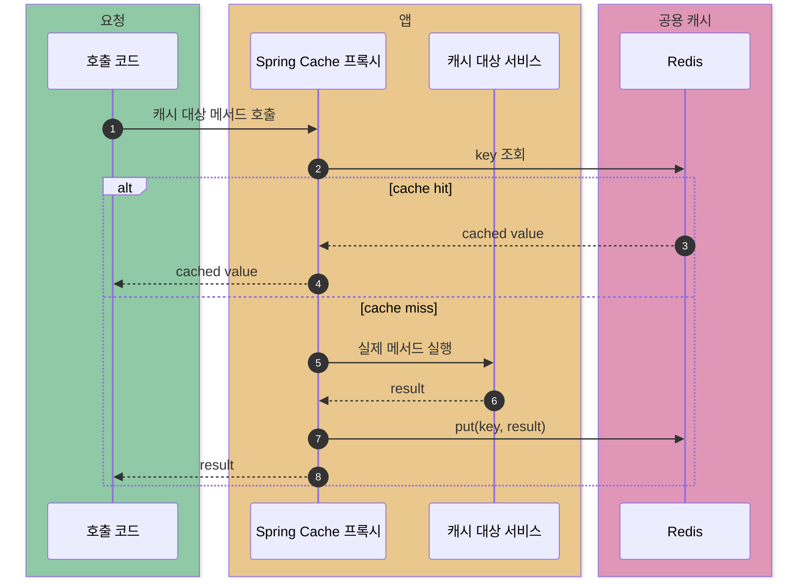
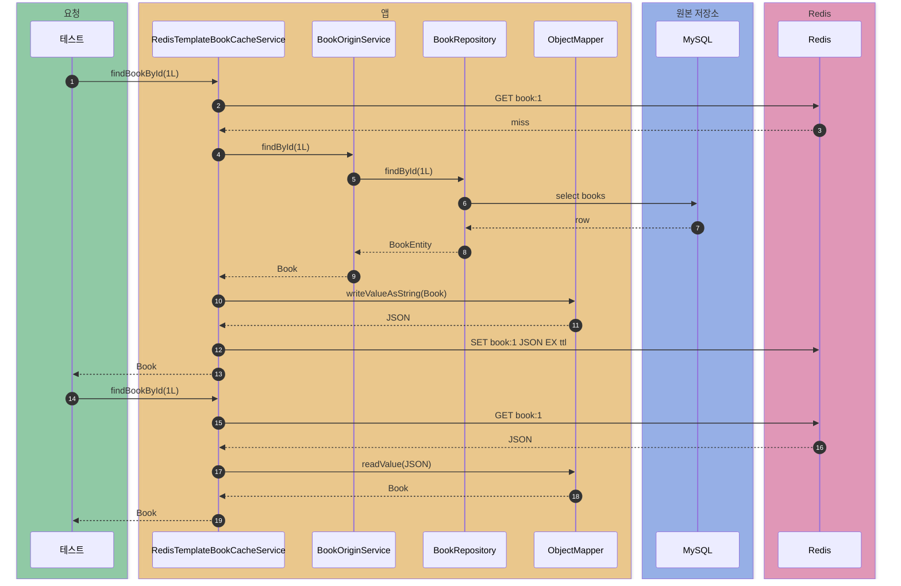
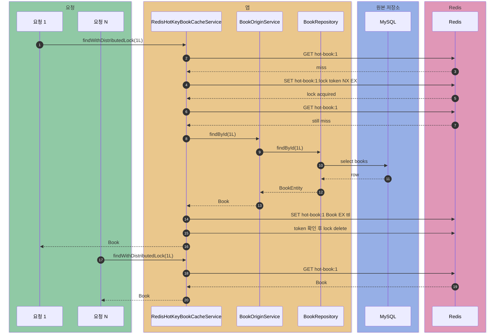

# spring-cache-redis

Spring Cache를 Redis 기반 공용 캐시로 사용할 때의 동작을 관찰하는 실험. Cache Aside, Null Caching, TTL Jitter, Hot Key 방어는 `RedisTemplate`으로 직접 구현·테스트하고, cache miss 시 원본 데이터는 MySQL/JPA에서 조회한다. `RedisCacheManager` 기반 `@Cacheable` 도메인 서비스는 아직 없다(아래 "구현 예정" 참고).

Redis가 리모트 캐시로 자주 쓰이는 이유와, Spring에서 Redis를 캐시 저장소로 직접 다룰 때 필요한 구현 포인트를 실험한다.

## 목표

- `RedisCacheManager` 기반 Spring Cache 구성
- 로컬 캐시(`spring-cache-local`)와 Redis 공용 캐시의 차이 비교
- 다중 WAS 환경에서 캐시 일관성 차이 관찰
- TTL, key prefix, serialization 설정 실험
- `@Cacheable`, `@CachePut`, `@CacheEvict`가 Redis에 어떤 명령으로 반영되는지 관찰
- `RedisTemplate`으로 Cache Aside, Null Caching, TTL Jitter, Hot Key 방어 직접 구현

## 현재 구성

| 항목 | 내용 |
| --- | --- |
| Spring Boot | 3.4.1 |
| Java | 21 |
| Cache 추상화 | Spring Cache |
| Redis 연동 | Spring Data Redis |
| CacheManager | Boot 자동 설정의 `RedisCacheManager` |
| Redis 접속 기본값 | `localhost:6379` |
| 원본 저장소 | MySQL + Spring Data JPA |
| 통합 테스트 | Testcontainers Redis 7.2.5, MySQL 8.0.36 |

## Redis를 리모트 캐시로 쓰는 이유

Redis는 메모리 기반 key-value 저장소다. 단순 문자열뿐 아니라 list, set, sorted set 같은 자료구조도 제공한다.

캐시에 잘 맞는 이유:

- 데이터를 메모리에 두기 때문에 DB 디스크 I/O보다 빠르게 응답할 수 있다.
- 명령을 단일 이벤트 루프에서 순차 처리하므로 `SET NX EX` 같은 원자적 조작을 활용하기 좋다.
- 키마다 TTL을 줄 수 있어 오래된 캐시와 메모리를 자동으로 정리할 수 있다.

주의할 점:

- Redis가 싱글스레드 명령 처리 모델이라는 점은 긴 명령에 취약하다는 뜻이기도 하다.
- 모든 키 검색, 대량 동기 삭제, 오래 걸리는 Lua 스크립트는 뒤 요청을 밀리게 할 수 있다.
- Redis는 빠른 저장소지만 네트워크를 건너는 리모트 캐시이므로 로컬 JVM 캐시와 비용 구조가 다르다.

## 예상 흐름

## 실험 목록

| 테스트 | 확인 내용 |
| --- | --- |
| `SpringCacheRedisApplicationTest` | `RedisCacheManager`, `RedisConnectionFactory`, MySQL/JPA 구성이 함께 뜨는지 확인 |
| `RedisBasicCommandTest` | `SET`, `GET`, `EXISTS`, `TTL`, `SET NX EX`, sorted set, `INFO` 명령 확인 |
| `RedisTemplateBookCacheTest` | MySQL/JPA 원본 조회 기반 RedisTemplate Cache Aside, JSON 직렬화/역직렬화, Null Caching, TTL Jitter 확인 |
| `RedisHotKeyLockTest` | Hot Key 동시 miss에서 Redis 분산 락과 Double-Checked Locking으로 MySQL/JPA 원본 조회를 줄이는지 확인 |

Redis/MySQL Testcontainers 기반 테스트는 Docker가 필요하다. Docker가 없으면 컨테이너 기반 통합 테스트는 skip된다.

## RedisTemplate 직접 캐싱

Spring Cache 어노테이션은 편하지만 Redis 고유 기능을 세밀하게 다루기 어렵다. 키별 TTL, sentinel 값, sorted set, 분산 락처럼 Redis 명령을 직접 제어해야 하는 경우에는 `RedisTemplate`이 더 명확하다.

`RedisTemplateBookCacheService.findBookById(long id)`는 Cache Aside를 직접 구현한다.

`BookOriginService`는 원본 저장소 자체가 아니라 실험 관찰용 wrapper다. 조회 횟수와 지연 시간만 기록하고, 실제 데이터는 `BookRepository`가 MySQL에서 읽는다.

## Null Caching

존재하지 않는 데이터를 반복 조회하면 캐시에도 없고 MySQL에도 없어 매번 원본 저장소까지 간다. 이 모듈에서는 DB 결과가 없을 때 `__NULL__` sentinel 값을 Redis에 짧은 TTL로 저장한다.

`RedisTemplateBookCacheTest`는 없는 ID를 20번 조회해도 저장소 조회가 1번만 발생하는지 확인한다.

## TTL Jitter

많은 key가 같은 시각에 만료되면 캐시 miss가 한꺼번에 발생한다. `RedisTtlJitterPolicy`는 기본 TTL에 key별 편차를 더해 만료 시점을 흩뜨린다.

테스트는 여러 책 캐시의 Redis TTL이 서로 다른 값으로 설정되는지 확인한다.

## Hot Key와 분산 락

Hot Key가 만료된 순간 다수 요청이 동시에 miss를 만나면 모든 요청이 저장소로 향할 수 있다. `RedisHotKeyBookCacheService`는 Redis `SET NX EX` 방식의 락과 Double-Checked Locking으로 이 문제를 줄인다.

## cache-patterns와 경계

`cache-patterns`는 Redis 없이 `InMemoryCache`로 캐시 패턴의 일반 원리를 보여준다.

이 모듈은 같은 개념을 Redis 구현 관점에서 본다.

| 주제 | `cache-patterns` | `spring-cache-redis` |
| --- | --- | --- |
| Cache Aside | 패턴 자체 | `RedisTemplate` GET/SET과 JSON 직렬화 |
| Cache Penetration | Negative caching 원리 | `__NULL__` sentinel과 Redis TTL |
| Cache Avalanche | TTL Jitter 원리 | Redis key별 TTL 분산 |
| Hot Key | Stampede/SingleFlight 원리 | Redis `SET NX EX` 분산 락과 DCL |

## 구현 예정

아직 `RedisCacheManager` 기반 `@Cacheable` 도메인 서비스와 모니터링 스택은 없다.

추후 Redis Exporter, Prometheus, Grafana 또는 Redis CLI 기반 관찰 실험을 추가한다.
