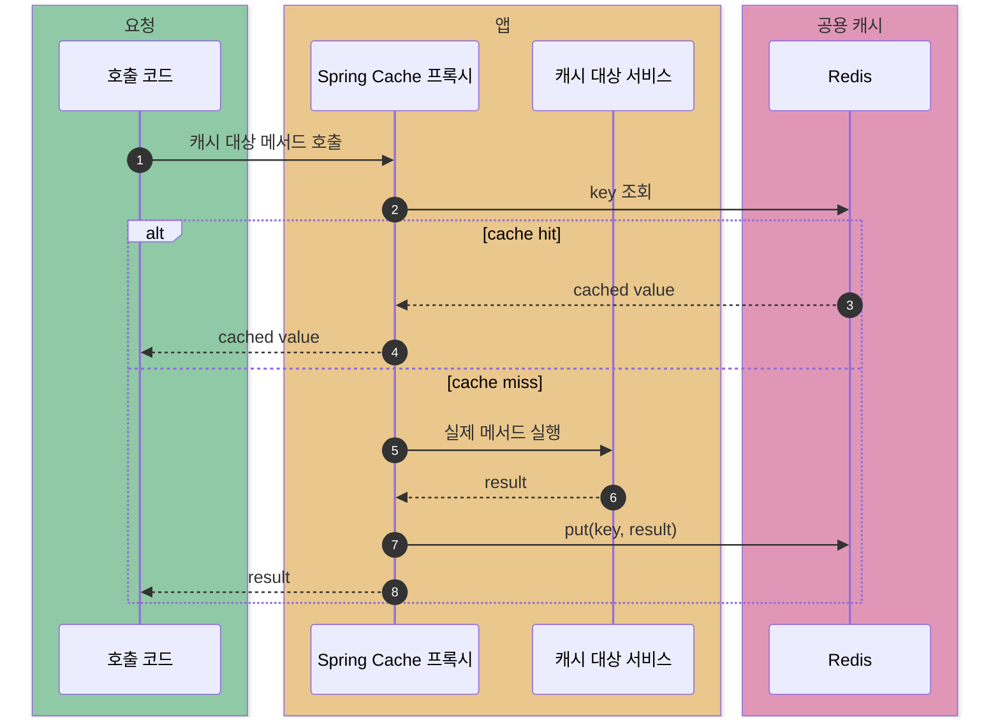

# spring-cache-redis

Spring Cache를 Redis 기반 공용 캐시로 사용할 때의 동작을 관찰하기 위한 예정 모듈.

현재는 모듈 뼈대만 만들고, 구현은 추후 추가한다.

## 목표

- `RedisCacheManager` 기반 Spring Cache 구성
- 로컬 캐시(`spring-cache-local`)와 Redis 공용 캐시의 차이 비교
- 다중 WAS 환경에서 캐시 일관성 차이 관찰
- TTL, key prefix, serialization 설정 실험
- `@Cacheable`, `@CachePut`, `@CacheEvict`가 Redis에 어떤 명령으로 반영되는지 관찰

## 예상 흐름

## 구현 예정

아직 애플리케이션 코드와 테스트는 없다.

추후 Redis Testcontainers 또는 Docker Compose 기반 Redis를 붙여서 `spring-cache-local`과 비교한다.
