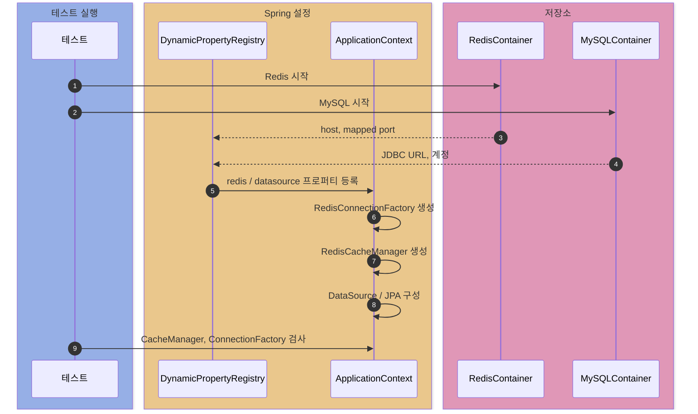
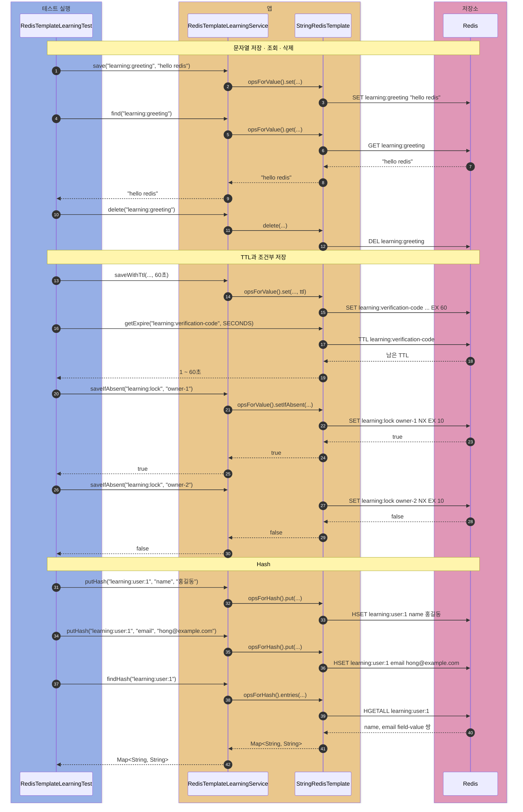
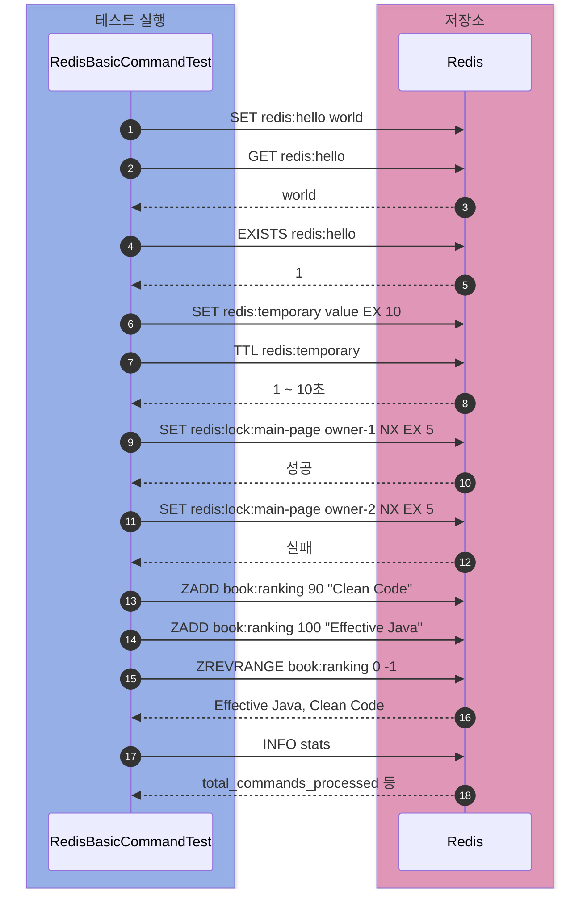
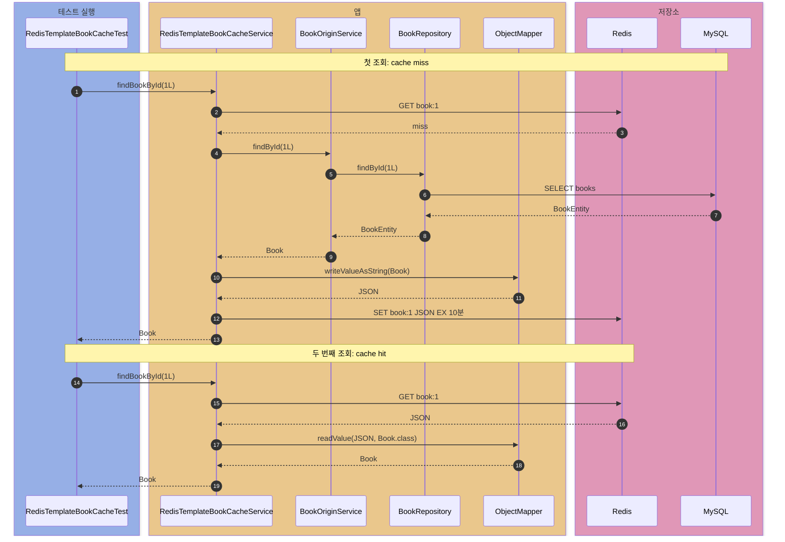
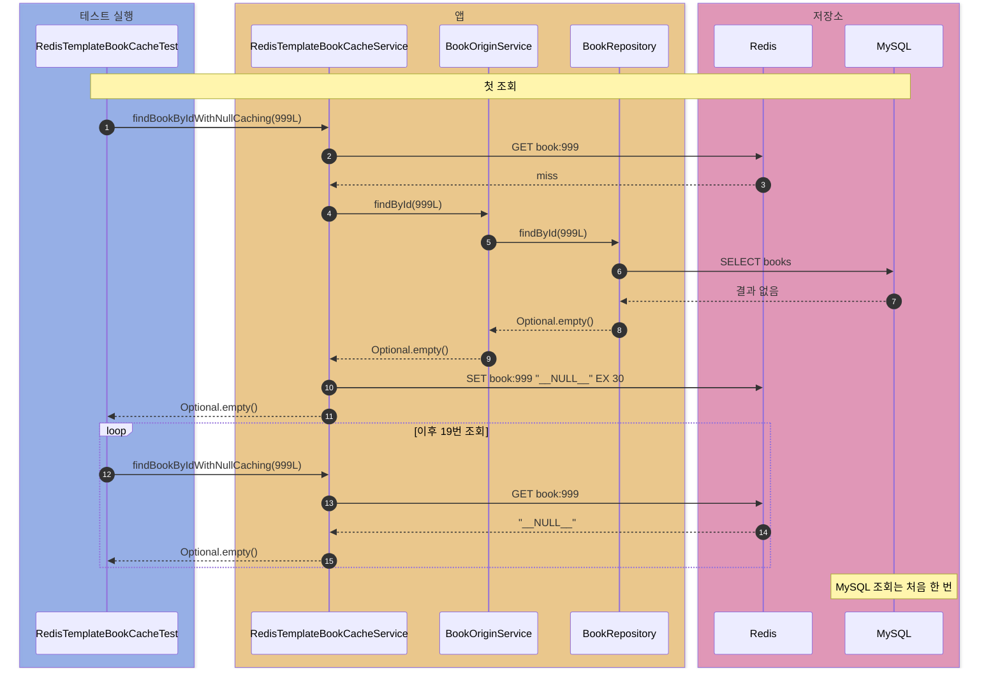
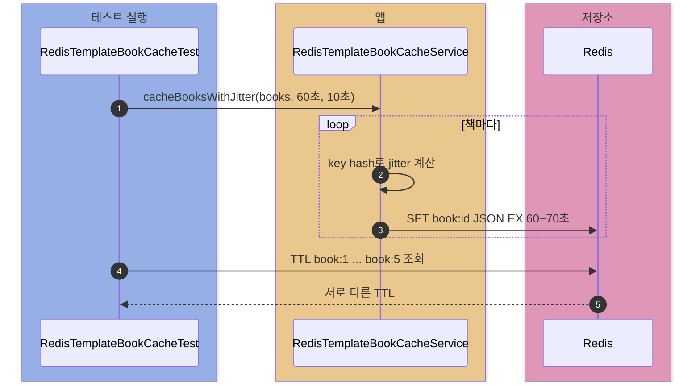
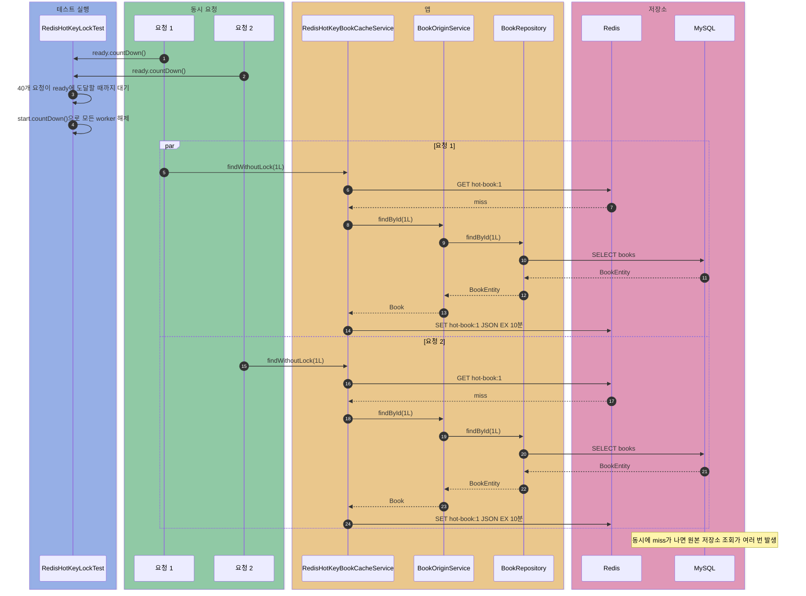
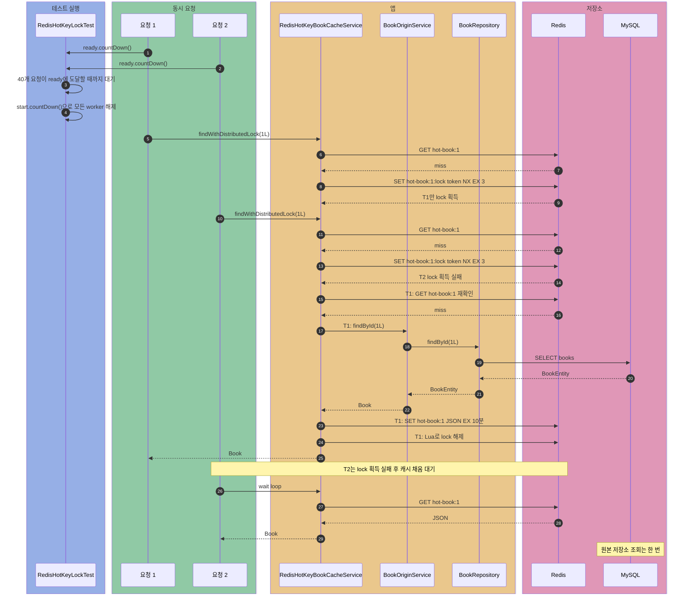
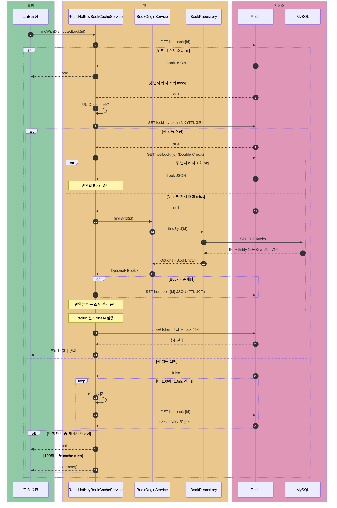

# spring-cache-redis

MySQL/JPA를 원본 저장소로 두고, `StringRedisTemplate`으로 Redis 캐시 패턴을 직접 구현·검증하는 실험이다.

## 어떤 테스트가 있나?

| 테스트 | 확인 내용 |
| --- | --- |
| `SpringCacheRedisApplicationTest` | Redis/MySQL Testcontainers와 Spring Cache 구성이 함께 시작되는지 확인 |
| `RedisTemplateLearningTest` | 문자열, TTL, `SET NX`, Hash를 `StringRedisTemplate`으로 다루는 방법 |
| `RedisBasicCommandTest` | Redis 기본 명령, sorted set, `INFO` 확인 |
| `RedisTemplateBookCacheTest` | Cache Aside, Null Caching, TTL Jitter |
| `RedisHotKeyLockTest` | 동시 cache miss와 Redis 분산 락 |

## 어떤 환경에서 실행되나?

| 항목 | 내용 |
| --- | --- |
| Spring Boot | 3.4.1 |
| 원본 저장소 | MySQL + Spring Data JPA |
| 캐시 | Redis + Spring Data Redis |
| 직렬화 | Jackson JSON |
| 통합 테스트 | Testcontainers Redis 7.2.5, MySQL 8.0.36 |

Docker가 없으면 컨테이너 기반 테스트는 skip된다.

## `RedisTemplate` API는 어떤 Redis 명령과 연결되나?

`StringRedisTemplate`은 key와 value를 문자열로 직렬화하는 `RedisTemplate`이다. 먼저 Redis 자료형에 맞는 `opsFor...()` API를 고른 뒤 명령을 호출한다.

| Redis 자료형 | `StringRedisTemplate` API | 대표 Redis 명령 |
| --- | --- | --- |
| String | `opsForValue().set()`, `get()` | `SET`, `GET` |
| Hash | `opsForHash().put()`, `entries()` | `HSET`, `HGETALL` |
| List | `opsForList().leftPush()`, `range()` | `LPUSH`, `LRANGE` |
| Set | `opsForSet().add()`, `members()` | `SADD`, `SMEMBERS` |
| Sorted Set | `opsForZSet().add()`, `reverseRange()` | `ZADD`, `ZREVRANGE` |
| 키 삭제 | `delete(key)` | `DEL` |

## 각 테스트는 어떤 요청 흐름을 검증하나?

### `SpringCacheRedisApplicationTest`는 어떻게 부팅되나?

### `RedisTemplateLearningTest`는 어떤 명령을 실행하나?

`getExpire(key, TimeUnit.SECONDS)`는 value를 조회하는 메서드가 아니라, 해당 key가 자동 삭제되기까지 남은 TTL을 초 단위로 조회하는 메서드다. 저장 직후에도 코드 실행 시간이 흐르므로 60초 TTL은 `60`보다 조금 작은 값으로 조회될 수 있다. 반환값이 `-1`이면 key는 있지만 만료 시간이 없고, `-2`이면 key 자체가 없다는 뜻이다.

### `RedisBasicCommandTest`는 Redis 기본 명령을 어떻게 확인하나?

### `RedisTemplateBookCacheTest`의 Cache Aside는 어떻게 동작하나?

### 없는 ID를 반복 조회하면 어떻게 되나?

### TTL Jitter는 만료 시점을 어떻게 분산하나?

### `RedisHotKeyLockTest`에서 락이 없으면 어떻게 되나?

### Redis 분산 락과 Double-Checked Locking은 어떻게 줄이나?

#### `findWithDistributedLock()` 내부에서는 어떻게 동작하나?

이 메서드는 모든 요청에 락을 거는 것이 아니라, 먼저 Redis 캐시를 조회하고 **캐시가 없을 때만** 락 획득을 시도한다.

1. `hot-book:{id}`를 조회한다. 값이 있으면 JSON을 `Book`으로 역직렬화해 바로 반환한다.
2. 캐시가 없으면 `hot-book:{id}:lock`을 락 키로 사용하고, 현재 요청만의 UUID 토큰을 만든다.
3. Redis의 `SET NX` 성격을 가진 `setIfAbsent()`로 3초짜리 락을 원자적으로 획득한다.
4. 락을 얻은 요청은 캐시를 한 번 더 확인한다. 첫 조회와 락 획득 사이에 다른 요청이 캐시를 채웠을 수 있기 때문이다.
5. 두 번째 조회도 실패했을 때만 MySQL을 조회하고, 책이 있으면 Redis에 10분 동안 저장한다.
6. 반환하기 전 `finally`에서 Lua 스크립트를 실행한다. Redis에 저장된 토큰이 내 토큰과 같을 때만 락을 삭제한다.
7. 락을 얻지 못한 요청은 MySQL을 직접 조회하지 않고, 10ms 간격으로 최대 100회 캐시가 채워졌는지 확인한다.

UUID 토큰과 Lua 스크립트가 필요한 이유는 **내가 획득한 락만 해제하기 위해서**다. 예를 들어 작업이 길어져 3초 뒤 기존 락이 만료되고 다른 요청이 새 락을 획득했다면, 먼저 실행된 요청이 단순히 `DEL`을 호출해서 새 락까지 지워서는 안 된다. Lua 스크립트는 토큰 비교와 삭제를 Redis 안에서 한 번에 실행해 이 문제를 막는다.

이 예제에서 락을 얻지 못한 요청은 sleep 시간만 합쳐 약 1초(`10ms × 100회`) 동안 기다리고, 락의 TTL은 3초다. 실제 대기 시간에는 Redis 조회와 스레드 스케줄링 시간도 더해질 수 있다. 원본 조회가 대기 루프보다 오래 걸리면 대기 요청은 캐시가 곧 채워지더라도 먼저 `Optional.empty()`를 받을 수 있다. 또한 존재하지 않는 책은 캐시에 저장하지 않으므로, 같은 ID를 반복 조회하면 원본 저장소를 다시 확인할 수 있다.
