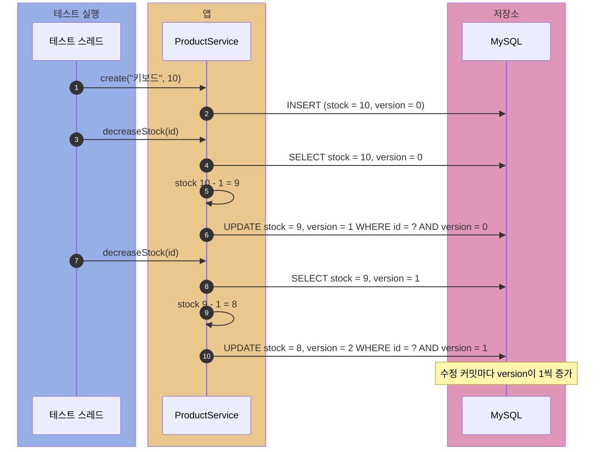
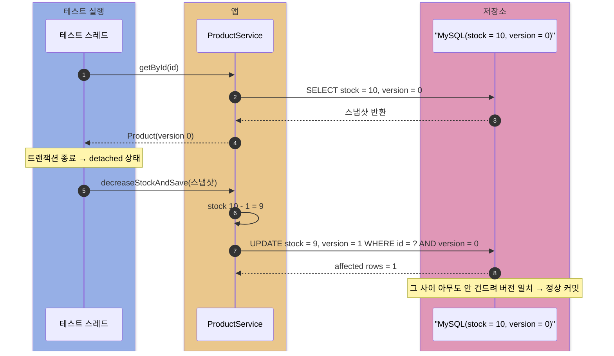
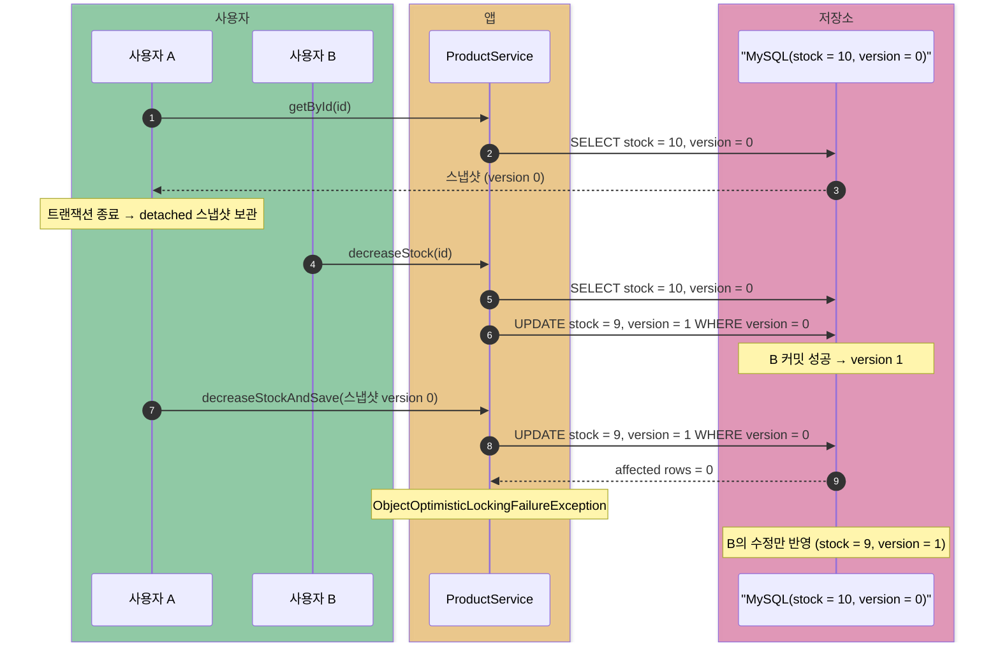
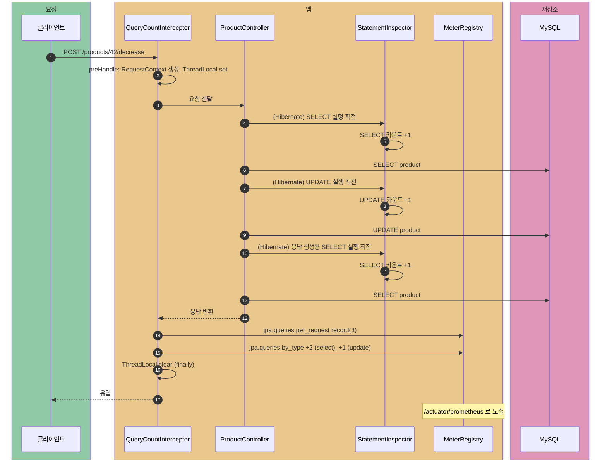

# spring-data-jpa

Spring Data JPA의 낙관적 락(`@Version`) 동작과, Hibernate `StatementInspector`로 요청당 SQL 수를 세는 쿼리 모니터링 실험.

낙관적 락 테스트: `OptimisticLockTest`. 스레드 경합 대신 `@Transactional` 메서드로 트랜잭션 경계를 끊어 "먼저 읽어 둔 옛 스냅샷"과 "그 사이 먼저 커밋한 수정"을 순서대로 만들어 결정적으로 재현한다.

## 케이스 1. 버전 자동 증가

흐름:

```text
INSERT(version = 0) -> 수정 커밋마다 UPDATE ... SET version = version + 1
```

코드 흐름:

```java
Long id = productService.create("키보드", 10);   // version 0

productService.decreaseStock(id);                // version 1
productService.decreaseStock(id);                // version 2
```

결과:

- 막 저장된 엔티티: `version = 0`
- 수정 커밋마다 `version`이 1씩 증가
- 테스트 단언문: `isEqualTo(0L)`, `isEqualTo(1L)`, `isEqualTo(2L)`

이유:

- `@Version` 컬럼이 있으면 JPA가 UPDATE 시 `WHERE id = ? AND version = ?` 조건을 자동으로 붙임
- 커밋/flush 시점에 version을 1 올려서 저장
- 개발자가 version을 직접 관리할 필요 없음



## 케이스 2. 충돌 없는 저장 (대조군)

흐름:

```text
SELECT(version 0) -> 트랜잭션 종료(detached) -> 아무도 안 건드림 -> saveAndFlush -> 버전 일치 -> 정상 커밋
```

코드 흐름:

```java
Product fresh = productService.getById(id);      // version 0 스냅샷, detached

productService.decreaseStockAndSave(fresh);      // DB version도 0 → 일치 → 성공
```

결과:

- 예외 없음, `stock = 9`, `version = 1`
- 테스트 단언문: `assertThat(current.stock()).isEqualTo(9)`, `assertThat(current.version()).isEqualTo(1L)`

이유:

- 읽어 둔 스냅샷의 version(0)과 DB의 version(0)이 일치
- `saveAndFlush`의 merge가 `UPDATE ... WHERE version = 0`을 실행 → `affected rows = 1` → 성공
- 이 대조군이 있어야 케이스 3의 예외가 "낙관적 락 때문"이지 `saveAndFlush` 자체 탓이 아님이 증명됨



## 케이스 3. 옛 스냅샷 저장 → 충돌 예외

흐름:

```text
A가 SELECT(version 0) -> B가 먼저 수정 커밋(version 1) -> A가 옛 스냅샷으로 saveAndFlush
  -> UPDATE ... WHERE version = 0 -> affected rows = 0 -> ObjectOptimisticLockingFailureException
```

코드 흐름:

```java
Product staleA = productService.getById(id);     // A의 스냅샷 (version 0), detached

productService.decreaseStock(id);                // B가 먼저 커밋 → DB version 0 → 1

assertThatThrownBy(() -> productService.decreaseStockAndSave(staleA))
        .isInstanceOf(ObjectOptimisticLockingFailureException.class);
```

결과:

- A의 저장은 예외로 거부, B의 수정만 반영
- 최종 상태: `stock = 9`, `version = 1` (A까지 반영됐다면 `stock = 8`)
- 테스트 단언문: `isInstanceOf(ObjectOptimisticLockingFailureException.class)`, `assertThat(current.stock()).isEqualTo(9)`

이유:

- A의 스냅샷 version(0)과 DB version(1)이 불일치
- `saveAndFlush`의 merge가 `UPDATE ... WHERE version = 0` 실행 → `affected rows = 0`
- JPA가 이를 "그 사이 누군가 먼저 수정함"으로 해석해 예외를 던짐
- 먼저 커밋한 쪽(B)이 이기고, 나중 쪽(A)은 실패 → lost update 방지

한계:

- 충돌을 사후에 감지하는 방식이라 충돌하면 요청이 실패 → 재시도 전략은 호출자 몫
- 동시 충돌이 잦은 상황(선착순 등)에는 재시도 폭주 → 비관적 락·원자적 UPDATE가 유리 (coupon-issue 실험 참고)



## 쿼리 카운트 모니터링

HTTP 요청 하나가 SQL을 몇 번 날리는지 세서 Micrometer 메트릭으로 발행한다. N+1 같은 "요청당 쿼리 폭발"을 지표로 감지하는 게 목적이다.

구성 요소:

| 조각 | 역할 |
| --- | --- |
| `QueryCountInterceptor` | 요청 앞뒤로 ThreadLocal을 깔고 치우며, 끝날 때 메트릭 기록 |
| `QueryCountContextHolder` | 현재 요청의 카운트 묶음을 스레드에 붙여 두는 ThreadLocal 보관소 |
| `RequestContext` | 한 요청 동안 누적되는 쿼리 종류별 카운트 |
| `QueryCountStatementInspector` | Hibernate가 SQL을 JDBC로 넘기기 직전마다 카운트 증가 |
| `QueryType` | SQL 첫 키워드로 SELECT/INSERT/UPDATE/DELETE/OTHER 분류 |
| `QueryMonitoringConfig` | 인터셉터를 MVC에, 인스펙터를 Hibernate 프로퍼티에 등록 |

흐름:

```text
preHandle: RequestContext 생성 -> ThreadLocal에 set
  -> 컨트롤러/서비스가 SQL 실행할 때마다 inspect(sql) -> 카운트 증가
  -> afterCompletion: 메트릭 기록 -> ThreadLocal clear (finally)
```

발행 메트릭:

- `jpa.queries.per_request` (DistributionSummary): 요청당 쿼리 수 분포, P50/P95 포함
- `jpa.queries.by_type` (Counter): 쿼리 종류별 누적 수
- 태그: `method`, `uri` (둘 다), `type` (by_type만)

확인 방법:

로컬 MySQL이 없을 때:

```bash
docker run --name deep-dive-jpa-mysql \
  -e MYSQL_ROOT_PASSWORD=root \
  -e MYSQL_DATABASE=deepdive \
  -p 3306:3306 \
  -d mysql:8.0.36
```

앱 실행:

```bash
./gradlew :spring-data-jpa:run
```

관측 대상 API 호출:

```bash
curl -s -X POST http://localhost:8080/products \
  -H 'Content-Type: application/json' \
  -d '{"name":"키보드","stock":10}'

curl -s http://localhost:8080/products/1

curl -s -X POST http://localhost:8080/products/1/decrease
```

생성 응답의 `id`가 `1`이 아니면 이후 URL의 `1`을 해당 id로 치환.

확인 순서:

| 순서 | 확인 대상 | 목적 |
| --- | --- | --- |
| 1 | `/actuator/metrics/...` | metric 이름, tag 후보, 특정 tag 필터 결과 확인 |
| 2 | `/actuator/prometheus` | Prometheus가 스크레이프할 실제 metric 이름/label 확인 |

Actuator JSON:

```bash
curl -s http://localhost:8080/actuator/metrics/jpa.queries.per_request

curl -s \
  'http://localhost:8080/actuator/metrics/jpa.queries.per_request?tag=method:POST&tag=uri:/products/%7Bid%7D/decrease'

curl -s \
  'http://localhost:8080/actuator/metrics/jpa.queries.by_type?tag=method:POST&tag=uri:/products/%7Bid%7D/decrease&tag=type:select'

curl -s \
  'http://localhost:8080/actuator/metrics/jpa.queries.by_type?tag=method:POST&tag=uri:/products/%7Bid%7D/decrease&tag=type:update'
```

`uri` tag의 `{id}`는 URL에서 `%7Bid%7D`로 인코딩. raw `{id}`를 그대로 넣으면 Tomcat이 `400 Bad Request`를 반환.

Actuator JSON 읽는 법:

- `/actuator/metrics/jpa.queries.per_request`: HTTP 요청 1번이 SQL을 몇 개 실행했는지
- `/actuator/metrics/jpa.queries.by_type`: `select`, `insert`, `update`, `delete` 종류별 누적 수
- `uri` tag는 `/products/1`이 아니라 `/products/{id}` 패턴으로 기록
- `POST /products/{id}/decrease`: `SELECT + UPDATE + 응답용 SELECT` 흐름이라 요청당 쿼리 수가 보통 `3`

예시 해석:

```json
{
  "name": "jpa.queries.per_request",
  "measurements": [
    { "statistic": "COUNT", "value": 1.0 },
    { "statistic": "TOTAL", "value": 3.0 }
  ]
}
```

`tag=method:POST&tag=uri:/products/%7Bid%7D/decrease`로 필터링한 결과라면:

- `COUNT=1`: 해당 API 요청이 1번 들어옴
- `TOTAL=3`: 그 1번의 요청 동안 SQL이 총 3개 실행됨
- 요청당 평균 쿼리 수: `TOTAL / COUNT = 3`

```json
{
  "name": "jpa.queries.by_type",
  "measurements": [
    { "statistic": "COUNT", "value": 2.0 }
  ]
}
```

`tag=type:select` 결과라면 `SELECT`가 2개. 같은 URI에서 `tag=type:update`가 `1`이면 `SELECT 2 + UPDATE 1`.

Prometheus 포맷:

```bash
curl -s http://localhost:8080/actuator/prometheus | grep 'jpa_queries'
```

대표 출력:

```text
jpa_queries_by_type_total{method="GET",type="select",uri="/products/{id}"} 1.0
jpa_queries_by_type_total{method="POST",type="insert",uri="/products"} 1.0
jpa_queries_by_type_total{method="POST",type="select",uri="/products"} 1.0
jpa_queries_by_type_total{method="POST",type="select",uri="/products/{id}/decrease"} 2.0
jpa_queries_by_type_total{method="POST",type="update",uri="/products/{id}/decrease"} 1.0

jpa_queries_per_request_queries{method="POST",uri="/products/{id}/decrease",quantile="0.5"} 3.0
jpa_queries_per_request_queries{method="POST",uri="/products/{id}/decrease",quantile="0.95"} 3.0
jpa_queries_per_request_queries_count{method="POST",uri="/products/{id}/decrease"} 1
jpa_queries_per_request_queries_sum{method="POST",uri="/products/{id}/decrease"} 3.0
jpa_queries_per_request_queries_max{method="POST",uri="/products/{id}/decrease"} 3.0
```

Prometheus 이름 변환:

| Actuator metric | Prometheus metric | 의미 |
| --- | --- | --- |
| `jpa.queries.by_type` | `jpa_queries_by_type_total` | 쿼리 종류별 누적 counter |
| `jpa.queries.per_request` | `jpa_queries_per_request_queries_count` | 기록된 HTTP 요청 수 |
| `jpa.queries.per_request` | `jpa_queries_per_request_queries_sum` | SQL 실행 수 총합 |
| `jpa.queries.per_request` | `jpa_queries_per_request_queries{quantile="0.5"}` | 요청당 SQL 수 p50 |
| `jpa.queries.per_request` | `jpa_queries_per_request_queries{quantile="0.95"}` | 요청당 SQL 수 p95 |
| `jpa.queries.per_request` | `jpa_queries_per_request_queries_max` | 최근 window의 최대 요청당 SQL 수 |

단위:

- `jpa.queries.per_request`는 시간 지표가 아니라 `DistributionSummary`
- 기록 값은 `context.totalCount()`, 즉 HTTP 요청 1번에서 실행된 SQL 개수
- `baseUnit("queries")`라서 Prometheus 이름도 `jpa_queries_per_request_queries`
- `quantile="0.95"`의 `3.0`은 `3초`가 아니라 `3 queries`
- 의미: 95% 요청이 SQL을 3개 이하로 실행
- `_count`: 기록된 HTTP 요청 수
- `_sum`: SQL 개수 총합
- 평균 요청당 SQL 수: `_sum / _count`

Actuator JSON은 개발 중 drill-down에 좋고, Prometheus 포맷은 실제 모니터링 시스템이 긁어가는 형태다.

실제 흐름:

```text
POST /products/{id}/decrease
-> decreaseStock(id): SELECT 1 + UPDATE 1
-> 응답 생성용 getById(id): SELECT 1
-> 총 3개
```



설계 포인트:

- **URI는 원시 경로 대신 패턴으로 태깅** — `/products/42`로 태그를 달면 id 하나하나가 별도 시계열이 되어 카디널리티 폭발. `HandlerMapping.BEST_MATCHING_PATTERN_ATTRIBUTE`에서 `/products/{id}`를 꺼내 쓴다
- **ThreadLocal은 반드시 clear** — 톰캣은 스레드를 풀에서 재사용하므로, 안 지우면 다음 요청이 이전 컨텍스트를 물려받는 누수 발생. `afterCompletion`의 finally에서 지운다
- **인스펙터는 상태 없음** — EntityManagerFactory당 하나만 만들어져 모든 스레드가 공유하므로 자체 상태를 두지 않고, 요청별 상태는 전부 ThreadLocal 쪽에 둔다
- **메트릭 기록은 요청 끝에 한 번** — 인스펙터는 ThreadLocal 카운트만 올리고, `MeterRegistry` 기록은 인터셉터가 요청 종료 시점에 모아서 한다

한계:

- 비동기로 작업을 다른 스레드에 넘기면 그 스레드에는 컨텍스트가 없어 카운트되지 않음 (의도된 한계)
- 요청 컨텍스트가 없는 SQL(부팅 시 스키마 생성, 배치 스레드)은 조용히 건너뜀

> `POST /products/{id}/decrease`가 요청당 3개(SELECT 2 + UPDATE 1)인 이유: `decreaseStock`이 조회 1번 + UPDATE 1번, 응답 생성용 `getById`가 조회 1번을 더 날리기 때문이다. 이런 구성 차이가 URI 패턴별 메트릭으로 드러난다.
