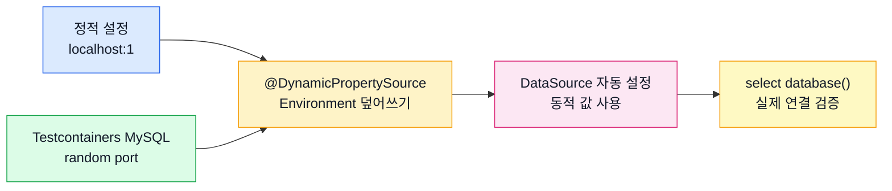
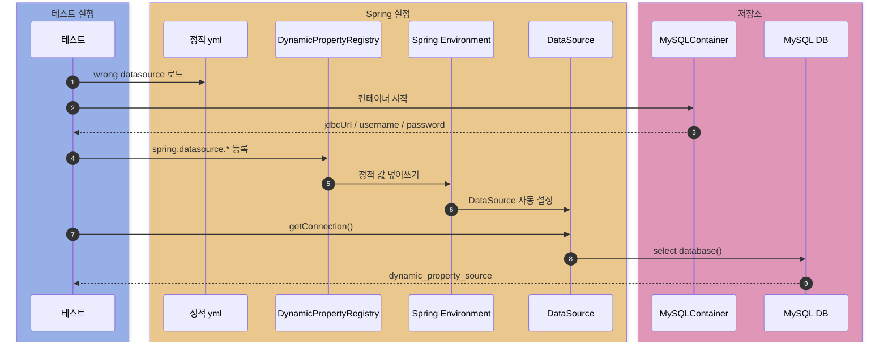

# spring-test-infra

Spring 테스트 인프라를 작은 테스트로 확인하는 실험실.

## 학습 순서

1. 정적 테스트 설정을 일부러 틀리게 둔다.
2. Testcontainers가 런타임에 MySQL 접속 정보를 만든다.
3. `@DynamicPropertySource`가 datasource 값을 덮어쓴다.
4. `DataSource`로 실제 DB 연결을 검증한다.



## 공통 환경

| 항목 | 내용 |
| --- | --- |
| 테스트 컨텍스트 | Spring Boot |
| 외부 리소스 | Testcontainers MySQL |
| 연결 방식 | JDBC `DataSource` |
| 정적 datasource | 실패해야 하는 값 |
| 동적 datasource | 컨테이너가 만든 실제 값 |

## @DynamicPropertySource

테스트 `ApplicationContext`가 만들어질 때 동적 프로퍼티를 Spring `Environment`에 등록하는 어노테이션.

| 항목 | 내용 |
| --- | --- |
| 위치 | 테스트 클래스의 `static` 메서드 |
| 파라미터 | `DynamicPropertyRegistry` |
| 등록 | `registry.add("property.name", supplier)` |
| 용도 | 실행 시점에 정해지는 포트, JDBC URL, 계정 주입 |
| 핵심 | 테스트 동적 값이 정적 yml보다 우선 |

## 케이스 1. datasource 동적 주입

정적 설정은 일부러 틀리게 둔다.

```yaml
spring:
  datasource:
    url: jdbc:mysql://localhost:1/this_datasource_should_not_be_used
    username: wrong-user
    password: wrong-password
```

테스트에서는 컨테이너 값을 등록한다.

```java
@Testcontainers
@SpringBootTest
class DynamicPropertySourceTest {

    @Container
    static MySQLContainer MYSQL = new MySQLContainer(DockerImageName.parse("mysql:8.0.36"));

    @DynamicPropertySource
    static void registerProperties(DynamicPropertyRegistry registry) {
        registry.add("spring.datasource.url", () -> MYSQL.getJdbcUrl() + "?serverTimezone=UTC");
        registry.add("spring.datasource.username", MYSQL::getUsername);
        registry.add("spring.datasource.password", MYSQL::getPassword);
    }
}
```

### 흐름



### 확인 포인트

- `spring.datasource.url`이 `localhost:1`이 아니다.
- username이 `wrong-user`가 아니라 `test`다.
- `select database()` 결과가 `dynamic_property_source`다.
- 즉, 정적 yml이 틀려도 테스트는 컨테이너 DB에 연결된다.

## 케이스 2. 컨테이너 생명주기

`@Container`는 컨테이너 시작과 종료를 JUnit/Testcontainers 생명주기에 맡긴다.

| 테스트 | 확인 내용 |
| --- | --- |
| `ContainerAnnotationLifecycleTest` | `@Container` 유무에 따른 자동 시작 차이를 비교한다 |
| `ManualContainerLifecycleTest` | 수동 방식은 `start()`와 `stop()` 위치를 테스트 코드가 직접 가진다 |

수동 방식에서 생명주기가 흩어진다는 말은 컨테이너 선언, 시작, 종료, Spring 프로퍼티 등록 책임이 각각 다른 위치로 나뉜다는 뜻이다.

## 실행

```bash
./gradlew :spring-test-infra:test
```

Docker가 떠 있어야 한다.

## 시작점

| 파일 | 역할 |
| --- | --- |
| `DynamicPropertySourceTest` | 동적 datasource 주입 검증 |
| `ContainerAnnotationLifecycleTest` | `@Container` 유무에 따른 자동 시작 비교 |
| `ManualContainerLifecycleTest` | 수동 `start()` / `stop()` 생명주기 검증 |
| `application-dynamic-property-source.yml` | 일부러 틀린 정적 datasource |
| `SpringTestInfraApplication` | 테스트 컨텍스트 시작점 |
