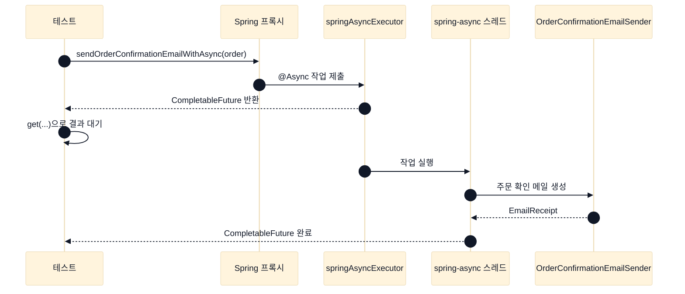
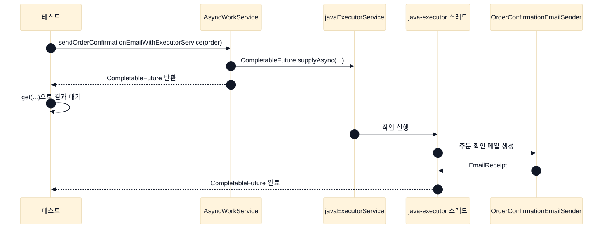
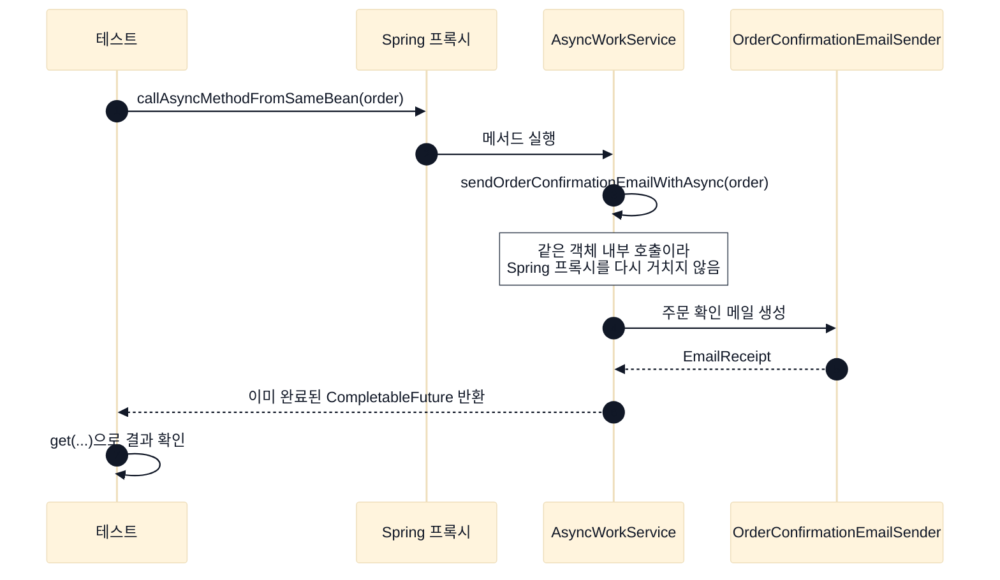

# spring

Spring 자체 기능을 작게 분리해서 관찰하는 실험실.

## @Async vs ExecutorService

주문 완료 후 확인 메일 후처리 비교.

| 구분 | `@Async` | `ExecutorService` |
| --- | --- | --- |
| 실행 방식 | Spring 프록시가 `TaskExecutor`에 위임 | 코드에서 직접 작업 제출 |
| 호출부 | 일반 메서드 호출처럼 보임 | `CompletableFuture.supplyAsync(..., executor)`가 드러남 |
| 장점 | 서비스 코드가 단순함 | 실행 흐름과 풀 선택이 명확함 |
| 주의점 | 같은 Bean 내부 호출에는 적용되지 않음 | 풀 종료와 제출 흐름을 직접 관리해야 함 |

## 언제 쓰나

| 상황 | 선택 |
| --- | --- |
| Spring 서비스 메서드 하나를 간단히 백그라운드로 넘길 때 | `@Async` |
| 메일, 알림, 후처리처럼 비즈니스 흐름에서 분리 가능한 작업 | `@Async` |
| 여러 작업의 제출, 완료, 조합을 직접 제어해야 할 때 | `ExecutorService` |
| Spring 프록시를 거치지 않는 순수 Java 코드에서도 써야 할 때 | `ExecutorService` |
| 같은 클래스 내부에서 비동기 메서드를 직접 호출해야 할 때 | `ExecutorService` 또는 Bean 분리 후 `@Async` |

## 예제 흐름

테스트 흐름:

1. 비동기 작업 제출
2. `CompletableFuture.get(...)`으로 검증 대기
3. `EmailReceipt.threadName()`으로 실제 실행 스레드 확인

`get(...)`은 테스트의 대기 지점일 뿐, 작업 실행 스레드는 별도.

### `@Async`



```java
sendOrderConfirmationEmailWithAsync(new Order("order-1", "han@example.com", "키보드", 120_000))
```

결과:

- 수신자: `han@example.com`
- 제목: `[deep-dive] 주문 확인: order-1`
- 본문: `키보드 주문이 완료되었습니다. 결제 금액: 120000원`
- 실행 스레드: `spring-async-*`

### `ExecutorService`



```java
sendOrderConfirmationEmailWithExecutorService(new Order("order-2", "kim@example.com", "모니터", 300_000))
```

결과:

- 수신자: `kim@example.com`
- 제목: `[deep-dive] 주문 확인: order-2`
- 본문: `모니터 주문이 완료되었습니다. 결제 금액: 300000원`
- 실행 스레드: `java-executor-*`

### self-invocation



같은 객체 내부 직접 호출은 Spring 프록시 미경유.

결과:

- 메일 내용 생성
- 실행 스레드: 테스트 스레드

## 시작점

- `SpringLabApplication`: `@EnableAsync`가 켜진 Spring Boot 애플리케이션
- `ExecutorConfig`: `ThreadPoolTaskExecutor`와 Java `ExecutorService` 설정
- `OrderConfirmationEmailSender`: 주문 확인 메일 내용 생성
- `AsyncWorkService`: 같은 메일 후처리를 두 실행 방식으로 위임
- `AsyncVsExecutorServiceTest`: 결과 메일과 실행 스레드 비교

## 실행

```bash
./gradlew :spring:test
```
