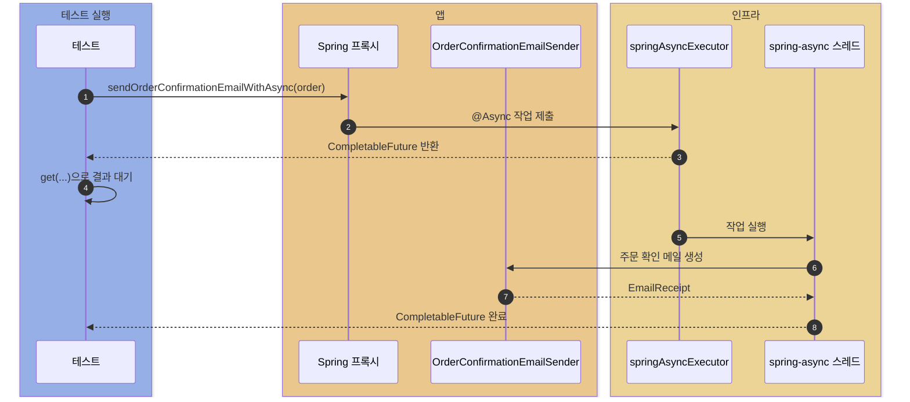
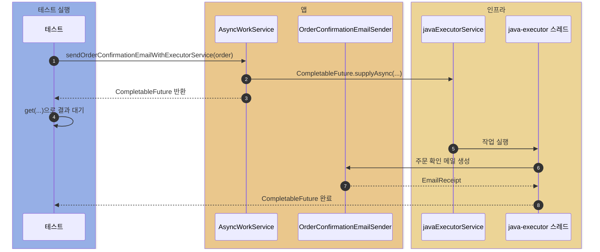
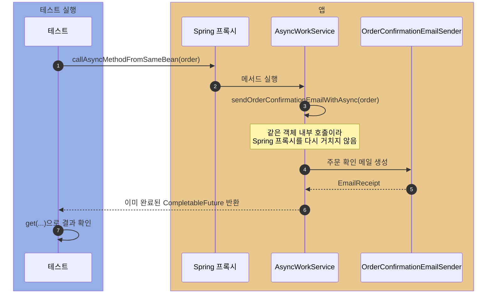
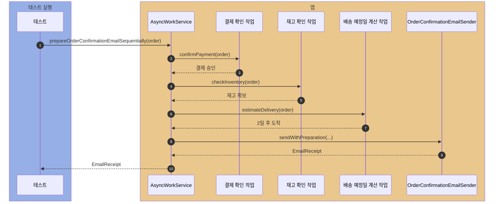
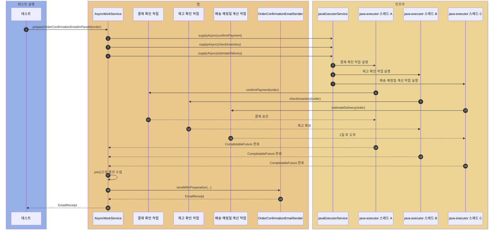

# spring

Spring 자체 기능을 작게 분리해서 관찰하는 실험실.

## @Async vs ExecutorService

주문 완료 후 확인 메일 후처리 비교.

| 구분 | `@Async` | `ExecutorService` |
| --- | --- | --- |
| 실행 방식 | Spring 프록시가 `TaskExecutor`에 위임 | 코드에서 직접 작업 제출 |
| 호출부 | 일반 메서드 호출처럼 보임 | `CompletableFuture.supplyAsync(..., executor)`가 드러남 |
| 장점 | 서비스 코드가 단순함 | 실행 흐름과 풀 선택이 명확함 |
| 주의점 | 같은 Bean 내부 호출에는 적용되지 않음 | 풀 종료와 제출 흐름을 직접 관리해야 함 |

## 언제 쓰나

| 상황 | 선택 |
| --- | --- |
| Spring 서비스 메서드 하나를 간단히 백그라운드로 넘길 때 | `@Async` |
| 메일, 알림, 후처리처럼 비즈니스 흐름에서 분리 가능한 작업 | `@Async` |
| 여러 작업의 제출, 완료, 조합을 직접 제어해야 할 때 | `ExecutorService` |
| Spring 프록시를 거치지 않는 순수 Java 코드에서도 써야 할 때 | `ExecutorService` |
| 같은 클래스 내부에서 비동기 메서드를 직접 호출해야 할 때 | `ExecutorService` 또는 Bean 분리 후 `@Async` |

## 예제 흐름

테스트 흐름:

1. 비동기 작업 제출
2. `CompletableFuture.get(...)`으로 검증 대기
3. `EmailReceipt.threadName()`으로 실제 실행 스레드 확인

`get(...)`은 테스트의 대기 지점일 뿐, 작업 실행 스레드는 별도.

### `@Async`



```java
sendOrderConfirmationEmailWithAsync(new Order("order-1", "han@example.com", "키보드", 120_000))
```

결과:

- 수신자: `han@example.com`
- 제목: `[deep-dive] 주문 확인: order-1`
- 본문: `키보드 주문이 완료되었습니다. 결제 금액: 120000원`
- 실행 스레드: `spring-async-*`

### `ExecutorService`



```java
sendOrderConfirmationEmailWithExecutorService(new Order("order-2", "kim@example.com", "모니터", 300_000))
```

결과:

- 수신자: `kim@example.com`
- 제목: `[deep-dive] 주문 확인: order-2`
- 본문: `모니터 주문이 완료되었습니다. 결제 금액: 300000원`
- 실행 스레드: `java-executor-*`

### self-invocation



같은 객체 내부 직접 호출은 Spring 프록시 미경유.

결과:

- 메일 내용 생성
- 실행 스레드: 테스트 스레드

## CompletableFuture 병렬 작업으로 시간 줄이기

위 예제가 하나의 메일 후처리 작업을 어떤 실행 주체에 맡기는지 비교했다면, 이 예제는 서로 의존하지 않는 작업 3개를 순차 처리했을 때와 병렬 처리했을 때의 실행 시간 차이를 본다.

주문 확인 메일을 만들기 전에 결제 확인, 재고 확인, 배송 예정일 계산 작업을 수행한다.
실제 HTTP 호출 대신 `Thread.sleep(...)`으로 각 작업의 대기 시간을 흉내 낸다.
after 병렬 작업도 위에서 사용한 `javaExecutorService`를 그대로 재사용한다. 예제에서는 독립 작업 3개를 동시에 실행할 수 있도록 fixed thread pool 크기를 3으로 둔다.

- 결제 확인: 250ms
- 재고 확인: 200ms
- 배송 예정일 계산: 220ms

테스트 흐름:

1. before 테스트에서 순차 작업 시간을 측정한다.
2. after 테스트에서 병렬 작업 시간을 측정한다.
3. 두 테스트 모두 같은 메일 본문을 반환하는지 확인한다.
4. before/after 시간 조건으로 병렬 작업 후 시간이 줄었는지 확인한다.

### Before: 순차 작업



```java
prepareOrderConfirmationEmailSequentially(order)
```

결과:

- 세 작업을 차례대로 처리
- 전체 시간은 세 작업 시간의 합에 가까움
- before는 테스트에서 600ms 이상으로 관찰

### After: 병렬 작업



```java
prepareOrderConfirmationEmailInParallel(order)
```

결과:

- 세 작업을 먼저 동시에 시작
- `EmailReceipt`를 만들 때 `join()`으로 결과 수집
- 전체 시간은 가장 느린 작업 시간에 가까움
- after는 테스트에서 500ms 미만으로 관찰
- before/after 테스트의 시간 조건으로 개선 효과를 확인

## @Async 병렬 작업으로 시간 줄이기

같은 before/after 실험을 `@Async`로도 구현할 수 있다.

차이는 작업 제출 방식이다. Java `ExecutorService` 예제는 `CompletableFuture.supplyAsync(..., javaExecutorService)`를 직접 호출하고, `@Async` 예제는 `@Async("springAsyncExecutor")`가 붙은 별도 빈 메서드를 호출한다.

`@Async`는 Spring 프록시를 거쳐야 하므로 결제/재고/배송 작업은 `OrderPreparationAsyncService`에 둔다. `springAsyncExecutor`도 독립 작업 3개가 동시에 실행될 수 있도록 fixed thread pool 크기를 3으로 둔다.

테스트 흐름:

1. before 테스트는 `@Async` 작업을 호출하자마자 `join()`한다.
2. after 테스트는 `@Async` 작업 3개를 먼저 시작한 뒤 마지막에 `join()`한다.
3. 두 테스트 모두 같은 메일 본문을 반환하는지 확인한다.
4. before/after 시간 조건으로 병렬 작업 후 시간이 줄었는지 확인한다.

### Before: @Async 작업을 바로 기다림

```java
String paymentStatus = orderPreparationAsyncService.confirmPayment(order).join();
String inventoryStatus = orderPreparationAsyncService.checkInventory(order).join();
String deliveryEstimate = orderPreparationAsyncService.estimateDelivery(order).join();
```

결과:

- 작업을 `@Async`로 제출하더라도 바로 `join()`하면 다음 작업을 시작하지 못함
- 전체 시간은 세 작업 시간의 합에 가까움
- before는 테스트에서 600ms 이상으로 관찰

### After: @Async 작업을 먼저 시작

```java
CompletableFuture<String> paymentStatus = orderPreparationAsyncService.confirmPayment(order);
CompletableFuture<String> inventoryStatus = orderPreparationAsyncService.checkInventory(order);
CompletableFuture<String> deliveryEstimate = orderPreparationAsyncService.estimateDelivery(order);

paymentStatus.join();
inventoryStatus.join();
deliveryEstimate.join();
```

결과:

- 세 작업을 먼저 동시에 시작
- 메일을 만들 때 `join()`으로 결과 수집
- 전체 시간은 가장 느린 작업 시간에 가까움
- after는 테스트에서 500ms 미만으로 관찰

## 시작점

- `SpringLabApplication`: `@EnableAsync`가 켜진 Spring Boot 애플리케이션
- `ExecutorConfig`: `ThreadPoolTaskExecutor`와 Java `ExecutorService` 설정
- `OrderConfirmationEmailSender`: 주문 확인 메일 내용 생성
- `OrderPreparationAsyncService`: `@Async`로 결제/재고/배송 작업 실행
- `AsyncWorkService`: 주문 확인 메일 후처리를 `@Async`, `ExecutorService`, `CompletableFuture` 방식으로 비교하고, 결제/재고/배송 API 지연을 시뮬레이션
- `AsyncVsExecutorServiceTest`: 결과 메일, 실행 스레드, Java ExecutorService와 `@Async`의 before/after 실행 시간 비교

## 실행

```bash
./gradlew :spring:test
```
